## req_015_architecture_robustness_and_product_improvements - Architecture, robustesse et évolution produit
> From version: 1.0.0
> Schema version: 1.0
> Status: Draft
> Understanding: 90%
> Confidence: 85%
> Complexity: High
> Theme: Architecture / Quality / Product
> Reminder: Update status/understanding/confidence and linked backlog/task references when you edit this doc.

# Needs
- Éclater app-shell.tsx (639 lignes) en sous-composants panel dédiés pour rester sous la limite de 1000 lignes et faciliter la maintenabilité.
- Extraire la logique de scoring/pondération de deepvault.ts vers un fichier scoring.ts isolé, testable indépendamment.
- Ajouter des barrel exports (index.ts) par dossier pour éviter les chemins relatifs profonds.
- Protéger chaque panel (Explorer, Bishop, Sync) derrière un Error Boundary React pour isoler les pannes.
- Rendre les appels Microsoft Graph API robustes : retry avec backoff exponentiel (rate limits 429), AbortController + timeout.
- Valider le schéma du corpus live au chargement (Zod ou assertions TypeScript) pour détecter tôt les données malformées.
- Étendre la suite E2E Playwright avec des parcours fonctionnels complets.
- Ajouter des tests unitaires pour la logique de scoring et des tests de contrat pour le fallback Bishop.
- Brancher un provider LLM réel (Claude via @anthropic-ai/sdk) sur le remote mode de Bishop.
- Persister la session Bishop (localStorage/IndexedDB) pour retrouver l'historique après rechargement.
- Ajouter un bouton export des résultats (conversation Bishop, résultats Explorer) en JSON/MD.
- Implémenter un delta sync corpus via lastModifiedDateTime du Graph API pour éviter les full-refresh.

# Context
- app-shell.tsx à 639 lignes contient le layout, la navigation et trois panneaux distincts — approche la limite soft de 1000 lignes du CONTRIBUTING.md.
- Les poids de scoring dans deepvault.ts (title=8, summary=6, content=4, tags=5, path=2) sont des paramètres métier qui méritent leur propre fichier et leurs propres tests.
- Aucun Error Boundary n'existe actuellement : une exception dans Bishop pendant le rendu planterait toute l'app.
- deepvault-graph.ts fait des appels fetch sans retry ni timeout — un réseau dégradé ou un rate limit Graph peut bloquer l'export indéfiniment.
- Le corpus live est chargé avec un fallback silencieux : des données malformées passent sans diagnostic.
- La suite E2E se limite à un smoke test ; les parcours critiques (rôle restreint, Bishop denied, switch mock↔live) ne sont pas couverts.
- L'orchestration Bishop a déjà un remote mode et un fallback local en place — le branchement LLM est la prochaine étape naturelle.
- La session Bishop est perdue au rechargement — friction pour les workflows d'analyse récurrents.
- Pas de moyen d'exporter les résultats hors de l'app — bloquant pour les utilisateurs qui produisent des livrables.
- Le full-refresh à chaque export live est coûteux sur des SharePoint importants — le Graph API expose lastModifiedDateTime pour faire du delta.

```mermaid
%% logics-kind: request
%% logics-signature: request|architecture-robustness-product|architecture-robustesse-et-evolution|ac1-app-shell-eclate
flowchart TD
    Trigger[Analyse du projet post-v1.0] --> Arch[Axe 1: Architecture]
    Trigger --> Robust[Axe 2: Robustesse]
    Trigger --> Tests[Axe 3: Tests]
    Trigger --> Product[Axe 4: Évolution produit]
    Arch --> AC1[AC1: app-shell éclaté]
    Arch --> AC2[AC2: scoring.ts isolé]
    Arch --> AC3[AC3: barrel exports]
    Robust --> AC4[AC4: Error Boundaries]
    Robust --> AC5[AC5: retry + timeout Graph]
    Robust --> AC6[AC6: validation corpus]
    Tests --> AC7[AC7: E2E parcours complets]
    Tests --> AC8[AC8: tests scoring + Bishop contrat]
    Product --> AC9[AC9: LLM branché sur Bishop]
    Product --> AC10[AC10: persistance session]
    Product --> AC11[AC11: export résultats]
    Product --> AC12[AC12: delta sync corpus]
```

# Acceptance criteria
- AC1: app-shell.tsx est réduit au layout et à la navigation ; chaque panel (Explorer, Bishop, Sync) vit dans son propre fichier sous `src/components/panels/`.
- AC2: La logique de scoring et les poids sont extraits dans `src/lib/scoring.ts` ; deepvault.ts l'importe sans dupliquer la logique.
- AC3: Un `index.ts` par dossier (`src/lib/`, `src/hooks/`, `src/components/`) expose les exports publics.
- AC4: Chaque panel est wrappé dans un `<ErrorBoundary>` qui affiche un message d'erreur isolé sans faire planter l'app entière.
- AC5: Tous les appels fetch vers Microsoft Graph passent par un wrapper avec retry (max 3, backoff 1s/2s/4s) et timeout configurables.
- AC6: Le corpus live est validé au chargement ; les données malformées lèvent une erreur explicite avec le champ fautif identifié.
- AC7: La suite E2E couvre : recherche 0 résultats, Bishop avec sources restricted, changement de rôle avec vérification du compte sources, switch mock↔live.
- AC8: Les tests unitaires couvrent le scoring pour query vide, document sans titre, stop words seuls ; les tests Bishop couvrent le fallback sur 500 remote.
- AC9: Bishop remote mode appelle Claude (`claude-sonnet-4-6` ou configurable) via `@anthropic-ai/sdk` avec prompt caching ; le fallback local reste actif si la clé API est absente.
- AC10: L'historique de conversation Bishop est persisté dans `localStorage` et restauré au chargement de la page.
- AC11: Un bouton "Exporter" sur le panel Bishop et sur les résultats Explorer permet de télécharger les données en JSON ou Markdown.
- AC12: L'export live utilise `lastModifiedDateTime` pour n'ingérer que les documents modifiés depuis le dernier checkpoint.

# Definition of Ready (DoR)
- [x] Problem statement est explicite et l'impact utilisateur est clair.
- [x] Périmètre (in/out) est défini.
- [x] Les critères d'acceptance sont testables.
- [ ] Découpage en backlog items à faire avant de démarrer.
- [ ] Dépendances inter-axes identifiées (AC9 dépend de AC1 pour isolation Bishop).

# Scope
**In scope**
- Refactoring structural de src/components et src/lib
- Hardening des appels Graph (retry, timeout, validation)
- Extension de la couverture de tests (unit + E2E)
- Intégration Claude API sur le remote mode Bishop
- Persistance session et export résultats

**Out of scope**
- Changement du design système ou du CSS
- Migration vers un framework de composants (MUI, Shadcn, etc.)
- Nouveau provider Graph (Teams, OneDrive — couvert par req_002)
- Changement du format de corpus ou du schéma de données

# Dependencies & risks
- AC9 (LLM) nécessite `ANTHROPIC_API_KEY` dans l'environnement — documenter dans `.env.exemple`
- AC12 (delta sync) dépend du format de checkpoint existant dans live-export-state.ts — vérifier la compatibilité avant de modifier
- AC1 (éclatement app-shell) peut créer des conflits si d'autres branches touchent app-shell.tsx simultanément

# Companion docs
- Product brief(s): (none yet)
- Architecture decision(s): (none yet)

# Backlog
- `item_046_split_app_shell_into_panel_components`
- `item_047_extract_scoring_module_and_barrel_exports`
- `item_048_react_error_boundaries_for_panels`
- `item_049_graph_api_retry_timeout_and_corpus_validation`
- `item_050_e2e_full_workflow_coverage`
- `item_051_unit_tests_scoring_and_bishop_contract`
- `item_052_bishop_claude_api_integration`
- `item_053_bishop_session_persistence_and_export`
- `item_054_corpus_delta_sync_via_graph_lastmodified`

# AI Context
- Summary: Amélioration structurelle, robustesse, tests et évolution produit de DeepVault Nexus post-v1.0.
- Keywords: refactoring, error boundary, graph api, retry, scoring, e2e, claude api, bishop, corpus, delta sync, export, persistance
- Use when: Use when planning the next wave of improvements after v1.0 stabilization.
- Skip when: Skip when the work is a hotfix or targets a single isolated component.
