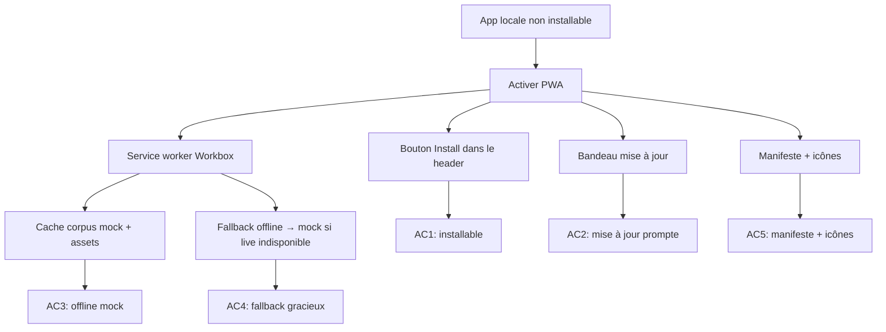

## req_016_pwa_install_and_offline_first - PWA : installation, mise à jour et fonctionnement hors-ligne
> From version: 1.0.0
> Schema version: 1.0
> Status: Done
> Understanding: 93%
> Confidence: 90%
> Complexity: Medium
> Theme: Infrastructure / UX
> Reminder: Update status/understanding/confidence and linked backlog/task references when you edit this doc.

# Needs
- Rendre DeepVault Nexus installable comme application native sur desktop et mobile via le bouton "Installer l'app" affiché en haut de l'interface.
- Afficher un bandeau de mise à jour discret lorsqu'une nouvelle version du service worker est disponible, avec un bouton "Mettre à jour" qui recharge immédiatement.
- Faire fonctionner l'app en mode hors-ligne pour le corpus mock : les assets, le corpus bundlé et l'UI doivent rester disponibles sans réseau.
- Utiliser `vite-plugin-pwa` (Workbox) pour générer le service worker et le manifeste automatiquement à chaque build.
- Ajouter un fichier `public/manifest.webmanifest` avec icônes, thème et couleurs alignés sur la charte DeepVault.

# Context
- L'app tourne sur Vite 6 + React 19 avec un build local-first — la base technique est idéale pour une PWA.
- Aucun service worker ni manifeste n'est présent aujourd'hui : une installation depuis le navigateur n'est pas possible.
- Le corpus mock (`pilot-corpus.json`) est bundlé dans l'app — il peut être mis en cache statiquement sans contrainte réseau.
- Le mode live (Graph API) reste réseau-dépendant par nature ; le fallback offline doit gracieusement revenir au corpus mock si le live n'est pas disponible.
- `vite-plugin-pwa` est le standard de facto pour Vite/React PWA — il intègre Workbox, génère le manifeste et expose un hook `useRegisterSW` pour gérer les mises à jour.
- Le bouton "Installer" doit capter l'événement `beforeinstallprompt` du navigateur et le déclencher sur clic.
- Le bandeau de mise à jour doit apparaître dès que `needRefresh` est `true` (nouveau service worker en attente) et disparaître après acceptation ou rejet.
- L'UX doit rester discrète : pas de modale bloquante, pas de notification intrusive.

# Acceptance criteria
- AC1: L'app affiche un bouton "Installer" dans le header lorsque le navigateur expose `beforeinstallprompt` ; cliquer dessus déclenche l'invite d'installation native. Le bouton est masqué si l'app est déjà installée ou si le navigateur ne supporte pas l'API.
- AC2: Lorsqu'une nouvelle version du service worker est disponible, un bandeau non-bloquant apparaît avec un bouton "Mettre à jour" ; cliquer recharge la page et active la nouvelle version. Le bandeau peut être fermé sans mettre à jour.
- AC3: En mode hors-ligne (réseau coupé), l'app se charge complètement depuis le cache service worker et le corpus mock reste interrogeable via Explorer et Bishop.
- AC4: Si le corpus live est sélectionné mais que le réseau est absent, l'app bascule silencieusement vers le corpus mock avec un indicateur visuel "Offline — corpus mock actif".
- AC5: Le manifeste définit `name`, `short_name`, `theme_color`, `background_color`, `display: standalone`, et au moins deux tailles d'icônes (192×192 et 512×512) cohérentes avec la charte DeepVault.
- AC6: `npm run build` génère un service worker valide dans `dist/` ; `npm run check` passe sans régression.
- AC7: La stratégie de cache Workbox utilise `CacheFirst` pour les assets statiques et `NetworkFirst` avec fallback cache pour les appels Graph.

# Definition of Ready (DoR)
- [x] Problem statement est explicite et l'impact utilisateur est clair.
- [x] Périmètre (in/out) est défini.
- [x] Acceptance criteria sont testables.
- [ ] Icônes DeepVault aux formats requis disponibles ou à créer.
- [ ] Décision sur le `theme_color` et `background_color` (à aligner avec `styles.css`).

# Scope
**In scope**
- Installation de `vite-plugin-pwa` et configuration Workbox
- Manifeste (`public/manifest.webmanifest`) avec icônes
- Composant `<InstallButton>` dans le header (capter `beforeinstallprompt`)
- Composant `<UpdateBanner>` via `useRegisterSW` (hook `vite-plugin-pwa`)
- Stratégie de cache : assets statiques + corpus mock en CacheFirst, Graph en NetworkFirst
- Fallback offline vers corpus mock avec indicateur visuel
- Tests E2E Playwright : vérification que l'app charge hors-ligne

**Out of scope**
- Notifications push
- Background sync (synchronisation en arrière-plan vers Graph)
- Mode offline complet pour le corpus live (trop volumineux pour le cache)
- Support IE/Edge Legacy

# Dependencies & risks
- `vite-plugin-pwa` doit être ajouté aux `devDependencies` — vérifier la compatibilité avec Vite 6.x avant d'intégrer.
- Les icônes PWA sont à créer ou extraire depuis les assets existants (`public/`).
- Le service worker peut interférer avec le hot-reload Vite en dev — configurer `devOptions: { enabled: false }` ou équivalent pour éviter la friction en développement.
- Playwright ne supporte pas nativement les API PWA (`beforeinstallprompt`) — les tests d'installation devront être bornés à la présence/absence du bouton dans le DOM.

# Companion docs
- Product brief(s): (none yet)
- Architecture decision(s): (none yet)

# Backlog
- `item_055_pwa_vite_plugin_and_workbox_setup`
- `item_056_pwa_install_button_in_header`
- `item_057_pwa_update_banner`
- `item_058_pwa_offline_cache_and_mock_fallback`

# AI Context
- Summary: Rendre DeepVault Nexus installable (PWA) avec service worker Workbox, bouton d'installation dans le header, bandeau de mise à jour et support offline pour le corpus mock.
- Keywords: pwa, service worker, workbox, vite-plugin-pwa, manifest, install, offline, cache, update banner, beforeinstallprompt
- Use when: Use when implementing PWA capabilities, install flow, update notifications, or offline corpus support.
- Skip when: Skip when the work targets Bishop orchestration, corpus data models, or Graph export logic.

# Report
- The PWA request is fully delivered: install button, update banner, offline mock fallback, Workbox cache strategy, and offline Playwright coverage are implemented and validated.
- The request is now closed after Wave 4 completed and the linked backlog items and task were marked `Done`.
