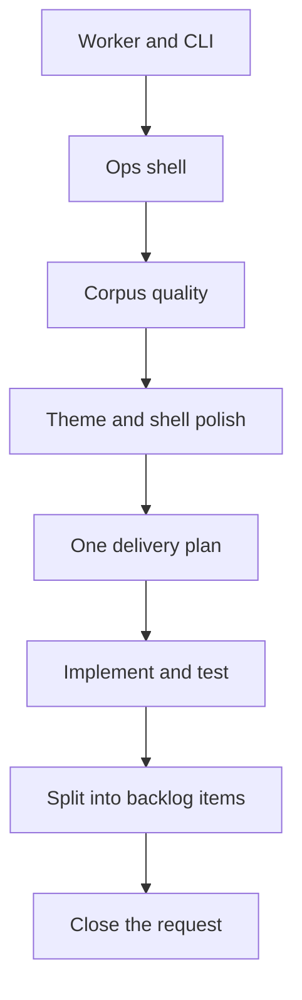

## req_017_implement_the_full_app_worker_corpus_and_shell_plan - Implement the full app worker corpus and shell plan
> From version: 1.1.0
> Schema version: 1.0
> Status: Draft
> Understanding: 94%
> Confidence: 90%
> Complexity: High
> Theme: General
> Reminder: Update status/understanding/confidence and linked backlog/task references when you edit this doc.

# Needs
- Implement the navigation and runtime clarity already defined for the sidebar, runtime controls, and sync ownership.
- Implement the product and architecture plan already defined for the worker boundary, the ops shell, corpus quality, and shell theme persistence.
- Make the app, CLI, worker, corpus, and shell changes land as one coherent delivery plan instead of isolated patches.
- Ensure every added product brief and ADR is backed by implementation work and tests.
- Keep the work split into bounded slices so the plan can be groomed into backlog items without losing traceability.

# Context
The repository now has a set of product briefs and ADRs that define the target operating model.
Those decisions cover navigation clarity, the worker boundary, the split Sync Status experience, ingestion quality, and the sidebar theme switch.
What is missing is a single request that frames the complete implementation and validation plan across all those decisions.
This request should be the umbrella entry for grooming, split into bounded backlog items before execution starts.
It should keep the implementation grounded in the existing local-first codebase while preparing the app for a dedicated worker and shared corpus artifacts.

# Acceptance criteria
- AC1: The request explicitly covers the sidebar navigation and runtime control clarity defined in prod 003 and adr 022.
- AC2: The request explicitly covers the worker boundary, app and CLI parity, and shared corpus artifacts defined in ADR 023.
- AC3: The request explicitly covers the split Sync Status screens and operational navigation defined in ADR 024.
- AC4: The request explicitly covers ingestion metadata, chunking, retrieval quality, and Bishop hints defined in ADR 026.
- AC5: The request explicitly covers the discrete sidebar theme switch and persisted shell mode defined in ADR 025.
- AC6: The request says the work must be implemented and tested, not just documented.
- AC7: The request is clear enough to be split into bounded backlog items for execution.

# AC Traceability
- AC1 -> Backlog item: `logics/backlog/item_061_stabilize_navigation_and_runtime_ownership.md`; task: `logics/tasks/task_029_stabilize_navigation_and_runtime_ownership.md`. Proof: capture validation evidence in the backlog item and its downstream task.
- AC2 -> Backlog item: `logics/backlog/item_059_establish_worker_boundary_and_cli_parity_with_shared_corpus_artifacts.md`; task: `logics/tasks/task_027_establish_worker_boundary_and_cli_parity_with_shared_corpus_artifacts.md`. Proof: capture validation evidence in the backlog item and its downstream task.
- AC3 -> Backlog item: `logics/backlog/item_060_split_sync_status_into_dedicated_operations_screens.md`; task: `logics/tasks/task_028_split_sync_status_into_dedicated_operations_screens.md`. Proof: capture validation evidence in the backlog item and its downstream task.
- AC4 -> Backlog item: `logics/backlog/item_062_improve_corpus_metadata_chunking_and_bishop_hints.md`; task: `logics/tasks/task_030_improve_corpus_metadata_chunking_and_bishop_hints.md`. Proof: capture validation evidence in the backlog item and its downstream task.
- AC5 -> Backlog item: `logics/backlog/item_063_add_persisted_sidebar_theme_switch.md`; task: `logics/tasks/task_031_add_persisted_sidebar_theme_switch.md`. Proof: capture validation evidence in the backlog item and its downstream task.
- AC6 -> Backlog items: `logics/backlog/item_059_establish_worker_boundary_and_cli_parity_with_shared_corpus_artifacts.md`, `logics/backlog/item_060_split_sync_status_into_dedicated_operations_screens.md`, `logics/backlog/item_061_stabilize_navigation_and_runtime_ownership.md`, `logics/backlog/item_062_improve_corpus_metadata_chunking_and_bishop_hints.md`, `logics/backlog/item_063_add_persisted_sidebar_theme_switch.md`; tasks: `logics/tasks/task_027_establish_worker_boundary_and_cli_parity_with_shared_corpus_artifacts.md`, `logics/tasks/task_028_split_sync_status_into_dedicated_operations_screens.md`, `logics/tasks/task_029_stabilize_navigation_and_runtime_ownership.md`, `logics/tasks/task_030_improve_corpus_metadata_chunking_and_bishop_hints.md`, `logics/tasks/task_031_add_persisted_sidebar_theme_switch.md`. Proof: capture implementation and validation evidence in each item and its downstream task.
- AC7 -> Task: `logics/tasks/task_026_wave_0_execution_planning_and_backlog_split_for_the_full_implementation_plan.md`; supporting tasks: `logics/tasks/task_027_establish_worker_boundary_and_cli_parity_with_shared_corpus_artifacts.md`, `logics/tasks/task_028_split_sync_status_into_dedicated_operations_screens.md`, `logics/tasks/task_029_stabilize_navigation_and_runtime_ownership.md`, `logics/tasks/task_030_improve_corpus_metadata_chunking_and_bishop_hints.md`, `logics/tasks/task_031_add_persisted_sidebar_theme_switch.md`. Proof: capture the split plan, wave map, and traceability evidence in the task.

# Definition of Ready (DoR)
- [x] Problem statement is explicit and user impact is clear.
- [x] Scope boundaries (in/out) are explicit.
- [x] Acceptance criteria are testable.
- [x] Dependencies and known risks are listed.

# Companion docs
- Product brief(s): `logics/product/prod_003_navigation_and_runtime_control_clarity.md`, `logics/product/prod_005_split_sync_status_into_dedicated_operations_screens.md`, `logics/product/prod_006_improve_ingestion_metadata_and_chunking_for_bishop_hints.md`, `logics/product/prod_007_add_a_discrete_light_and_dark_theme_switch_in_the_sidebar.md`, `logics/product/prod_008_make_ingestion_and_live_export_operable_across_app_and_cli.md`
- Architecture decision(s): `logics/architecture/adr_022_separate_runtime_controls_from_sync_operations.md`, `logics/architecture/adr_023_split_execution_runtime_from_the_app_and_share_corpus_artifacts.md`, `logics/architecture/adr_024_split_sync_status_into_dedicated_operations_screens.md`, `logics/architecture/adr_025_add_a_discrete_light_and_dark_theme_switch_with_persisted_shell_mode.md`, `logics/architecture/adr_026_improve_ingestion_metadata_and_chunking_for_bishop_hints.md`

# AI Context
- Summary: Umbrella request for the full implementation and test plan across worker, ops shell, corpus quality, and theme polish.
- Keywords: worker, cli, corpus, ops shell, ingestion, bishop, theme, implementation, tests
- Use when: Use when framing the complete delivery plan that should be split into executable backlog items.
- Skip when: Skip when the work targets only one of the already defined streams.
# Backlog
- [item_059_establish_worker_boundary_and_cli_parity_with_shared_corpus_artifacts](logics/backlog/item_059_establish_worker_boundary_and_cli_parity_with_shared_corpus_artifacts.md)
- [item_060_split_sync_status_into_dedicated_operations_screens](logics/backlog/item_060_split_sync_status_into_dedicated_operations_screens.md)
- [item_061_stabilize_navigation_and_runtime_ownership](logics/backlog/item_061_stabilize_navigation_and_runtime_ownership.md)
- [item_062_improve_corpus_metadata_chunking_and_bishop_hints](logics/backlog/item_062_improve_corpus_metadata_chunking_and_bishop_hints.md)
- [item_063_add_persisted_sidebar_theme_switch](logics/backlog/item_063_add_persisted_sidebar_theme_switch.md)
