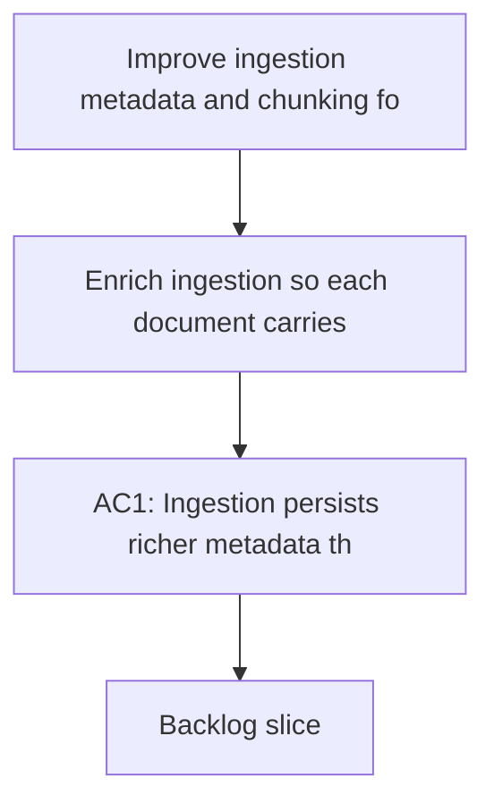

## req_017_improve_ingestion_metadata_and_chunking_for_bishop_hints - Improve ingestion metadata and chunking for Bishop hints
> From version: 1.1.0
> Schema version: 1.0
> Status: Draft
> Understanding: 88%
> Confidence: 84%
> Complexity: Medium
> Theme: General
> Reminder: Update status/understanding/confidence and linked backlog/task references when you edit this doc.

# Needs
- Enrich ingestion so each document carries more searchable context than title, summary, content, tags, and path alone.
- Make chunking preserve section and heading context so retrieval can rank the right passage more reliably.
- Improve the corpus signals that Bishop can use to explain what extra input would help the next answer.
- Reduce generic fallback hints that only say to add a better document title or site name.
- Keep permission-aware filtering and the local-first pipeline intact while improving retrieval quality.

# Context
- Bishop currently emits a generic improvement hint when the retrieval signal is weak. That hint is driven mostly by answer status, source count, and chunk count.
- The current retrieval path relies on a narrow set of document fields, so short or vague user questions often do not match strongly enough even when the corpus contains the right material.
- The ingestion pipeline should add more structured metadata and better chunk boundaries so search, ranking, and answer hints can use richer signals.
- This request covers both the mock corpus and the live export shape. It does not introduce a hosted backend or change the current permission model.
- The desired outcome is fewer generic "tell me the title or site name" hints and more useful suggestions about what kind of context would actually improve the answer.

# Acceptance criteria
- AC1: Ingestion persists richer metadata that can be used for retrieval, including at least document title, site name, path, tags, and structural context from the source when available.
- AC2: Chunking preserves section or heading context so a chunk can be traced back to the part of the document that produced it.
- AC3: Short or vague questions surface more relevant sources when the corpus contains a matching document or section.
- AC4: Bishop improvement hints use the richer corpus signal and are no longer limited to a generic "add a better title or site name" fallback.
- AC5: The new ingestion and ranking behavior is covered by tests for corpus loading, retrieval quality, and Bishop hint generation.
- AC6: Permission-aware filtering and local-first behavior remain unchanged.

# Definition of Ready (DoR)
- [x] Problem statement is explicit and user impact is clear.
- [x] Scope boundaries (in/out) are explicit.
- [x] Acceptance criteria are testable.
- [x] Dependencies and known risks are listed.

# Companion docs
- Product brief(s): (none yet)
- Architecture decision(s): (none yet)

# AI Context
- Summary: Improve ingestion metadata and chunking for Bishop hints
- Keywords: ingestion, metadata, chunking, retrieval, ranking, bishop, hint, corpus
- Use when: Use when framing ingestion and retrieval quality work that should reduce generic Bishop hints.
- Skip when: Skip when the work targets UI polish, sync operations, or unrelated backend features.
# Backlog
- (none yet)
