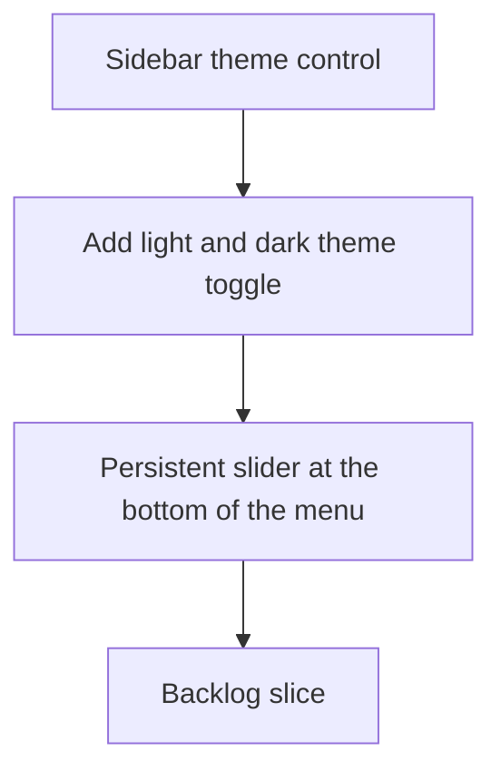

## req_018_add_a_discrete_light_and_dark_theme_switch_in_the_sidebar - Add a discrete light and dark theme switch in the sidebar
> From version: 1.1.0
> Schema version: 1.0
> Status: Draft
> Understanding: 92%
> Confidence: 88%
> Complexity: Medium
> Theme: General
> Reminder: Update status/understanding/confidence and linked backlog/task references when you edit this doc.

# Needs
- Add a light and dark theme toggle that feels native to the app shell.
- Place the control at the bottom of the sidebar so it stays discreet and does not compete with navigation.
- Use a slider-style affordance that looks refined instead of a generic checkbox or dropdown.
- Persist the selected theme locally so the app opens in the user's preferred mode.
- Keep the theme system compatible with the current local-first UI and CSS variable setup.

# Context
- The app already uses a compact left sidebar and a visual language built around muted surfaces, pills, and panels.
- The theme switch should live low in the sidebar rail, separated from the primary navigation and application sections.
- The control should be subtle but clearly interactive, with a polished slider treatment rather than a loud settings control.
- The implementation should update the app shell styling consistently across the Explorer, Bishop, Sync status, AI stats, and Settings screens.
- The change should be local-first and work without introducing a backend dependency.

# Acceptance criteria
- AC1: The sidebar exposes a discrete light and dark theme control at the bottom of the menu.
- AC2: The control uses a slider-style interaction that feels visually refined and does not crowd the navigation.
- AC3: The selected theme is persisted locally and restored on reload.
- AC4: The theme applies consistently across the shell, panels, and modal surfaces.
- AC5: The request is clear enough to be promoted into a bounded backlog item.

# Definition of Ready (DoR)
- [x] Problem statement is explicit and user impact is clear.
- [x] Scope boundaries (in/out) are explicit.
- [x] Acceptance criteria are testable.
- [x] Dependencies and known risks are listed.

# Companion docs
- Product brief(s): (none yet)
- Architecture decision(s): (none yet)

# AI Context
- Summary: Add a discrete light and dark theme switch in the sidebar
- Keywords: theme, sidebar, light, dark, slider, toggle, persistence, shell
- Use when: Use when framing a compact theme selector for the app sidebar.
- Skip when: Skip when the work targets unrelated navigation, sync, or content features.
# Backlog
- `item_060_add_a_discrete_light_and_dark_theme_switch_in_the_sidebar`
