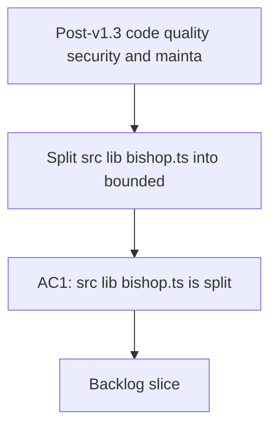

## req_018_post_v1_3_code_quality_security_and_maintainability_audit - Post-v1.3 code quality, security, and maintainability audit

> From version: 1.4.0
> Schema version: 1.0
> Status: Done
> Understanding: 99%
> Confidence: 98%
> Complexity: High
> Theme: Quality / Security / Maintainability
> Reminder: Update status, understanding, confidence, and linked backlog or task references when you edit this doc.

# Needs

- ~~Split `src/lib/bishop.ts` into bounded modules~~ — **Cancelled** (`adr_035`): bishop.ts is removed from the browser bundle entirely; bishop orchestration moves to the Python FastAPI worker.
- Reduce `src/components/app-shell.tsx` (948 lines) before it crosses the limit — extract navigation and panel coordination logic into dedicated units.
- Modularize `src/styles.css` (75 KB monolithic file) so styles can be traced to their owning component or panel.
- Add a visible warning in the Settings panel next to the API key inputs indicating that values are stored unencrypted in `localStorage` and are intended for local/dev use only.
- Introduce schema validation (Zod or TypeScript assertions) on critical data read from `localStorage` to replace bare `JSON.parse()` calls with no contract.
- Add an optional silent health check at app startup for remote worker URLs when live mode is configured.
- ~~Evaluate lazy-loading the mock corpus as a separate Vite chunk~~ — **Cancelled** (`adr_035`): no corpus is bundled in the browser; the browser always fetches from the Python worker.
- Audit and strengthen existing error boundaries: ensure every panel has its own granular boundary, not only the root-level one.

# Context

- A full repository audit conducted in April 2026 (v1.3.0) identified these items as the most concrete maintainability and security risks.
- `bishop.ts` at 1216 lines formally violates the CONTRIBUTING.md rule of less than 1000 lines per file. It mixes orchestration, provider adapters for OpenAI/Gemini/Anthropic, prompt construction, and fallback logic in a single module — making execution path tracing difficult.
- `app-shell.tsx` was at 948 lines when the audit was opened; Wave 2 has now reduced it to 478 lines by extracting shell chrome into a dedicated module.
- `useSyncOperations.ts` at 778 lines is dense but cohesive (a job state machine) — monitor before refactoring.
- `styles.css` at 75 KB is not a performance problem (gzip compresses it well), but it makes it hard to know which styles are active for which component and increases CSS regression risk when editing.
- Provider API keys (OpenAI, Gemini, Anthropic) are stored in `localStorage` — this is intentional for local/dev use, but no UI warning communicates that risk to the user.
- Several `JSON.parse()` calls on `localStorage` data have graceful fallbacks but no schema contract; silently corrupted or migrated data can produce unexpected behavior that is hard to diagnose.
- In live mode with a remote worker URL configured, the app does not check worker availability at startup — the user discovers the worker is unreachable only when they trigger an operation.
- The mock corpus is bundled in `src/data/corpus.ts` and included in the main chunk — this inflates the initial bundle even for users who configure a live corpus.
- Only one root-level `<ErrorBoundary>` exists; an exception during panel rendering takes down the entire app instead of isolating the failure.

# Acceptance criteria

- ~~AC1: `src/lib/bishop.ts` is split into sub-modules~~ — **Cancelled** (`adr_035`). Bishop moves to Python.
- AC2: `src/components/app-shell.tsx` is reduced below 800 lines; extracted logic lives in dedicated testable components or hooks.
- AC3: An explicit warning appears in the Settings panel next to API key input fields (local dev mode), stating that values are stored in plaintext in `localStorage` and are intended for local use only. In hosted mode, API key inputs are hidden entirely.
- AC4: Critical data read from `localStorage` (settings, Bishop conversation, artifacts) is validated against a declared schema; a validation failure produces a clean empty state with a diagnostic log message rather than a bare `JSON.parse()` throw.
- AC5: The app performs a silent health check at startup against the Python worker (`GET /api/health`) and surfaces a worker availability indicator in the Settings panel or status bar.
- AC6: Each of the 6 panels (`explorer-panel`, `bishop-panel`, `sync-panel`, `artifacts-panel`, `ai-stats-panel`, `settings-panel`) is wrapped in a granular `<ErrorBoundary>` that renders an isolated error message without crashing the rest of the app.
- ~~AC7: The mock corpus is loaded lazily~~ — **Cancelled** (`adr_035`). No corpus is bundled in the browser.
- AC8 (optional): A CSS modularization strategy is documented (CSS Modules, co-location, or per-panel split) and at least one pilot panel is migrated; `styles.css` remains functional for all other panels during the transition.

# Definition of Ready (DoR)

- [x] Problem statement is explicit and concrete risks are documented.
- [x] In/out scope is defined.
- [x] Acceptance criteria are testable.
- [x] Backlog items to be created before starting.
- [x] Inter-axis dependencies identified (AC1 before AC2; AC6 is independent).

# Scope

**In scope**
- ~~Split `bishop.ts` into bounded sub-modules~~ — Cancelled (adr_035)
- Reduce `app-shell.tsx` below 800 lines
- API key localStorage warning in Settings UI (local dev mode); inputs hidden in hosted mode
- Schema validation on critical localStorage data
- Silent Python worker health check at startup (`GET /api/health`)
- Granular error boundaries per panel
- ~~Lazy loading of the mock corpus~~ — Cancelled (adr_035)

**Out of scope**
- Refactoring `useSyncOperations.ts` (monitor but not urgent)
- Full migration of `styles.css` to CSS Modules (AC8 is optional pilot only)
- Changes to corpus format or data schema
- Adding new LLM providers
- Encrypting keys in localStorage (out of scope — warning is the required deliverable)

# Dependencies & risks

- AC1 (splitting bishop.ts) may cause conflicts if active branches are touching Bishop orchestration simultaneously.
- AC4 (localStorage schema validation) requires a decision between Zod (additional dependency) and hand-rolled TypeScript assertions — resolve before starting.
- AC7 (lazy mock corpus) requires verifying that Vite code-splitting and PWA Workbox correctly handle the additional chunk in offline mode.
- AC8 (optional CSS): a partial CSS Modules migration may introduce specificity conflicts if `styles.css` coexists with `.module.css` files.

# Companion docs

- Product brief(s): (none)
- Architecture decision(s): (none yet — create one for AC1 if splitting bishop.ts changes the orchestration contract)

# AI Context

- Summary: Post-v1.3 quality, security, and maintainability audit for DeepVault Nexus — resolving file size violations, localStorage security hardening, granular error boundaries, remote worker health check, and lazy mock corpus loading.
- Keywords: audit, bishop refactor, app-shell, styles.css, localStorage security, schema validation, zod, error boundary, health check, lazy loading, bundle size, maintainability
- Use when: Use when planning the structural cleanup and robustness wave post-v1.3, prioritizing items that violate size rules or expose user-facing risks.
- Skip when: Skip for isolated hotfixes or new feature work unrelated to internal structure.

# Backlog

- ~~`item_072_split_bishop_into_bounded_sub_modules`~~ — Cancelled (adr_035)
- `item_073_reduce_app_shell_below_800_lines` — Done
- `item_074_harden_localstorage_api_key_warning_and_schema_validation` — Done
- `item_075_add_worker_health_check_and_granular_error_boundaries` — Done
- ~~`item_076_lazy_load_mock_corpus_chunk`~~ — Cancelled (adr_035)

## Progress notes

- Execution has started through Wave 2: `item_073` is now complete, and `src/components/app-shell.tsx` is down to 478 lines after extracting sidebar/topbar/toolbar chrome into `src/components/app-shell-chrome.tsx`.
- Wave 3 is now complete: `item_074` added explicit plaintext `localStorage` warnings under each provider API key field and hardened the critical persisted browser state reads with shared schema guards plus diagnostic warnings.
- Wave 4 is now complete: remote worker mode now performs a silent startup `/api/health` probe and exposes the resulting operator-facing status in Settings, while app-shell integration tests confirm one panel failure stays isolated behind its own boundary.
- `req_018` is now complete: the remaining required audit items are closed, and the final `rtk npm run check` gate passed with lint, typecheck, tests, build, E2E, and evaluation green.
