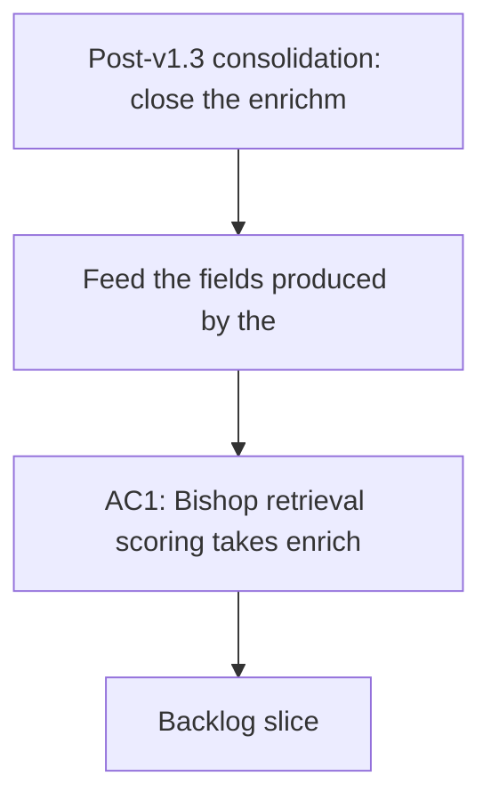

## req_019_post_v1_3_consolidation_enrichment_loop_ci_and_configuration_portability - Post-v1.3 consolidation: close the enrichment loop, add automated CI, and make configuration portable

> From version: 1.3.0
> Schema version: 1.0
> Status: In progress
> Understanding: 99%
> Confidence: 97%
> Complexity: High
> Theme: Quality / Operational / Product
> Reminder: Update status, understanding, confidence, and linked backlog or task references when you edit this doc.

# Needs

- Feed the fields produced by the `analyze` pipeline (AI summaries, extracted keywords, confidence scores) back into Bishop retrieval scoring so enrichment concretely improves answer quality.
- Set up a GitHub Actions workflow covering frontend validation, worker validation, smoke contract checks, build, and hermetic evaluate on every PR and push to `main`.
- Allow full application configuration (API keys, Entra settings, Bishop tuning) to be exported and imported so teams can share a setup and switch between environments without manual re-entry.

# Context

- The `analyze` pipeline shipped in April 2026 (v1.3.0): it enriches each document with an AI summary, extracted keywords, and a confidence score. These fields are stored in artifacts and visible in the Artifacts panel. However, Bishop retrieval scoring still uses the original static weights (title=8, summary=6, content=4, tags=5, path=2) with no awareness of whether a document has been enriched or of its AI confidence score. The enrichment exists but does not close the loop on response quality.
- No automated CI workflow exists (GitHub Actions or equivalent). Only local scripts are available (`npm run check`, `npm run ci:local`). For a tool used by a team against real SharePoint data, regressions can land without anyone having run the check manually. PRs are not protected by an automatic gate.
- Provider API keys (OpenAI, Gemini, Anthropic), Entra configuration, worker URLs, and Bishop tuning parameters are stored in `localStorage` — meaning they are lost when the user switches machine, browser, or clears storage. There is no export/import mechanism for this configuration. For a RAG administration tool shared across operators or deployed against multiple SharePoint environments, this is a concrete operational blocker.

# Acceptance criteria

- AC1: Bishop retrieval scoring takes enriched fields from `analyze` into account — at minimum, documents with a high confidence score rank higher than unenriched documents for equivalent queries; the change is documented in `worker/scoring.py`.
- AC2: When an analyzed corpus is published via `publish-analyzed-corpus`, AI keywords and the AI summary are indexed into scoring fields; the static weight fallback remains active for documents without enrichment.
- AC3: Unit tests for scoring cover: unenriched document, document with high confidence, document with low confidence — all three cases produce explainable differential ranks.
- AC4: A GitHub Actions workflow is active on `main` and on open PRs; it runs separate `frontend`, `worker`, and `contracts` smoke jobs, plus hermetic evaluate where applicable; a failure on any step blocks the merge.
- AC5: The CI workflow is hermetic: it uses no ambient provider API keys, has no access to live corpus files, and writes no artifacts outside `coverage/` and `dist/`.
- AC5a: The CI workflow validates at least `GET /api/health` and `GET /api/config/mode` through a local worker smoke job.
- AC5b: The CI workflow can enforce anti-zombie migration checks once runtime waves start removing legacy browser/Node paths.
- AC6: An "Export configuration" button in the Settings panel generates a JSON file containing all persisted parameters (API keys, Entra settings, worker URL, Bishop tuning); the file is downloaded locally and does not transit through any server.
- AC7: An "Import configuration" button in the Settings panel accepts a JSON file produced by AC6 and applies the imported values after explicit user confirmation; existing values are overwritten only after the imported file passes schema validation.
- AC8: The configuration export displays a visible warning stating that the file contains secrets in plaintext and must be treated as a sensitive file.

# Definition of Ready (DoR)

- [x] Problem statement is explicit and operational impacts are documented.
- [x] In/out scope is defined.
- [x] Acceptance criteria are testable.
- [x] Backlog items created before starting.
- [x] Inter-axis dependencies identified (AC1/AC2/AC3 are linked; AC6/AC7/AC8 are linked; AC4/AC5 are independent).

# Scope

**In scope**
- Integration of enriched `analyze` fields into `worker/scoring.py`
- GitHub Actions workflow (lint, typecheck, tests, build, evaluate)
- GitHub Actions workflow with separate frontend, worker, and smoke-contract validation jobs
- Full configuration export/import from the Settings panel
- Scoring unit tests for enriched vs unenriched cases

**Out of scope**
- Semantic or vector retrieval (architectural break)
- Encryption of the exported configuration file (out of scope for the first wave — the warning is the required deliverable)
- Automatic configuration sync across machines (no backend)
- Multi-corpus workspace profile management
- Changes to corpus format or data schema

# Dependencies & risks

- AC1/AC2: verify that the `confidence` field in artifacts is stable and available in the published corpus before using it as a scoring input — the `publish-analyzed-corpus` contract must be validated first.
- AC4: the CI workflow must cache the Playwright browser download to avoid inflating run times.
- AC7: importing configuration overwrites sensitive values (API keys) — user confirmation and schema validation are mandatory before any `localStorage` write.
- AC5: confirm that `npm run evaluate` remains hermetic in GitHub Actions (no dependency on ambient provider environment variables) — this was already addressed locally but must be verified in the Actions context.
- AC5b: anti-zombie checks should not be enabled prematurely for modules that are still legitimately present before the corresponding migration wave closes.

# Delivery update

- Wave 1 is shipped: Bishop retrieval scoring now consumes fresh analyze enrichment fields in `worker/scoring.py`, with bounded confidence boosting and static fallback for unenriched documents.
- The delivery also closed a confidence-format mismatch: analyze emits confidence on a `55..95` scale, so scoring now normalizes both that shipped scale and older `0..1` fixtures before applying trust thresholds.
- Wave 2 implementation is now in place locally: GitHub Actions is split into `frontend`, `worker`, and `contracts` jobs, evaluate can run hermetically without writing to `data/eval/`, and a dedicated anti-zombie guard blocks the reintroduction of retired runtime paths.
- The first live GitHub Actions pass remains pending because it cannot be observed from the local environment.
- Wave 3 is now shipped: Settings can export the full browser-stored configuration to JSON, import it back through schema validation and explicit overwrite confirmation, and display an inline plaintext-secrets warning before export.
- Only the final Wave 2 GitHub-run confirmation remains open under `task_041`.

# Companion docs

- Product brief(s): `logics/product/prod_013_make_application_configuration_exportable_and_importable.md`
- Architecture decision(s): `logics/architecture/adr_032_integrate_analyze_enrichment_fields_into_bishop_retrieval_scoring.md`

# AI Context

- Summary: Post-v1.3 consolidation wave for DeepVault Nexus — closing the AI enrichment loop into Bishop scoring, setting up automated GitHub Actions CI, and making user configuration portable via JSON export/import.
- Keywords: corpus enrichment, analyze pipeline, bishop scoring, retrieval quality, github actions, ci, configuration portability, export import, settings, api keys, hermetic
- Use when: Use when planning the consolidation wave after the Artifacts/AI View delivery, prioritizing items that close open functional loops or remove concrete operational friction.
- Skip when: Skip for isolated hotfixes, surface-level new features, or structural refactors covered by req_018.

# Backlog

- `item_077_integrate_analyze_enrichment_into_bishop_scoring`
- `item_078_add_github_actions_ci_workflow`
- `item_079_add_configuration_export_and_import_to_settings`
