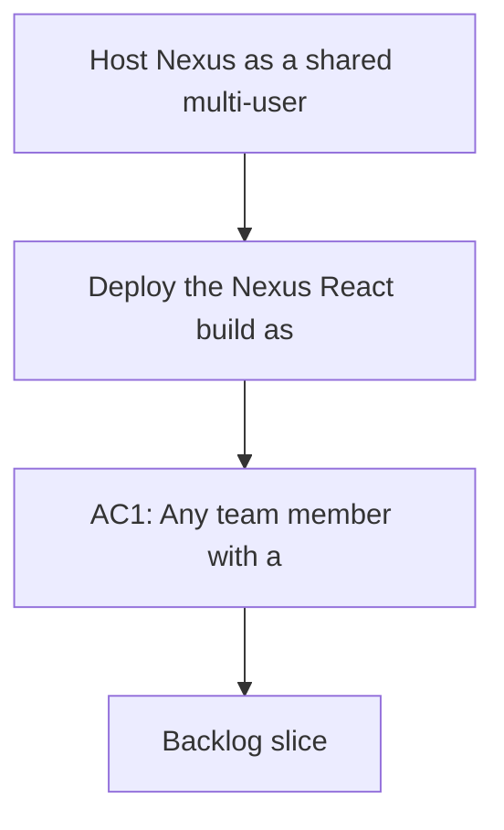

## req_020_host_nexus_as_a_shared_multi_user_web_application - Host Nexus as a shared multi-user web application

> From version: 1.3.0
> Schema version: 1.0
> Status: Ready
> Understanding: 97%
> Confidence: 96%
> Complexity: High
> Theme: Architecture / Product / Operational
> Reminder: Update status, understanding, confidence, and linked backlog or task references when you edit this doc.

# Needs

- Deploy the Nexus React build as a static web app served by Caddy on a local network machine so any team member can access it from any browser without local setup.
- Serve the shared corpus from the worker machine via a `GET /api/corpus` endpoint so all browsers see the same corpus version instead of each loading their own bundled or localStorage copy.
- Proxy Bishop LLM calls through the worker machine (`POST /api/bishop/query`) so API keys never reach the browser and team members never need to supply or know a provider key.
- Protect the hosted app with Entra SSO using MSAL browser-side integration so only team members with a Microsoft 365 account in the organization's tenant can access it.
- Enforce two access levels — team member (read: Explorer, Bishop, Sync history) and operator (read + job control + Artifacts) — using an Entra object ID allowlist in the worker configuration.
- Add a structured JSON access log on the worker (one line per validated request: timestamp, Entra object ID, endpoint, status) with daily rotation and 30-day retention.

# Context

- Nexus is currently a local-first per-operator tool: each person runs their own instance, manages their own corpus, and keeps API keys in browser localStorage. This model was right for the validation phase but blocks broader team use.
- All team members have Microsoft 365 accounts. Their machines have internet access from the local network where Nexus will be hosted. Entra SSO is therefore viable with no additional identity infrastructure.
- On Windows domain-joined machines with Edge or Chrome, the Entra login is silent — users open the Nexus URL and land in the app with no visible prompt. On other browsers, a standard Microsoft redirect takes 2–10 seconds.
- The worker boundary established in `adr_023` is the right architectural unit for this pivot: the worker already owns corpus publication, job execution, and the HTTP API. Extending it to serve the corpus endpoint and proxy LLM calls is bounded and low-risk.
- No Azure is planned. The deployment target is a local network machine running Caddy (static files + `/api/*` proxy) and a Python FastAPI worker process. Same machine is the default; separate machines on the same network are also acceptable.
- The Python FastAPI worker (`adr_035`) is the implementation runtime for all backend logic: corpus serving, bishop orchestration, scoring, job execution. The browser becomes a pure UI client in both local and hosted modes.
- Local development: Vite dev proxy forwards `/api/*` to the Python worker at `localhost:8000`. The Python worker runs alongside Vite (`uvicorn worker.main:app --reload` or `docker compose up worker`). No bundled corpus or browser-side bishop logic.
- ~~The bishop.ts split (`req_018` item_072 / `adr_033`)~~ is no longer a prerequisite — bishop.ts is removed from the browser entirely.
- `req_018` and `req_019` are the pre-migration cleanup that makes this pivot cleaner — they should land before this request is executed.

# Acceptance criteria

- AC1: Any team member with a Microsoft 365 account opens the Nexus URL on the local network and reaches the Explorer panel with the shared corpus — no local installation required.
- AC2: On a Windows domain-joined machine with Edge or Chrome, the login is silent — no redirect prompt is shown.
- AC3: The browser fetches the corpus from `GET /api/corpus` on the worker at startup. No corpus is bundled in the static build for hosted mode. All connected browsers see the same corpus version.
- AC4: Bishop queries are sent to `POST /api/bishop/query` on the worker. The worker performs grounding and calls the LLM provider with server-side keys. No API key appears in any browser network request or browser storage in hosted mode.
- AC5: The worker validates every incoming request against the Entra JWKS. Unauthenticated requests return `401`. Requests to job control or Artifacts endpoints from non-operator accounts return `403`.
- AC6: Team members see Explorer, Bishop, and Sync (read-only job history). Operators additionally see the Artifacts panel and Sync job control buttons. Access level is derived silently from the Entra token without any additional prompt.
- AC7: Adding or removing an Entra object ID from `OPERATOR_ALLOWLIST` in the worker config and restarting the worker process changes operator access within one restart cycle.
- AC8: A structured JSON access log is written by the worker for every validated request (`{ ts, oid, endpoint, status }`). Log files rotate daily and are retained for 30 days.
- AC9: The Settings panel in hosted mode shows a `Shared` label and the authenticated user's display name or email. API key input fields are hidden.
- AC10: The local development mode (`npm run dev` with mock corpus) is unaffected — no token, no MSAL, no Entra app registration required for local use.

# Definition of Ready (DoR)

- [x] Problem statement is explicit and the deployment context is documented.
- [x] All users confirmed to have Microsoft 365 accounts with internet access from the local network.
- [x] In/out scope is defined.
- [x] Acceptance criteria are testable.
- [ ] Backlog items to be created before starting.
- [x] Dependencies identified: `req_018` and `req_019` should land first as cleanup/consolidation waves, but `item_072` itself is cancelled by `adr_035` and is not a prerequisite.

# Scope

**In scope**
- Caddy static serving of the Nexus build on the local network machine + `/api/*` reverse proxy
- Python FastAPI worker service (`worker/main.py`) replacing all Node.js worker scripts
- `GET /api/corpus` endpoint on the Python worker
- `POST /api/bishop/query` LLM proxy endpoint on the Python worker
- `GET /api/config/mode` endpoint so the browser adapts its UI for hosted vs local mode
- Vite dev proxy (`/api → localhost:8000`) for local development with the Python worker
- MSAL browser-side integration (`@azure/msal-browser`) with silent SSO + redirect fallback
- Entra token validation middleware on the Python worker (`worker/auth.py`, JWKS-based, no introspection)
- Operator access gate via `OPERATOR_ALLOWLIST` (Entra object IDs in worker config)
- Structured JSON access log on the worker with daily rotation and 30-day retention
- `Shared` label in Settings and authenticated user identity in the shell
- Sign-out option clearing the MSAL session
- Entra app registration (one-time setup: SPA type, redirect URI, `Nexus.Access` scope)
- Removal of `src/lib/bishop.ts`, `src/lib/scoring.ts`, `src/lib/deepvault.ts`, and `src/data/corpus.ts` from the browser bundle

**Out of scope**
- Azure hosting — local network machine only
- Teams or Slack integration
- Guest accounts or external users outside the Entra tenant
- Per-user corpus filtering or fine-grained RBAC
- Bishop proxy streaming (SSE) — full response is acceptable in the first wave
- High-availability or geo-distributed deployment
- Session audit UI — the log file is sufficient in the first wave

# Dependencies & risks

- ~~**bishop.ts split (item_072)**~~: Cancelled (`adr_035`). Bishop moves to Python (`worker/bishop.py`); no TypeScript split is needed.
- **Python worker setup**: developers need Python 3.12+ and either `uvicorn` or Docker Desktop to run the worker locally. Document the setup steps before starting.
- **Entra app registration**: requires a one-time action by an Entra admin (add redirect URI, expose `Nexus.Access` scope). This is a soft external dependency — coordinate before starting the MSAL integration wave.
- **Single-origin proxying**: the default deployment uses Caddy to serve the static app and proxy `/api/*` to the worker on the same origin. If the team deploys static and API on different origins instead, CORS must then be configured explicitly.
- **Local network HTTPS**: Entra redirect URIs can be HTTP for localhost but Microsoft may require HTTPS for non-localhost URLs. If the local network URL is not `localhost`, Caddy should terminate HTTPS for the shared origin; validate the exact redirect URI requirements during Entra app registration.
- **Token lifetime**: Microsoft tenant defaults (1-hour access token, 24-hour refresh). No custom configuration needed. MSAL handles silent refresh.

# Companion docs

- Product brief(s): `logics/product/prod_014_host_nexus_as_a_shared_multi_user_web_application.md`, `logics/product/prod_015_user_authentication_and_access_management.md`
- Architecture decision(s): `logics/architecture/adr_034_nexus_hosted_deployment_topology_and_multi_user_access_model.md`, `logics/architecture/adr_023_split_execution_runtime_from_the_app_and_share_corpus_artifacts.md`

# AI Context

- Summary: Host Nexus as a shared multi-user web application on a local network machine — static Caddy serving, shared corpus endpoint, Bishop LLM proxy, Entra SSO with MSAL, two access levels via object ID allowlist, and a structured access log.
- Keywords: hosted, multi-user, local network, caddy, corpus endpoint, bishop proxy, entra sso, msal, operator allowlist, access log, shared deployment
- Use when: Use when planning or executing the hosted deployment pivot for Nexus. This is the next major wave after req_018 and req_019.
- Skip when: Skip for local development work, structural cleanup, or feature work that does not touch the deployment topology or authentication model.

# Backlog

- `item_080_python_fastapi_worker_foundation` — Python FastAPI foundation: /health, /config/mode, Vite dev proxy, Dockerfile
- `item_081_port_scoring_to_python_worker` — Port document scoring to worker/scoring.py
- `item_082_corpus_endpoint_and_browser_bundle_cleanup` — GET /api/corpus + remove bishop.ts/scoring.ts/deepvault.ts/corpus.ts from browser
- `item_083_bishop_proxy_endpoint` — POST /api/bishop/query on the Python worker
- `item_084_job_execution_in_python_worker` — Ingest, analyze, evaluate, export-live in Python + SSE job events
- `item_085_entra_sso_msal_and_worker_token_validation` — MSAL browser integration + JWKS token validation middleware
- `item_086_operator_allowlist_and_access_log` — OPERATOR_ALLOWLIST gate + structured JSON access log
- `item_087_hosted_mode_ui` — Identity display, Shared label, sign-out, hide API key inputs, operator-gated panels
- `item_088_docker_compose_deployment_package` — docker-compose.yml, Caddyfile, .env.example, operator runbook
