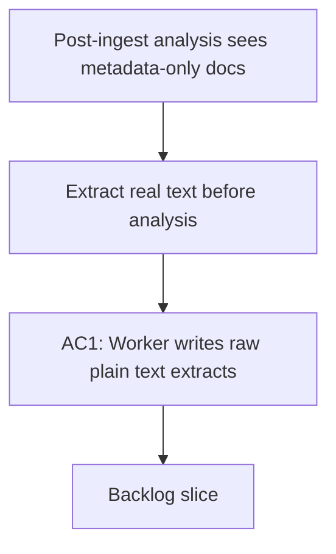

## req_021_enforce_real_text_extraction_before_post_ingest_analysis - Enforce real text extraction before post-ingest analysis
> From version: 1.5.1
> Schema version: 1.0
> Status: Proposed
> Understanding: 94%
> Confidence: 92%
> Complexity: High
> Theme: Architecture / Product / Operational
> Reminder: Update status, understanding, confidence, and linked backlog or task references when you edit this doc.

# Needs
- Extract the real plain text from SharePoint documents during ingest or export, before any analysis pass runs.
- Stop treating metadata-only fallback content as if it were the document body.
- Make metadata-only and unreadable items explicit in the corpus so analysis and retrieval can handle them conservatively.
- Ensure the analyze command consumes extracted text artifacts first and only falls back to heuristics when extraction truly failed.
- Keep the baseline corpus safe and queryable even when text extraction is unavailable.

# Context
- The current export path can fetch real text for some textual items, but when it cannot, it writes `Source: ... Path: ...` into `content`.
- That fallback is useful as a placeholder, but it is not document evidence. When analysis reads it, the model can infer a misleading "template" or "administrative" summary from metadata alone.
- The repository already defines a hybrid extraction and chunking contract in the Logics specs, so the missing piece is not the storage shape. The gap is making the worker produce and consume the extracted text as the source of truth before analysis.
- The worker runtime already owns export, job execution, and derived corpus artifacts, so this belongs in the worker pipeline rather than the browser.

# Acceptance criteria
- AC1: The worker writes raw plain-text extract artifacts for supported file types during ingest or export, and each extract includes the source metadata plus the full extracted text.
- AC2: When the worker can read a document's text, the derived corpus document uses that extracted text rather than a `Source:` / `Path:` placeholder for `content`.
- AC3: Documents that cannot be fully extracted are marked with an explicit metadata-only or unreadable state, and that state is visible in the corpus and analysis output instead of being implied.
- AC4: `npm run analyze` and any worker-backed analyze path consume extracted text first, so summaries, sections, and keywords reflect the document body when it exists.
- AC5: A `.docx` or `.pdf` fixture with real body text produces a body-grounded analysis result, while the same file represented as metadata-only remains clearly flagged as such.
- AC6: Tests cover at least one successful extraction path, one metadata-only fallback path, and one analysis run that proves the pipeline prefers extracted text.

# Definition of Ready (DoR)
- [x] Problem statement is explicit and user impact is clear.
- [x] Scope boundaries (in/out) are explicit.
- [x] Acceptance criteria are testable.
- [x] Dependencies and known risks are listed.
- [ ] Backlog items to be created before starting.

# Scope
**In scope**
- Worker-side extraction of plain text from SharePoint content during ingest or export.
- Explicit extract artifact handling for the corpus pipeline.
- Metadata-only and unreadable-state classification.
- Analysis input selection that prefers extracted text over placeholder content.
- Tests for supported extraction and fallback cases.

**Out of scope**
- OCR for image-only scans in the first wave.
- Semantic or vector retrieval changes.
- UI redesign beyond surfacing the new explicit state.
- Reworking the entire corpus schema beyond the minimum contract needed for extraction fidelity.

# Dependencies & risks
- Supported file-type coverage depends on the extraction libraries and Graph content formats available in the worker runtime.
- Scanned or image-only PDFs may still require OCR in a later wave if the source text is not available through a normal text extraction path.
- Existing corpus rows that only contain placeholder content may need a backfill pass once the extract contract is in place.
- Downstream ranking and Bishop prompt assembly may need to prefer extract-backed evidence more aggressively once the new pipeline is live.

# Companion docs
- Product brief(s): `logics/product/prod_006_improve_ingestion_metadata_and_chunking_for_bishop_hints.md`, `logics/product/prod_010_add_a_post_ingest_ai_analysis_command_for_corpus_enrichment.md`
- Architecture decision(s): `logics/architecture/adr_003_hybrid_knowledge_store_and_retrieval_model.md`, `logics/architecture/adr_016_deepvault_persistence_and_storage_layout.md`, `logics/architecture/adr_029_bound_post_ingest_analysis_contract_and_runtime_output.md`
- Spec(s): `logics/specs/spec_004_deepvault_data_schema_and_storage_contracts.md`, `logics/specs/spec_006_deepvault_prompt_and_context_assembly.md`

# AI Context
- Summary: Request to move post-ingest analysis onto real extracted text instead of metadata-only placeholder content.
- Keywords: extraction, extracts, analyze, metadata-only, docx, pdf, ingest, export, worker, corpus
- Use when: Use when the corpus analysis path is producing summaries from file metadata instead of actual document text.
- Skip when: Skip for UI-only changes or when the work does not touch ingest, export, extraction, or analysis inputs.

# Open questions
- Should metadata-only documents remain searchable in the main corpus view, or should they be visually separated from full-text documents?
- Should OCR for scanned files be part of the first wave, or explicitly deferred until the normal text-extraction path is stable?
- Should backfilling old placeholder documents happen automatically after the extract pipeline lands, or as a separate operator-triggered job?
