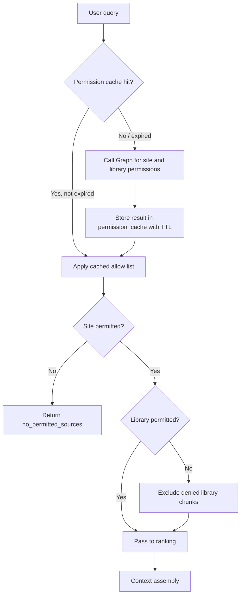

## spec_005_deepvault_permission_mapping_and_retrieval_filters - DeepVault permission mapping and retrieval filters
> From version: 0.0.1
> Understanding: 95%
> Confidence: 93%
> Related request: `logics/request/req_000_v0_bootstrap_and_initial_foundations.md`

# Overview
This spec defines how SharePoint permissions are translated into retrieval filters at query time.
It covers the three-level scope hierarchy (site, library, item), the caching strategy, inherited permission handling, and the exact behavior when access cannot be verified.
The retrieval layer must apply these filters before ranking. No chunk from a denied source should ever reach the LLM context.

# Goals
- Give engineers a concrete implementation contract for permission-aware retrieval.
- Remove ambiguity about what "permission-first" means for each SharePoint scope level.
- Define the cache model and TTLs so the team doesn't build ad-hoc session logic.

# Non-goals
- Managing SharePoint permissions themselves (read-only from Graph).
- Replacing the Microsoft Graph access control model.
- Implementing item-level filtering in V1 (explicitly deferred).

# Permission scope hierarchy

SharePoint permissions are hierarchical. DeepVault maps them to retrieval filters at three levels:

## Level 1: Site (V1 scope)
A user may only receive content from sites that are both:
1. In the configured pilot site list (`sites` table, `enabled = 1`), and
2. Accessible to the user's identity via Graph (`/sites/{site_id}/permissions` or membership check).

**Filter applied**: exclude all chunks where `chunk.site_id` is not in the user's resolved site allow list.

**Graph call**: `GET /sites/{site_id}` — if the call returns 403 or 404, the site is denied. If it succeeds (200), the user can access the site.

## Level 2: Library / List (V1 scope)
If a library or list has unique permissions (broken inheritance), the user must also pass a library-level check.

**Detection**: during ingestion, record whether each library/list has inherited or unique permissions. Store this in `sync_state` or a `containers` metadata table.

**Filter applied**: for libraries/lists with unique permissions, exclude chunks where `chunk.library_path` falls within a container the user cannot access.

**Graph call**: `GET /sites/{site_id}/drives/{drive_id}` or `GET /sites/{site_id}/lists/{list_id}` — 403 means the container is denied.

**Inherited permissions**: if a library inherits site permissions, no additional Graph call is needed. The site-level check is sufficient.

## Level 3: Item (explicitly deferred to post-V1)
Per-file permission checks are out of scope for V1. The pilot sites use standard inherited permissions, so site-level and library-level checks cover the full corpus.

Item-level filtering will be added in a future iteration when:
- A pilot site has files with broken inheritance at the item level, or
- A tenant-wide rollout requires document-level access control.

# Permission resolution flow



# Cache model

| Parameter | Local runtime | Hosted runtime |
|---|---|---|
| Cache store | `permission_cache` SQLite table | `permission_cache` Azure SQL table |
| Cache key | `"{user_upn}:{site_id}"` or `"{user_upn}:{site_id}:{container_id}"` | Same |
| Site-level TTL | 5 minutes | 15 minutes |
| Library-level TTL | 5 minutes | 15 minutes |
| Cache invalidation triggers | User sign-in, sign-out, manual refresh | Same |
| Stale cache behavior | If expired and Graph is unavailable: fail closed. Do not serve stale results. | Same |

The cache is a performance optimization only. The permission model must be correct even if the cache is cold. A cold cache must trigger a Graph resolution, not a fallback to permissive access.

# Handling Graph API unavailability

If Graph returns a non-retryable error (5xx after 3 retries, or network timeout) during permission resolution:

1. Fail closed: do not allow the query to proceed.
2. Return a structured `permission_check_failed` response to the caller.
3. Log the event in `audit_events` with `event_type = "permission_denied"` and `outcome = "failed"`.
4. Do not expose the error details to the end user. Return a generic "content access could not be verified" message.

This applies to both local and hosted runtimes. There is no fallback to permissive access under any failure condition.

# Denial response format

When a user is denied access to all sources:

```json
{
  "type": "no_permitted_sources",
  "message": "No accessible content was found for your query. Your access may be limited to specific sites.",
  "sources_checked": 0,
  "sources_permitted": 0
}
```

When a query spans mixed-scope sources (some permitted, some denied):

```json
{
  "type": "partial_access",
  "message": "This answer is based on content you have access to. Some sources were not included.",
  "sources_checked": 12,
  "sources_permitted": 8,
  "exclusion_count": 4
}
```

Rules:
- Never include the names or IDs of denied sources in any response.
- Never include the names or IDs of denied sites in any response.
- The `exclusion_count` field is informational for the user. It does not expose what was excluded.

# Inherited permission handling

| Scenario | Detection method | Action |
|---|---|---|
| Library inherits site permissions | `uniquePermissions = false` from Graph | Site-level check is sufficient. No additional Graph call. |
| Library has unique permissions (broken inheritance) | `uniquePermissions = true` from Graph | Library-level check required. Add `container_id` entry to permission cache. |
| Item has unique permissions | Not checked in V1 | Items are included/excluded based on their parent library only. |
| Site permissions include a security group | Group membership resolved via Graph at site check | If the user's UPN is not in the group, the site is denied. |

# Acceptance criteria
- A user with site access sees chunks from that site in retrieval results.
- A user without site access sees zero chunks from that site, even if the corpus contains them.
- A library with broken inheritance is checked independently of the site-level result.
- A Graph failure at permission check time always results in a `permission_check_failed` response, not a permissive fallback.
- Permission cache entries expire after the TTL and are not served stale.
- Denial responses never include the names or IDs of denied sources.

# Validation / test plan
- Configure a pilot site with a user who has access and one who does not. Confirm retrieval returns sources only for the permitted user.
- Simulate a Graph API 503 during permission check. Confirm the response is `permission_check_failed` and not an answer.
- Configure a library with unique permissions. Confirm the library-level check runs independently.
- Expire the permission cache manually. Confirm the next query triggers a fresh Graph call.
- Run `python3 logics/skills/logics-doc-linter/scripts/logics_lint.py --require-status`.

# References
- `logics/architecture/adr_001_identity_and_access_model_for_sharepoint_knowledge_graph.md`
- `logics/architecture/adr_009_permission_aware_retrieval_and_source_filtering.md`
- `logics/architecture/adr_011_observability_audit_and_answer_traceability.md`
- `logics/architecture/adr_015_deepvault_security_audit_logging_and_retention_boundaries.md`
- `logics/specs/spec_004_deepvault_data_schema_and_storage_contracts.md`
- `logics/specs/spec_002_deepvault_bishop_chat_flow_and_answer_quality.md`
- `logics/tasks/task_002_v1_ingestion_sync_and_retrieval_hardening.md`
