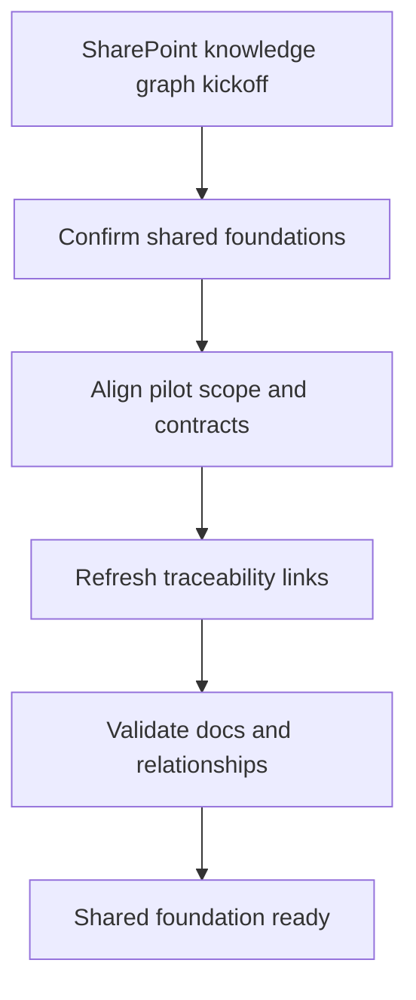

## task_000_sharepoint_foundations_and_shared_contracts - SharePoint foundations and shared contracts
> From version: 0.0.0
> Schema version: 1.0
> Status: Ready
> Understanding: 95%
> Confidence: 92%
> Progress: 0%
> Complexity: High
> Theme: General
> Reminder: Update status/understanding/confidence/progress, linked request/backlog/task references, and DeepVault/Nexus naming when you edit this doc.

# Context
This task establishes the shared foundation for the DeepVault product before surface-specific work starts.
It aligns pilot scope, configuration, ingestion, storage, retrieval, permissions, sync, provider abstraction, hosting target, and observability so later work can reuse the same contracts inside `Nexus`.
The goal is to make the rest of the delivery plan deterministic and traceable.

# Plan
- [ ] Confirm the shared scope across discovery, ingestion, storage, retrieval, sync, and provider abstraction.
- [ ] Align the key product and architecture decisions that every later task depends on.
- [ ] Confirm the Azure-first hosting target and keep Render as the documented fallback.
- [ ] Refresh the request, backlog, product, and architecture links so the workflow stays traceable.
- [ ] Validate the doc set and relationship graph after the contract updates.

# Delivery checkpoints
- Each completed wave should leave the repository in a coherent, commit-ready state.
- Update the linked Logics docs during the wave that changes the behavior, not only at final closure.
- Prefer a reviewed commit checkpoint at the end of each meaningful wave instead of accumulating several undocumented partial states.
- If the shared AI runtime is active and healthy, use `python logics/skills/logics.py flow assist commit-all` to prepare the commit checkpoint for each meaningful step, item, or wave.
- Do not mark a wave or step complete until the relevant automated tests and quality checks have been run successfully.

# AC Traceability
- `item_000_graph_discovery_and_pilot_scope` -> AC1, AC2, AC4, AC5, AC6, AC7, AC8, AC9, AC10
- `item_001_sharepoint_ingestion_and_sync_pipeline` -> AC2, AC5, AC6, AC12, AC14
- `item_002_hybrid_knowledge_store_and_retrieval` -> AC3, AC9, AC13
- `item_005_runtime_config_and_operations` -> AC4, AC5, AC14, AC15
- `item_007_llm_provider_abstraction_for_openai_and_gemini` -> AC11

# Decision framing
- Product framing: Required
- Product signals: shared scope, cross-cutting contracts, product consistency for DeepVault
- Product follow-up: Keep the product vision and strategy briefs aligned with the shared foundation.
- Architecture framing: Required
- Architecture signals: data model and persistence, state and sync, security and identity
- Architecture follow-up: Keep the shared ADRs synchronized with the task output in `Nexus`.

# Links
- Product brief(s): `logics/product/prod_000_sharepoint_knowledge_graph_product_vision.md`, `logics/product/prod_001_local_first_development_and_test_strategy.md`, `logics/product/prod_002_hosted_production_strategy_with_teams_at_the_end.md`
- Architecture decision(s): `logics/architecture/adr_001_identity_and_access_model_for_sharepoint_knowledge_graph.md`, `logics/architecture/adr_002_sharepoint_ingestion_and_sync_pipeline.md`, `logics/architecture/adr_003_hybrid_knowledge_store_and_retrieval_model.md`, `logics/architecture/adr_005_explorer_ui_for_sharepoint_navigation.md`, `logics/architecture/adr_006_runtime_configuration_and_operations.md`, `logics/architecture/adr_008_llm_provider_abstraction_for_openai_and_gemini.md`, `logics/architecture/adr_009_permission_aware_retrieval_and_source_filtering.md`, `logics/architecture/adr_010_sharepoint_sync_orchestration_and_refresh_policy.md`, `logics/architecture/adr_011_observability_audit_and_answer_traceability.md`, `logics/architecture/adr_013_hosted_backend_and_teams_chat_channel.md`
- Backlog item(s): `logics/backlog/item_000_graph_discovery_and_pilot_scope.md`, `logics/backlog/item_001_sharepoint_ingestion_and_sync_pipeline.md`, `logics/backlog/item_002_hybrid_knowledge_store_and_retrieval.md`, `logics/backlog/item_005_runtime_config_and_operations.md`, `logics/backlog/item_007_llm_provider_abstraction_for_openai_and_gemini.md`
- Request(s): `logics/request/req_000_sharepoint_knowledge_graph_kickoff.md`

# AI Context
- Summary: Shared foundations for the SharePoint knowledge product
- Keywords: foundations, contracts, ingestion, retrieval, permissions, sync, provider abstraction
- Use when: Use when aligning the cross-cutting contracts before surface-specific delivery starts.
- Skip when: Skip when the work is already narrowed to a single surface or channel.

# References
- `logics/skills/logics-flow-manager/SKILL.md`
- `logics/skills/logics-task-breakdown/SKILL.md`

# Validation
- `python3 logics/skills/logics-doc-linter/scripts/logics_lint.py --require-status`
- `python3 logics/skills/logics-relationship-linker/scripts/link_relations.py --out logics/RELATIONSHIPS.md`
- `python3 logics/skills/logics-global-reviewer/scripts/logics_global_review.py`
- `python3 logics/skills/logics-duplicate-detector/scripts/find_duplicates.py --min-score 0.55`

# Definition of Done (DoD)
- [ ] Scope implemented and acceptance criteria covered.
- [ ] Validation commands executed and results captured.
- [ ] No wave or step was closed before the relevant automated tests and quality checks passed.
- [ ] Linked request/backlog/task docs updated during completed waves and at closure.
- [ ] Each completed wave left a commit-ready checkpoint or an explicit exception is documented.
- [ ] Status is `Done` and progress is `100%`.

# Report
- Not started.
