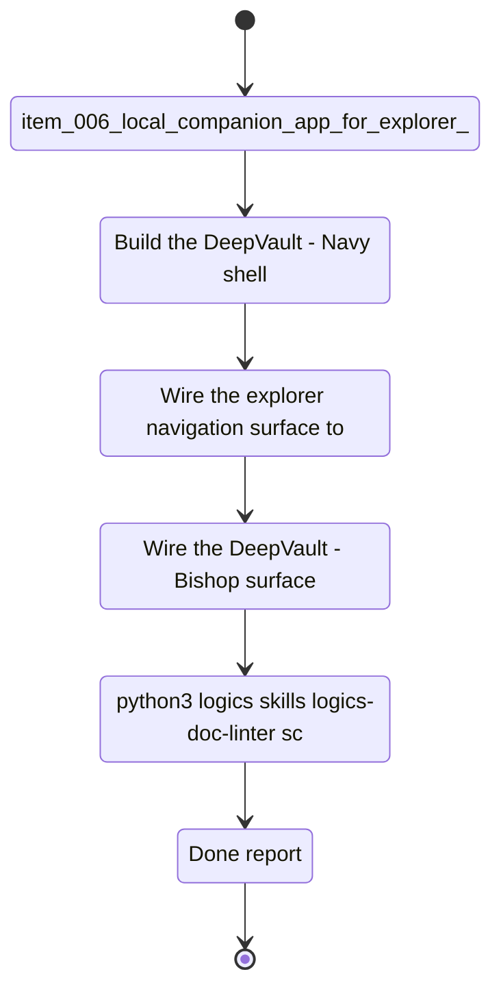

## task_001_local_companion_vertical_slice - DeepVault - Navy vertical slice
> From version: 0.0.0
> Schema version: 1.0
> Status: Ready
> Understanding: 95%
> Confidence: 92%
> Progress: 2%
> Complexity: High
> Theme: UI
> Reminder: Update status/understanding/confidence/progress, linked request/backlog/task references, and `DeepVault - Navy`/`DeepVault - Bishop` naming when you edit this doc. For any UX/UI or frontend implementation work, use `logics/skills/logics-ui-steering/SKILL.md`.

# Context
This task delivers the first complete local user flow for the DeepVault product.
It combines `DeepVault - Navy`, `DeepVault - Bishop`, and sync status so the team can validate navigation, retrieval, and answer provenance in one place.
`DeepVault - Navy` is the proving ground for UX and local test scenarios.

# Plan
- [ ] Build the `DeepVault - Navy` shell and route structure for the companion app.
- [ ] Wire the explorer navigation surface to the local data contract.
- [ ] Wire the `DeepVault - Bishop` surface to the provider abstraction and permission-aware retrieval flow.
- [ ] Add the sync and operational view so `DeepVault - Navy` can explain refresh and provenance.

# Delivery checkpoints
- Each completed wave should leave the repository in a coherent, commit-ready state.
- Update the linked Logics docs during the wave that changes the behavior, not only at final closure.
- Prefer a reviewed commit checkpoint at the end of each meaningful wave instead of accumulating several undocumented partial states.
- If the shared AI runtime is active and healthy, use `python logics/skills/logics.py flow assist commit-all` to prepare the commit checkpoint for each meaningful step, item, or wave.
- Do not mark a wave or step complete until the relevant automated tests and quality checks have been run successfully.

# AC Traceability
- `item_006_local_companion_app_for_explorer_and_chat` -> local shell, shared layout, local runtime boundary
- `item_008_local_explorer_shell_and_navigation` -> local exploration of sites, libraries, folders, and lists
- `item_009_local_chat_surface_and_answer_flow` -> grounded chat answers and source citations
- `item_010_local_sync_status_and_operational_view` -> crawl progress, refresh state, and answer provenance

# Decision framing
- Product framing: Required
- Product signals: local validation surface, fast iteration, testability for DeepVault
- Product follow-up: Keep the local-first strategy brief current as the surface evolves.
- Architecture framing: Required
- Architecture signals: browser routing, local runtime boundary, shared contracts
- Architecture follow-up: Keep the local runtime ADR and the explorer/chat ADR current in `Nexus`.

# Links
- Product brief(s): `logics/product/prod_000_sharepoint_knowledge_graph_product_vision.md`, `logics/product/prod_001_local_first_development_and_test_strategy.md`
- Architecture decision(s): `logics/architecture/adr_007_local_companion_app_architecture_for_explorer_and_chat.md`, `logics/architecture/adr_008_llm_provider_abstraction_for_openai_and_gemini.md`, `logics/architecture/adr_009_permission_aware_retrieval_and_source_filtering.md`, `logics/architecture/adr_011_observability_audit_and_answer_traceability.md`, `logics/architecture/adr_012_local_companion_runtime_for_explorer_and_chat.md`
- Backlog item(s): `logics/backlog/item_006_local_companion_app_for_explorer_and_chat.md`, `logics/backlog/item_008_local_explorer_shell_and_navigation.md`, `logics/backlog/item_009_local_chat_surface_and_answer_flow.md`, `logics/backlog/item_010_local_sync_status_and_operational_view.md`
- Request(s): `logics/request/req_000_sharepoint_knowledge_graph_kickoff.md`

# AI Context
- Summary: DeepVault - Navy vertical slice for explorer, chat, and sync
- Keywords: local, explorer, chat, sync, provenance, testability
- Use when: Use when implementing the first end-to-end local user flow.
- Skip when: Skip when the work is about hosted backend or Teams delivery.

# References
- `logics/skills/logics-flow-manager/SKILL.md`
- `logics/skills/logics-task-breakdown/SKILL.md`

# Validation
- `python3 logics/skills/logics-doc-linter/scripts/logics_lint.py --require-status`
- `python3 logics/skills/logics-relationship-linker/scripts/link_relations.py --out logics/RELATIONSHIPS.md`
- `python3 logics/skills/logics-global-reviewer/scripts/logics_global_review.py`
- `python3 logics/skills/logics-duplicate-detector/scripts/find_duplicates.py --min-score 0.55`

# Definition of Done (DoD)
- [ ] Scope implemented and acceptance criteria covered.
- [ ] Validation commands executed and results captured.
- [ ] No wave or step was closed before the relevant automated tests and quality checks passed.
- [ ] Linked request/backlog/task docs updated during completed waves and at closure.
- [ ] Each completed wave left a commit-ready checkpoint or an explicit exception is documented.
- [ ] Status is `Done` and progress is `100%`.

# Report
- Not started.
