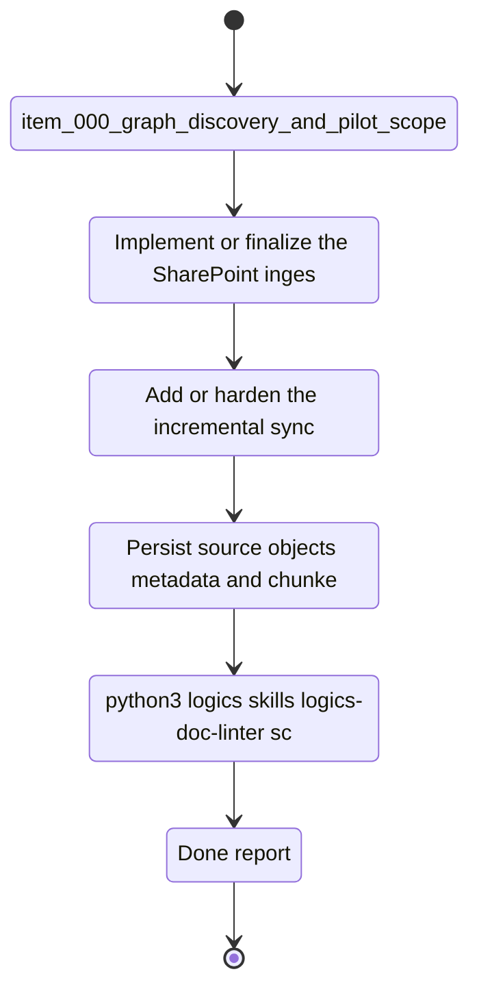

## task_002_ingestion_sync_and_retrieval_hardening - Ingestion, sync, and retrieval hardening
> From version: 0.0.0
> Schema version: 1.0
> Status: Done
> Understanding: 95%
> Confidence: 92%
> Progress: 100%
> Complexity: High
> Theme: General
> Reminder: Update status/understanding/confidence/progress and linked request/backlog/task references when you edit this doc.

# Context
This task hardens the data path that feeds the SharePoint knowledge product.
It covers Graph ingestion, incremental sync, hybrid knowledge storage, and permission-aware retrieval so the system can stay current and safe to query.
The goal is to make the data layer reliable before the hosted backend and Teams channel are layered on top.

# Plan
- [x] Implement or finalize the SharePoint ingestion path and its source selection rules.
- [x] Add or harden the incremental sync behavior, checkpoints, and refresh policy.
- [x] Persist source objects, metadata, and chunked text in the hybrid knowledge store.
- [x] Enforce permission-aware retrieval before LLM context is assembled.

# Delivery checkpoints
- Each completed wave should leave the repository in a coherent, commit-ready state.
- Update the linked Logics docs during the wave that changes the behavior, not only at final closure.
- Prefer a reviewed commit checkpoint at the end of each meaningful wave instead of accumulating several undocumented partial states.
- If the shared AI runtime is active and healthy, use `python logics/skills/logics.py flow assist commit-all` to prepare the commit checkpoint for each meaningful step, item, or wave.
- Do not mark a wave or step complete until the relevant automated tests and quality checks have been run successfully.

# AC Traceability
- `item_000_graph_discovery_and_pilot_scope` -> discovery, pilot scope, configurable site list
- `item_001_sharepoint_ingestion_and_sync_pipeline` -> ingestion, crawl order, sync, refresh
- `item_002_hybrid_knowledge_store_and_retrieval` -> hybrid store and retrieval
- `item_005_runtime_config_and_operations` -> operational config and telemetry

# Decision framing
- Product framing: Required
- Product signals: reliable content intake, freshness, trust
- Product follow-up: Keep the product vision aligned with the data model and refresh behavior.
- Architecture framing: Required
- Architecture signals: data model, state and sync, security and identity
- Architecture follow-up: Keep the ingestion, sync, and retrieval ADRs aligned with implementation.

# Links
- Product brief(s): `logics/product/prod_000_sharepoint_knowledge_graph_product_vision.md`, `logics/product/prod_002_hosted_production_strategy_with_teams_at_the_end.md`
- Architecture decision(s): `logics/architecture/adr_001_identity_and_access_model_for_sharepoint_knowledge_graph.md`, `logics/architecture/adr_002_sharepoint_ingestion_and_sync_pipeline.md`, `logics/architecture/adr_003_hybrid_knowledge_store_and_retrieval_model.md`, `logics/architecture/adr_009_permission_aware_retrieval_and_source_filtering.md`, `logics/architecture/adr_010_sharepoint_sync_orchestration_and_refresh_policy.md`, `logics/architecture/adr_011_observability_audit_and_answer_traceability.md`
- Backlog item(s): `logics/backlog/item_000_graph_discovery_and_pilot_scope.md`, `logics/backlog/item_001_sharepoint_ingestion_and_sync_pipeline.md`, `logics/backlog/item_002_hybrid_knowledge_store_and_retrieval.md`, `logics/backlog/item_005_runtime_config_and_operations.md`
- Request(s): `logics/request/req_000_sharepoint_knowledge_graph_kickoff.md`

# AI Context
- Summary: SharePoint ingestion, sync, storage, and retrieval hardening
- Keywords: ingestion, sync, retrieval, permissions, hybrid store, provenance
- Use when: Use when implementing the data path that powers answers and search.
- Skip when: Skip when the work is primarily UI or channel plumbing.

# References
- `logics/skills/logics-flow-manager/SKILL.md`
- `logics/skills/logics-task-breakdown/SKILL.md`

# Validation
- `python3 logics/skills/logics-doc-linter/scripts/logics_lint.py --require-status`
- `python3 logics/skills/logics-relationship-linker/scripts/link_relations.py --out logics/RELATIONSHIPS.md`
- `python3 logics/skills/logics-global-reviewer/scripts/logics_global_review.py`
- `python3 logics/skills/logics-duplicate-detector/scripts/find_duplicates.py --min-score 0.55`

# Definition of Done (DoD)
- [x] Scope implemented and acceptance criteria covered.
- [x] Validation commands executed and results captured.
- [x] No wave or step was closed before the relevant automated tests and quality checks passed.
- [x] Linked request/backlog/task docs updated during completed waves and at closure.
- [x] Each completed wave left a commit-ready checkpoint or an explicit exception is documented.
- [x] Status is `Done` and progress is `100%`.

# Report
- Implemented the local corpus, sync snapshot generator, and permission-aware retrieval engine.
- Validation: `npm run ingest`, `npm run evaluate`, `npm run lint`, `npm test`, `npm run build`.
- Result: local refresh state is reproducible and the baseline evaluation passes at 100%.
