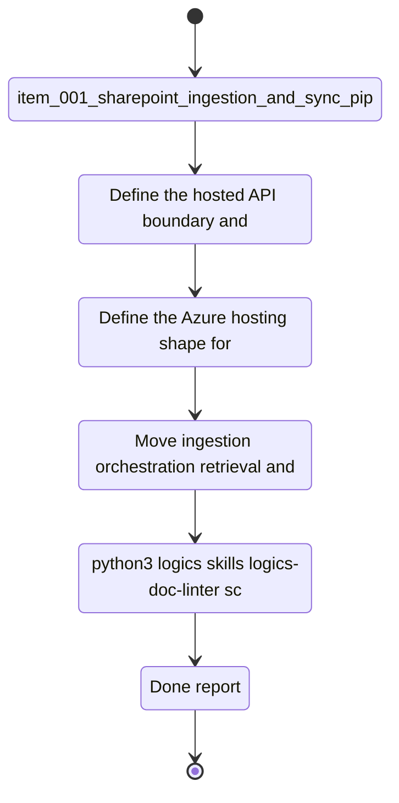

## task_003_hosted_backend_core_delivery - Hosted backend core delivery
> From version: 0.0.0
> Schema version: 1.0
> Status: Ready
> Understanding: 95%
> Confidence: 92%
> Progress: 1%
> Complexity: High
> Theme: General
> Reminder: Update status/understanding/confidence/progress, linked request/backlog/task references, and DeepVault/Nexus naming when you edit this doc.

# Context
This task extracts the shared runtime into a hosted backend that can serve multiple clients.
It centralizes ingestion orchestration, retrieval, permissions, provider routing, configuration, and observability behind one backend contract for DeepVault.
Azure is the default hosting target for this backend unless a cost or complexity check later makes Render the better fallback.
The output is the production core that the local app and Teams channel can both call.

# Plan
- [ ] Define the hosted API boundary and the shared runtime contract.
- [ ] Define the Azure hosting shape for the backend, including secrets and operations.
- [ ] Move ingestion orchestration, retrieval, and provider routing behind the backend.
- [ ] Add runtime configuration and observability hooks needed for operations.
- [ ] Verify the backend can be reused by the local app and the Teams channel.

# Delivery checkpoints
- Each completed wave should leave the repository in a coherent, commit-ready state.
- Update the linked Logics docs during the wave that changes the behavior, not only at final closure.
- Prefer a reviewed commit checkpoint at the end of each meaningful wave instead of accumulating several undocumented partial states.
- If the shared AI runtime is active and healthy, use `python logics/skills/logics.py flow assist commit-all` to prepare the commit checkpoint for each meaningful step, item, or wave.
- Do not mark a wave or step complete until the relevant automated tests and quality checks have been run successfully.

# AC Traceability
- `item_011_hosted_backend_core` -> reusable contract, retrieval orchestration, channel agnosticism
- `item_005_runtime_config_and_operations` -> runtime configuration and operations
- `item_001_sharepoint_ingestion_and_sync_pipeline` -> shared ingestion orchestration
- `item_002_hybrid_knowledge_store_and_retrieval` -> shared retrieval model

# Decision framing
- Product framing: Required
- Product signals: hosted runtime, shared services, production readiness for DeepVault
- Product follow-up: Keep the hosted production brief aligned with the backend contract.
- Architecture framing: Required
- Architecture signals: Azure hosting target, shared contracts, runtime governance
- Architecture follow-up: Keep the hosted backend ADR aligned with the implementation.

# Links
- Product brief(s): `logics/product/prod_000_sharepoint_knowledge_graph_product_vision.md`, `logics/product/prod_002_hosted_production_strategy_with_teams_at_the_end.md`
- Architecture decision(s): `logics/architecture/adr_001_identity_and_access_model_for_sharepoint_knowledge_graph.md`, `logics/architecture/adr_002_sharepoint_ingestion_and_sync_pipeline.md`, `logics/architecture/adr_003_hybrid_knowledge_store_and_retrieval_model.md`, `logics/architecture/adr_006_runtime_configuration_and_operations.md`, `logics/architecture/adr_009_permission_aware_retrieval_and_source_filtering.md`, `logics/architecture/adr_010_sharepoint_sync_orchestration_and_refresh_policy.md`, `logics/architecture/adr_011_observability_audit_and_answer_traceability.md`, `logics/architecture/adr_013_hosted_backend_and_teams_chat_channel.md`
- Spec(s): `logics/specs/spec_007_deepvault_hosted_backend_api_contract.md`
- Backlog item(s): `logics/backlog/item_011_hosted_backend_core.md`, `logics/backlog/item_005_runtime_config_and_operations.md`
- Request(s): `logics/request/req_000_sharepoint_knowledge_graph_kickoff.md`

# AI Context
- Summary: Hosted backend core for shared ingestion, retrieval, permissions, and routing
- Keywords: hosted backend, api, shared runtime, retrieval, orchestration, observability
- Use when: Use when implementing the backend that multiple clients will consume.
- Skip when: Skip when the work is primarily local UI or Teams packaging.

# References
- `logics/skills/logics-flow-manager/SKILL.md`
- `logics/skills/logics-task-breakdown/SKILL.md`

# Validation
- `python3 logics/skills/logics-doc-linter/scripts/logics_lint.py --require-status`
- `python3 logics/skills/logics-relationship-linker/scripts/link_relations.py --out logics/RELATIONSHIPS.md`
- `python3 logics/skills/logics-global-reviewer/scripts/logics_global_review.py`
- `python3 logics/skills/logics-duplicate-detector/scripts/find_duplicates.py --min-score 0.55`

# Definition of Done (DoD)
- [ ] Scope implemented and acceptance criteria covered.
- [ ] Validation commands executed and results captured.
- [ ] No wave or step was closed before the relevant automated tests and quality checks passed.
- [ ] Linked request/backlog/task docs updated during completed waves and at closure.
- [ ] Each completed wave left a commit-ready checkpoint or an explicit exception is documented.
- [ ] Status is `Done` and progress is `100%`.

# Report
- Not started.
