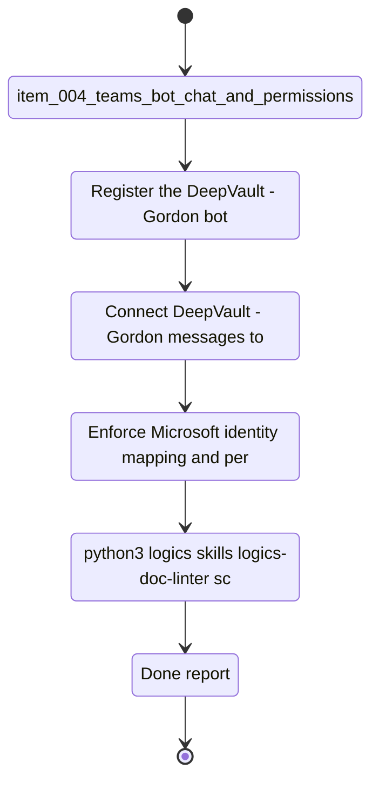

## task_004_teams_channel_and_permissions_delivery - DeepVault - Gordon channel and permissions delivery
> From version: 0.0.0
> Schema version: 1.0
> Status: Ready
> Understanding: 96%
> Confidence: 93%
> Progress: 0%
> Complexity: High
> Theme: General
> Reminder: Update status/understanding/confidence/progress, linked request/backlog/task references, and `DeepVault - Gordon` naming when you edit this doc.

# Context
This task delivers the production `DeepVault - Gordon` channel and the permission model that guards it.
It turns the hosted backend into an enterprise chat surface with Microsoft identity, message routing, and governed access checks.
The outcome is a channel that can answer safely without bypassing the retrieval rules.

# Plan
- [ ] Register the `DeepVault - Gordon` bot and wire the message ingress path.
- [ ] Connect `DeepVault - Gordon` messages to the hosted backend contract.
- [ ] Enforce Microsoft identity mapping and permission checks for each answer.
- [ ] Validate the end-to-end channel flow, including traceability and provenance.

# Delivery checkpoints
- Each completed wave should leave the repository in a coherent, commit-ready state.
- Update the linked Logics docs during the wave that changes the behavior, not only at final closure.
- Prefer a reviewed commit checkpoint at the end of each meaningful wave instead of accumulating several undocumented partial states.
- If the shared AI runtime is active and healthy, use `python logics/skills/logics.py flow assist commit-all` to prepare the commit checkpoint for each meaningful step, item, or wave.
- Do not mark a wave or step complete until the relevant automated tests and quality checks have been run successfully.

# AC Traceability
- `item_004_teams_bot_chat_and_permissions` -> channel governance, permission model, channel rules
- `item_012_teams_bot_channel_and_permissions` -> Teams routing, identity, permission enforcement

# Decision framing
- Product framing: Required
- Product signals: enterprise channel, governed chatbot, user trust
- Product follow-up: Keep the production brief aligned with the Teams channel delivery.
- Architecture framing: Required
- Architecture signals: bot auth, identity mapping, permission-aware chat
- Architecture follow-up: Keep the Teams and identity ADRs aligned with the implementation.

# Links
- Product brief(s): `logics/product/prod_000_sharepoint_knowledge_graph_product_vision.md`, `logics/product/prod_002_hosted_production_strategy_with_teams_at_the_end.md`
- Architecture decision(s): `logics/architecture/adr_001_identity_and_access_model_for_sharepoint_knowledge_graph.md`, `logics/architecture/adr_004_teams_bot_architecture_for_llm_chat.md`, `logics/architecture/adr_009_permission_aware_retrieval_and_source_filtering.md`, `logics/architecture/adr_013_hosted_backend_and_teams_chat_channel.md`
- Backlog item(s): `logics/backlog/item_004_teams_bot_chat_and_permissions.md`, `logics/backlog/item_012_teams_bot_channel_and_permissions.md`
- Request(s): `logics/request/req_000_sharepoint_knowledge_graph_kickoff.md`

# AI Context
- Summary: Teams channel delivery with governed Microsoft identity and permissions
- Keywords: teams, bot, permissions, identity, governance, chat
- Use when: Use when implementing the enterprise Teams delivery surface.
- Skip when: Skip when the work is about local-only runtime or backend internals.

# References
- `logics/skills/logics-flow-manager/SKILL.md`
- `logics/skills/logics-task-breakdown/SKILL.md`

# Validation
- `python3 logics/skills/logics-doc-linter/scripts/logics_lint.py --require-status`
- `python3 logics/skills/logics-relationship-linker/scripts/link_relations.py --out logics/RELATIONSHIPS.md`
- `python3 logics/skills/logics-global-reviewer/scripts/logics_global_review.py`
- `python3 logics/skills/logics-duplicate-detector/scripts/find_duplicates.py --min-score 0.55`

# Definition of Done (DoD)
- [ ] Scope implemented and acceptance criteria covered.
- [ ] Validation commands executed and results captured.
- [ ] No wave or step was closed before the relevant automated tests and quality checks passed.
- [ ] Linked request/backlog/task docs updated during completed waves and at closure.
- [ ] Each completed wave left a commit-ready checkpoint or an explicit exception is documented.
- [ ] Status is `Done` and progress is `100%`.

# Report
- Not started.

# Notes
