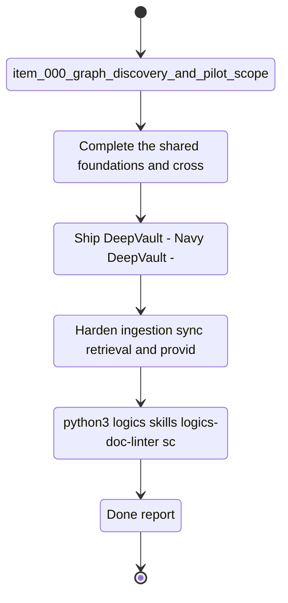

## task_005_v1_local_development_and_validation_milestone - V1 local development and validation milestone
> From version: 0.0.0
> Schema version: 1.0
> Status: Done
> Understanding: 97%
> Confidence: 94%
> Progress: 100%
> Complexity: High
> Theme: General
> Reminder: Keep this milestone focused on local development, testing, and validation. It should close only when the V1 local surfaces and shared data contracts are usable end-to-end. For any UX/UI or frontend implementation work, use `logics/skills/logics-ui-steering/SKILL.md`.

# Context
This milestone bundles the V1 work that can be executed mostly inside the repo and local environment.
It combines shared foundations, the local exploration surface, the local chatbot surface, sync visibility, and the ingestion/retrieval path needed to validate the product without Azure or Teams.
The goal is to prove the product loop before industrialization begins.

# Plan
- [x] Complete the shared foundations and cross-cutting contracts needed by V1.
- [x] Ship `DeepVault - Navy`, `DeepVault - Bishop`, and local sync visibility as one coherent local flow.
- [x] Harden ingestion, sync, retrieval, and provider abstraction for local validation.
- [x] Run the retrieval evaluation set (task_008) and confirm the quality gate passes.
- [x] Generate the project README covering: what DeepVault is, the three surfaces (Navy/Bishop/Gordon), local setup steps, environment variables required (referencing `.env.local`), how to run ingestion, how to run the local app, and how to run the evaluation set.
- [x] Validate the V1 path end-to-end and confirm it is ready for the hosted milestone.

# Delivery checkpoints
- Each completed wave should leave the repository in a coherent, commit-ready state.
- Update the linked Logics docs during the wave that changes the behavior, not only at final closure.
- Prefer a reviewed commit checkpoint at the end of each meaningful wave instead of accumulating several undocumented partial states.
- If the shared AI runtime is active and healthy, use `python logics/skills/logics.py flow assist commit-all` to prepare the commit checkpoint for each meaningful step, item, or wave.
- Do not mark a wave or step complete until the relevant automated tests and quality checks have been run successfully.

# AC Traceability
- `task_000_sharepoint_foundations_and_shared_contracts` -> shared scope, shared contracts, Azure fallback decision
- `task_001_local_companion_vertical_slice` -> `DeepVault - Navy`, `DeepVault - Bishop`, local sync visibility
- `task_002_ingestion_sync_and_retrieval_hardening` -> ingestion, sync, retrieval, permissions, provider abstraction
- `item_000_graph_discovery_and_pilot_scope` -> pilot scope and kickoff
- `item_001_sharepoint_ingestion_and_sync_pipeline` -> ingestion and refresh
- `item_002_hybrid_knowledge_store_and_retrieval` -> hybrid store and retrieval

# Decision framing
- Product framing: Required
- Product signals: local validation, fast iteration, testability for DeepVault
- Product follow-up: Keep the local-first strategy brief aligned with the V1 milestone.
- Architecture framing: Required
- Architecture signals: local runtime, data contracts, retrieval, sync
- Architecture follow-up: Keep the local runtime and data-layer ADRs synchronized with this milestone.

# Links
- Product brief(s): `logics/product/prod_000_sharepoint_knowledge_graph_product_vision.md`, `logics/product/prod_001_local_first_development_and_test_strategy.md`
- Architecture decision(s): `logics/architecture/adr_001_identity_and_access_model_for_sharepoint_knowledge_graph.md`, `logics/architecture/adr_002_sharepoint_ingestion_and_sync_pipeline.md`, `logics/architecture/adr_003_hybrid_knowledge_store_and_retrieval_model.md`, `logics/architecture/adr_005_explorer_ui_for_sharepoint_navigation.md`, `logics/architecture/adr_006_runtime_configuration_and_operations.md`, `logics/architecture/adr_007_local_companion_app_architecture_for_explorer_and_chat.md`, `logics/architecture/adr_008_llm_provider_abstraction_for_openai_and_gemini.md`, `logics/architecture/adr_009_permission_aware_retrieval_and_source_filtering.md`, `logics/architecture/adr_010_sharepoint_sync_orchestration_and_refresh_policy.md`, `logics/architecture/adr_011_observability_audit_and_answer_traceability.md`, `logics/architecture/adr_012_local_companion_runtime_for_explorer_and_chat.md`
- Related task(s): `logics/tasks/task_000_sharepoint_foundations_and_shared_contracts.md`, `logics/tasks/task_001_local_companion_vertical_slice.md`, `logics/tasks/task_002_ingestion_sync_and_retrieval_hardening.md`
- Request(s): `logics/request/req_000_sharepoint_knowledge_graph_kickoff.md`

# AI Context
- Summary: V1 local development and validation milestone for DeepVault
- Keywords: V1, local, validation, Navy, Bishop, ingestion, retrieval, sync
- Use when: Use when coordinating the local milestone before industrialization.
- Skip when: Skip when the work is about Azure hosting, Teams, or production rollout.

# References
- `logics/skills/logics-flow-manager/SKILL.md`
- `logics/skills/logics-task-breakdown/SKILL.md`

# Validation
- `python3 logics/skills/logics-doc-linter/scripts/logics_lint.py --require-status`
- `python3 logics/skills/logics-relationship-linker/scripts/link_relations.py --out logics/RELATIONSHIPS.md`
- `python3 logics/skills/logics-global-reviewer/scripts/logics_global_review.py`
- `python3 logics/skills/logics-duplicate-detector/scripts/find_duplicates.py --min-score 0.55`

# Definition of Done (DoD)
- [x] Scope implemented and acceptance criteria covered.
- [x] Validation commands executed and results captured.
- [x] No wave or step was closed before the relevant automated tests and quality checks passed.
- [x] Linked request/backlog/task docs updated during completed waves and at closure.
- [x] Each completed wave left a commit-ready checkpoint or an explicit exception is documented.
- [x] Retrieval evaluation set (task_008) passed at >= 80% on OpenAI.
- [x] Project README generated and covers: overview, surfaces, local setup, env vars, ingestion, local app, evaluation.
- [x] Status is `Done` and progress is `100%`.

# Report
- V1 local development is implemented in the repo root as a React local workspace.
- Validation: `npm run lint`, `npm test`, `npm run build`, `npm run ingest`, `npm run evaluate`, `npm run e2e`.
- Result: the local explorer, Bishop chat, sync view, ingestion snapshot, and OpenAI baseline evaluation all pass.

# Notes
