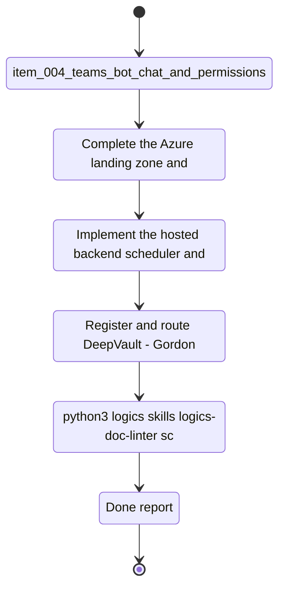

## task_006_v2_hosted_industrialization_and_teams_readiness_milestone - V2 hosted industrialization and Teams readiness milestone
> From version: 0.0.0
> Schema version: 1.0
> Status: Ready
> Understanding: 97%
> Confidence: 94%
> Progress: 0%
> Complexity: High
> Theme: General
> Reminder: Keep this milestone focused on Azure, Teams, scheduling, and production readiness. It should start only after V1 is stable and the external platform prerequisites are in place. For any UX/UI or frontend implementation work, use `logics/skills/logics-ui-steering/SKILL.md`.

# Context
This milestone bundles the work that turns the local product into a hosted, operable DeepVault service.
It covers Azure hosting, Azure Functions scheduling, GitHub Actions CI/CD, secrets, storage, observability, Teams bot/channel readiness, and rollout controls.
It also acts as the preflight checklist for starting the industrialization chantier.

# Launch checklist
- [ ] Azure subscription and access are confirmed.
- [ ] Resource group, naming, and environment split are decided.
- [ ] Compute, storage, retrieval index, Key Vault, and monitoring targets are provisioned or ready to provision.
- [ ] Managed identity or service principal strategy is defined.
- [ ] GitHub Actions permissions and secrets are ready for build and deploy automation.
- [ ] Azure Functions timer trigger plan is approved for hosted refresh jobs.
- [ ] Teams app registration, bot credentials, and channel/test tenant are available.
- [ ] Graph and SharePoint permissions are confirmed for the hosted runtime.
- [ ] A rollback or disable plan exists for the first production slice.

# Plan
- [ ] Complete the Azure landing zone and secret-management shape for the hosted backend.
- [ ] Implement the hosted backend, scheduler, and CI/CD path that production will use.
- [ ] Register and route `DeepVault - Gordon` through the hosted backend with governed identity and permissions.
- [ ] Validate production readiness, including monitoring, rollback, and rollout controls.

# Delivery checkpoints
- Each completed wave should leave the repository in a coherent, commit-ready state.
- Update the linked Logics docs during the wave that changes the behavior, not only at final closure.
- Prefer a reviewed commit checkpoint at the end of each meaningful wave instead of accumulating several undocumented partial states.
- If the shared AI runtime is active and healthy, use `python logics/skills/logics.py flow assist commit-all` to prepare the commit checkpoint for each meaningful step, item, or wave.
- Do not mark a wave or step complete until the relevant automated tests and quality checks have been run successfully.

# AC Traceability
- `task_003_hosted_backend_core_delivery` -> hosted API, Azure hosting shape, config, observability
- `task_004_teams_channel_and_permissions_delivery` -> Teams routing, identity mapping, permission checks
- `item_011_hosted_backend_core` -> reusable contract, channel agnosticism
- `item_012_teams_bot_channel_and_permissions` -> Teams routing and permissions
- `item_005_runtime_config_and_operations` -> runtime configuration and operations
- `item_004_teams_bot_chat_and_permissions` -> governance and channel rules

# Decision framing
- Product framing: Required
- Product signals: hosted runtime, governance, production readiness for DeepVault
- Product follow-up: Keep the hosted production brief aligned with the industrialization milestone.
- Architecture framing: Required
- Architecture signals: Azure hosting, scheduler, Teams bot, permissions, operational governance
- Architecture follow-up: Keep the hosted backend and Teams ADRs synchronized with this milestone.

# Links
- Product brief(s): `logics/product/prod_000_sharepoint_knowledge_graph_product_vision.md`, `logics/product/prod_002_hosted_production_strategy_with_teams_at_the_end.md`
- Architecture decision(s): `logics/architecture/adr_001_identity_and_access_model_for_sharepoint_knowledge_graph.md`, `logics/architecture/adr_002_sharepoint_ingestion_and_sync_pipeline.md`, `logics/architecture/adr_003_hybrid_knowledge_store_and_retrieval_model.md`, `logics/architecture/adr_004_teams_bot_architecture_for_llm_chat.md`, `logics/architecture/adr_006_runtime_configuration_and_operations.md`, `logics/architecture/adr_009_permission_aware_retrieval_and_source_filtering.md`, `logics/architecture/adr_010_sharepoint_sync_orchestration_and_refresh_policy.md`, `logics/architecture/adr_011_observability_audit_and_answer_traceability.md`, `logics/architecture/adr_013_hosted_backend_and_teams_chat_channel.md`, `logics/architecture/adr_016_deepvault_persistence_and_storage_layout.md`
- Related task(s): `logics/tasks/task_003_hosted_backend_core_delivery.md`, `logics/tasks/task_004_teams_channel_and_permissions_delivery.md`
- Request(s): `logics/request/req_000_sharepoint_knowledge_graph_kickoff.md`

# AI Context
- Summary: V2 hosted industrialization and Teams readiness milestone for DeepVault
- Keywords: V2, Azure, Teams, scheduler, hosting, production, readiness
- Use when: Use when coordinating the hosted and Teams milestone after V1 is stable.
- Skip when: Skip when the work is limited to local development or validation.

# References
- `logics/skills/logics-flow-manager/SKILL.md`
- `logics/skills/logics-task-breakdown/SKILL.md`

# Validation
- `python3 logics/skills/logics-doc-linter/scripts/logics_lint.py --require-status`
- `python3 logics/skills/logics-relationship-linker/scripts/link_relations.py --out logics/RELATIONSHIPS.md`
- `python3 logics/skills/logics-global-reviewer/scripts/logics_global_review.py`
- `python3 logics/skills/logics-duplicate-detector/scripts/find_duplicates.py --min-score 0.55`

# Definition of Done (DoD)
- [ ] Scope implemented and acceptance criteria covered.
- [ ] Validation commands executed and results captured.
- [ ] No wave or step was closed before the relevant automated tests and quality checks passed.
- [ ] Linked request/backlog/task docs updated during completed waves and at closure.
- [ ] Each completed wave left a commit-ready checkpoint or an explicit exception is documented.
- [ ] Status is `Done` and progress is `100%`.

# Report
- Not started.

# Notes
