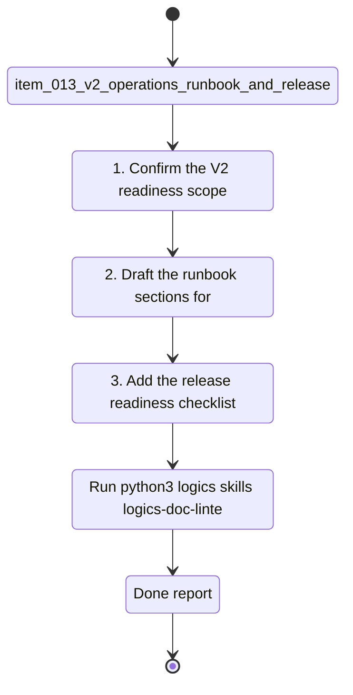

## task_007_v2_operations_runbook_and_release_readiness - V2 operations runbook and release readiness
> From version: 0.0.2
> Schema version: 1.0
> Status: Ready
> Understanding: 95%
> Confidence: 90%
> Progress: 1%
> Complexity: High
> Theme: General
> Reminder: Update status/understanding/confidence/progress and linked request/backlog references when you edit this doc.

# Context
- Execute the bounded delivery slice for V2 operations runbook and release readiness.
- The work should produce a practical launch guide for Azure, rollback, secrets, monitoring, and release gates.

# Plan
- [ ] 1. Confirm the V2 readiness scope, dependencies, and launch gates.
- [ ] 2. Draft the runbook sections for deploy, rollback, disable, secrets, and smoke checks.
- [ ] 3. Add the release readiness checklist for approvals, monitoring, and incident response.
- [ ] 4. Link the task back to the backlog, product brief, and ADRs.
- [ ] CHECKPOINT: leave the current wave commit-ready and update the linked Logics docs before continuing.
- [ ] CHECKPOINT: if the shared AI runtime is active and healthy, run `python logics/skills/logics.py flow assist commit-all` for the current step, item, or wave commit checkpoint.
- [ ] GATE: do not close a wave or step until the relevant automated tests and quality checks have been run successfully.
- [ ] FINAL: Update related Logics docs and release checklist artifacts

# Delivery checkpoints
- Each completed wave should leave the repository in a coherent, commit-ready state.
- Update the linked Logics docs during the wave that changes the behavior, not only at final closure.
- Prefer a reviewed commit checkpoint at the end of each meaningful wave instead of accumulating several undocumented partial states.
- If the shared AI runtime is active and healthy, use `python logics/skills/logics.py flow assist commit-all` to prepare the commit checkpoint for each meaningful step, item, or wave.
- Do not mark a wave or step complete until the relevant automated tests and quality checks have been run successfully.

# AC Traceability
- AC1 -> Scope: Draft the runbook sections for deploy, rollback, disable, secrets, and smoke checks.. Proof: capture validation evidence in this doc.
- AC2 -> Scope: Add the release readiness checklist for approvals, monitoring, and incident response.. Proof: capture validation evidence in this doc.
- AC3 -> Scope: Keep the task bounded to the V2 operations slice and link it back to the backlog item.. Proof: capture validation evidence in this doc.

# Decision framing
- Product framing: Not needed
- Product signals: production readiness, supportability, release safety
- Product follow-up: Keep the hosted production brief aligned with the release criteria.
- Architecture framing: Required
- Architecture signals: Azure release process, rollback, secrets, audit boundaries
- Architecture follow-up: Keep the hosted backend and security ADRs synchronized with this task.

# Links
- Product brief(s): `logics/product/prod_002_hosted_production_strategy_with_teams_at_the_end.md`
- Architecture decision(s): `logics/architecture/adr_006_runtime_configuration_and_operations.md`, `logics/architecture/adr_013_hosted_backend_and_teams_chat_channel.md`, `logics/architecture/adr_015_deepvault_security_audit_logging_and_retention_boundaries.md`
- Backlog item: `logics/backlog/item_013_v2_operations_runbook_and_release_readiness.md`
- Request(s): `logics/request/req_000_sharepoint_knowledge_graph_kickoff.md`

# AI Context
- Summary: V2 operations runbook and release readiness task for DeepVault
- Keywords: operations, runbook, release, readiness, rollback, secrets
- Use when: Use when executing the current implementation wave for the V2 launch guide.
- Skip when: Skip when the work belongs to another backlog item or a different execution wave.
# Validation
- Run `python3 logics/skills/logics-doc-linter/scripts/logics_lint.py --require-status`.
- Run `python3 logics/skills/logics-relationship-linker/scripts/link_relations.py --out logics/RELATIONSHIPS.md`.
- Run `python3 logics/skills/logics-global-reviewer/scripts/logics_global_review.py --out /tmp/deepvault_global_review.md`.
- Confirm the completed wave leaves the repository in a commit-ready state.

# Definition of Done (DoD)
- [ ] Scope implemented and acceptance criteria covered.
- [ ] Validation commands executed and results captured.
- [ ] No wave or step was closed before the relevant automated tests and quality checks passed.
- [ ] Linked request/backlog/task docs updated during completed waves and at closure.
- [ ] Each completed wave left a commit-ready checkpoint or an explicit exception is documented.
- [ ] Status is `Done` and progress is `100%`.

# Report
