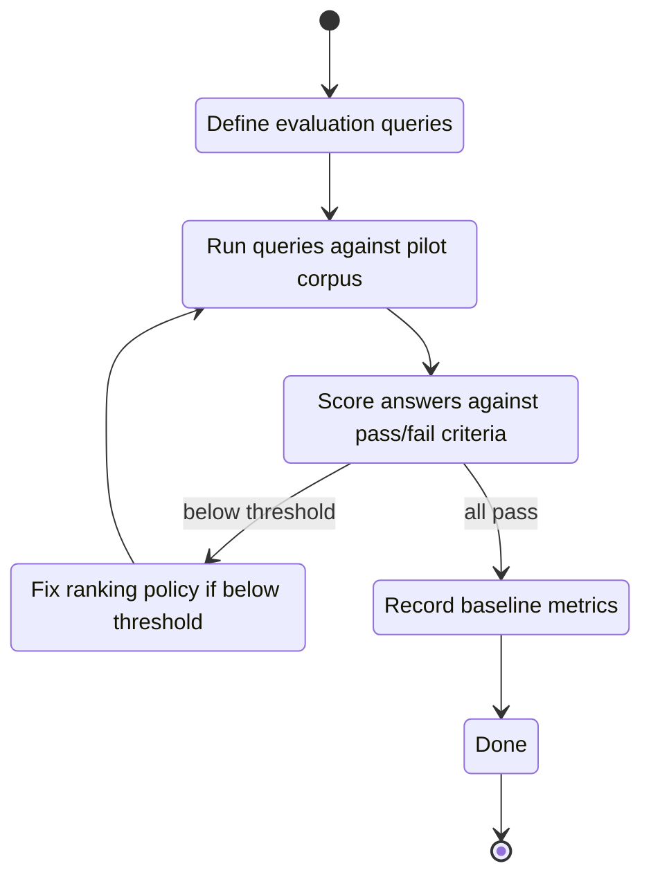

## task_008_retrieval_evaluation_set_and_quality_gates - Retrieval evaluation set and quality gates
> From version: 0.0.1
> Schema version: 1.0
> Status: Ready
> Understanding: 95%
> Confidence: 93%
> Progress: 0%
> Complexity: Medium
> Theme: Quality

# Context
- Define and run the V1 retrieval evaluation set that determines whether the pilot is ready to move to V2.
- The evaluation set is a small corpus of representative queries with expected sources and pass/fail criteria.
- No implementation work should advance past V1 without the evaluation set being run and passing.

# Plan
- [ ] 1. Confirm the pilot corpus is fully ingested and indexed before running any queries.
- [ ] 2. Run the 20 evaluation queries below against the local Bishop chat surface.
- [ ] 3. Score each answer against the pass/fail criteria.
- [ ] 4. If fewer than 16 of 20 queries pass, investigate ranking or ingestion issues before advancing.
- [ ] 5. Record the baseline metrics for each passing query (score, chunk count, token count, latency).
- [ ] 6. Re-run after any ranking weight or threshold change to confirm no regression.
- [ ] GATE: do not close V1 or advance to V2 until the evaluation set passes at 80% or above.

# Evaluation queries

The queries below are intentionally diverse: factual lookups, summary requests, cross-document synthesis, and permission-boundary cases. They should be adapted to match the actual pilot site content before running.

| ID | Query | Expected behavior | Pass criteria |
|---|---|---|---|
| Q01 | "What is the budget for Q3 2025?" | Returns answer with a citation from a financial document | Citation present, source is a document from a Finance site |
| Q02 | "Who is the project lead for Project Alpha?" | Returns a name with a citation from a project charter or HR document | Citation present, answer matches the document content |
| Q03 | "What were the decisions made in the last board meeting?" | Returns bullet points from a meeting notes document | At least one citation from a meeting notes or minutes document |
| Q04 | "What are the IT security requirements for remote access?" | Returns policy content with a citation from an IT or policy library | Citation from a policy document. No hallucinated requirements. |
| Q05 | "Summarize the Q4 2024 product roadmap." | Returns a multi-point summary with citations | Citations present. Answer is a summary, not a verbatim copy. |
| Q06 | "What is the onboarding process for new employees?" | Returns process steps with citations from HR content | At least one citation from an HR library |
| Q07 | "What are the current open risks on the Alpha project?" | Returns a list of risks from a risk register or project doc | Citation from a project document. Risk items match the source. |
| Q08 | "Who approved the infrastructure spend for FY2025?" | Returns a name or team reference with a citation | Citation present. Answer is attributed to a named approver if present in the source. |
| Q09 | "What is the escalation path for a P1 incident?" | Returns a structured escalation process | Citation from an IT ops or incident management document |
| Q10 | "Explain the data classification policy." | Returns a structured policy summary | Citation from a policy document. No fabricated policy items. |
| Q11 | "What tools are approved for use by the engineering team?" | Returns a list or table of approved tools | Citation from an IT or engineering policy document |
| Q12 | "What is the deadline for the Q1 2026 compliance audit?" | Returns a date or timeline with a citation | Citation present. Date matches the source document. |
| Q13 | "Give me a summary of the Alpha project status as of last month." | Returns a status summary | Citation from a project status report. Freshness signal present. |
| Q14 | "What SharePoint sites are available for the Finance team?" | Should return a no-answer or a general response based on ingested content — this query is about structure, not knowledge | No hallucinated list of sites. Response is honest about the scope of what DeepVault knows. |
| Q15 | "What are the quarterly OKRs for the product team?" | Returns OKR items with citations | Citation from an OKR or strategy document |
| Q16 | "Who should I contact for budget approval?" | Returns a name or role reference with a citation | Citation from a relevant document. No fabricated contact information. |
| Q17 | "What is the vendor onboarding checklist?" | Returns checklist items with a citation | Citation from a procurement or vendor management document |
| Q18 | "What are the known issues with the current SSO implementation?" | Returns issue descriptions with a citation | Citation from an IT or engineering document. Issues match the source. |
| Q19 | [Permission boundary test] Ask a question about content from a site the test user does NOT have access to | Should return `no_permitted_sources` or `partial_access` | Zero chunks from the denied site appear in the answer or sources array |
| Q20 | [Empty retrieval test] Ask a question about a topic completely absent from the pilot corpus | Should return the no-answer response | No LLM call made. Answer clearly states no relevant content was found. |

# Pass/fail criteria per query

A query **passes** if all of the following hold:
1. At least one citation is present in the answer (except Q14, Q19, Q20 which have specific criteria above).
2. The cited source exists in the pilot corpus and matches the answer content.
3. The answer does not include fabricated facts (verified against the source document).
4. No chunk from a permission-denied source appears in the `sources` array.
5. The response is returned in under 15 seconds end-to-end (local runtime).

A query **fails** if any of the following occur:
- No citation is returned when the content exists in the corpus.
- A citation points to a source that does not match the answer claim.
- A denied source appears in the answer or `sources` array.
- The response is a generic chatbot answer with no grounding.
- The LLM call is made when `chunk_count = 0` (testable via logs).

# Quality gate thresholds (V1 closure)

| Metric | Threshold | Action if below |
|---|---|---|
| Query pass rate | ≥ 80% (16 of 20) | Investigate ranking weights or ingestion gaps before advancing to V2 |
| Permission boundary test (Q19) | Must pass 100% | Block V1 closure. Permission leakage is a hard blocker. |
| Empty retrieval test (Q20) | Must pass 100% | Block V1 closure. Hallucinated answers without sources are a hard blocker. |
| Max end-to-end latency (local) | ≤ 15 seconds | Warn if exceeded. Not a hard blocker for V1, but must be addressed before V2. |
| Token budget exceeded | 0 queries | Block V1 closure. Any query exceeding 8,000 context tokens is a hard blocker. |

# Baseline metrics to record

For each passing query, record:
- `query_id` (Q01–Q20)
- `chunk_count` (how many chunks were assembled)
- `token_count` (context token count)
- `source_count` (how many distinct sources were cited)
- `latency_ms` (end-to-end response time)
- `provider` (openai or gemini)
- `pass` (true/false)
- `notes` (any notable observation about the answer or source quality)

Store these results in `data/eval/v1_baseline_{YYYY-MM-DD}.json` for future regression comparison.

# AC Traceability
- AC1 -> Pilot corpus is fully ingested before evaluation. Proof: sync_state shows all sources as `synced`.
- AC2 -> All 20 queries run without runtime errors. Proof: evaluation log with no exceptions.
- AC3 -> Pass rate ≥ 80% and hard blockers all pass. Proof: evaluation result file with per-query outcomes.
- AC4 -> Baseline metrics recorded and stored. Proof: `data/eval/v1_baseline_{date}.json` present.

# Links
- Product brief(s): `logics/product/prod_001_local_first_development_and_test_strategy.md`
- Architecture decision(s): `logics/architecture/adr_009_permission_aware_retrieval_and_source_filtering.md`, `logics/architecture/adr_014_deepvault_retrieval_ranking_quality_and_cost_policy.md`
- Spec(s): `logics/specs/spec_002_deepvault_bishop_chat_flow_and_answer_quality.md`, `logics/specs/spec_003_deepvault_pilot_site_onboarding_and_retrieval_quality.md`, `logics/specs/spec_006_deepvault_prompt_and_context_assembly.md`
- Backlog item: `logics/backlog/item_002_hybrid_knowledge_store_and_retrieval.md`
- Request(s): `logics/request/req_000_sharepoint_knowledge_graph_kickoff.md`

# AI Context
- Summary: V1 retrieval evaluation set and quality gates for DeepVault
- Keywords: evaluation, quality gate, retrieval, ranking, pilot, citations, permissions
- Use when: Running the V1 quality gate before closing the local validation milestone.
- Skip when: Skip when work belongs to ingestion, sync, or UI tasks not related to retrieval quality.

# Validation
- Run `python3 logics/skills/logics-doc-linter/scripts/logics_lint.py --require-status`.
- Run `python3 logics/skills/logics-relationship-linker/scripts/link_relations.py --out logics/RELATIONSHIPS.md`.
- Confirm the evaluation result file is present and the pass rate meets the threshold.

# Definition of Done (DoD)
- [ ] All 20 evaluation queries run against the pilot corpus without runtime errors.
- [ ] Pass rate ≥ 80%. Hard blockers (Q19, Q20, token budget) pass 100%.
- [ ] Baseline metrics recorded in `data/eval/v1_baseline_{date}.json`.
- [ ] No ranking or permission issues discovered that are not tracked in the backlog.
- [ ] Status is `Done` and progress is `100%`.

# Report
