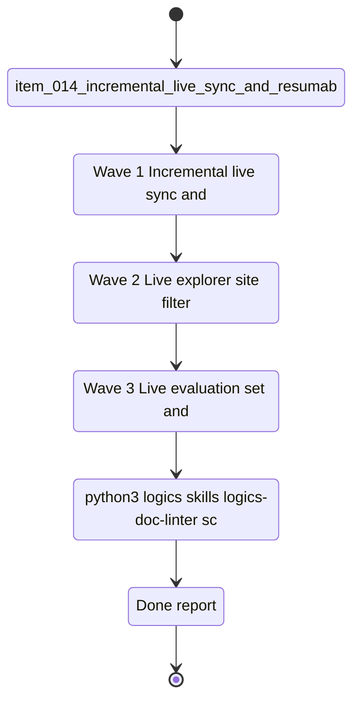

## task_009_local_hardening_and_v1_scope_evolution - V1 scope evolution — local hardening and live delivery
> From version: 1.0.2
> Schema version: 1.0
> Status: Done
> Understanding: 97%
> Confidence: 95%
> Progress: 100%
> Complexity: High
> Theme: General
> Reminder: Update status/understanding/confidence/progress and linked request/backlog/task references when you edit this doc. This task contains everything that can be executed locally without Azure or Teams. For any UX/UI or frontend implementation work, use `logics/skills/logics-ui-steering/SKILL.md`.

# Context
This task represents the evolution of the V1 scope: everything that extends, hardens, and completes the local product without introducing Azure or Teams dependencies.
The V1 foundations, local surfaces, ingestion, and the baseline evaluation are already shipped.
What remains in V1 is hardening the live data path, tightening the explorer UX, wiring the live quality gate, and cleaning the backlog and docs so the V1 scope is fully closed.
The goal is to close V1 with a stable, well-tested local product and a clean slate.

## What is already done in V1 (do not re-implement)
- SharePoint foundations and shared contracts: scope confirmed, contracts aligned.
- DeepVault - Navy vertical slice: explorer, Bishop chat, and sync surfaces shipped.
- Ingestion, sync, and retrieval hardening: local corpus, snapshot generator, and permission-aware retrieval complete.
- V1 local development and validation milestone: end-to-end local flow validated and README generated.
- Retrieval evaluation set and quality gates: V1 baseline passed at 100% on OpenAI, stored in `data/eval/v1_baseline_2026-04-10.json`.

# Plan
- [x] **Wave 1 — Incremental live sync and crawl resilience** (`item_014` + `item_017`): implement incremental live sync, resumable export, crawl checkpoints, progress visibility, memory guards, and artifact governance.
- [x] **Wave 2 — Live explorer site filter alignment** (`item_015`): make the selected site actually bound live explorer results; keep list, detail, and navigation state aligned.
- [x] **Wave 3 — Live evaluation set and quality gate** (`item_016`): build the live evaluation set, wire the deterministic quality gate, and record a live baseline that reflects exported SharePoint content.
- [x] **Wave 4 — V1 backlog and doc cleanup** (`item_018`): split any remaining broad items, clean the doc framing, and keep the V1 scope clearly closed.
- [x] After each wave: run the relevant validation commands, update the linked Logics docs, and leave a reviewed commit checkpoint before starting the next wave.
- [x] Close the task only after all waves are complete, the live validation path is green, and the V1 scope is cleanly closed.

# Delivery checkpoints
- Each wave must end in a coherent, commit-ready repository state.
- Do not start the next wave until the current wave has passed its relevant tests and quality checks.
- Keep the linked request, backlog items, and support docs updated during the wave that changes behavior.
- If the shared AI runtime is healthy, prefer `python logics/skills/logics.py flow assist commit-all` for the checkpoint commit of each meaningful wave.
- Do not mark the task complete until the live export, live ingest, live evaluation, and live UI checks have all been exercised in the final state.

# AC Traceability
- `item_014_v1_incremental_live_sync_and_resumable_export` -> Wave 1 incremental sync and resumable export.
- `item_017_v1_crawl_resilience_and_artifact_governance` -> Wave 1 crawl resilience, memory guards, and artifact governance.
- `item_015_v1_live_explorer_site_filter_alignment` -> Wave 2 live explorer site filtering.
- `item_016_v1_live_evaluation_set_and_quality_gate` -> Wave 3 live evaluation set and quality gate.
- `item_018_v1_pre_v2_backlog_and_doc_cleanup` -> Wave 4 V1 backlog cleanup and doc framing.

# Decision framing
- Product framing: Required
- Product signals: reliability, UX trust, live quality, V1 scope closure
- Product follow-up: Keep the local-first strategy brief aligned with the V1 scope evolution and live corpus quality bar.
- Architecture framing: Required
- Architecture signals: sync orchestration, state and persistence, retrieval quality, audit and retention
- Architecture follow-up: Keep the sync policy, storage layout, and security boundary ADRs aligned with the wave output.

# Links
- Product brief(s): `logics/product/prod_001_local_first_development_and_test_strategy.md`
- Architecture decision(s): `logics/architecture/adr_005_explorer_ui_for_sharepoint_navigation.md`, `logics/architecture/adr_010_sharepoint_sync_orchestration_and_refresh_policy.md`, `logics/architecture/adr_014_deepvault_retrieval_ranking_quality_and_cost_policy.md`, `logics/architecture/adr_015_deepvault_security_audit_logging_and_retention_boundaries.md`, `logics/architecture/adr_016_deepvault_persistence_and_storage_layout.md`
- Request: `logics/request/req_001_v1_local_hardening_and_scope_evolution.md`
- Backlog items: `logics/backlog/item_014_v1_incremental_live_sync_and_resumable_export.md`, `logics/backlog/item_015_v1_live_explorer_site_filter_alignment.md`, `logics/backlog/item_016_v1_live_evaluation_set_and_quality_gate.md`, `logics/backlog/item_017_v1_crawl_resilience_and_artifact_governance.md`, `logics/backlog/item_018_v1_pre_v2_backlog_and_doc_cleanup.md`

# AI Context
- Summary: V1 scope evolution — live sync hardening, explorer UX, live quality gate, and V1 closure. No Azure or Teams dependency.
- Keywords: V1, local, live export, incremental sync, explorer filter, evaluation gate, cleanup
- Use when: Use for any work that runs locally without Azure or Teams.
- Skip when: Skip when the work requires Azure hosting or Teams channel wiring.

# References
- `logics/skills/logics-flow-manager/SKILL.md`
- `logics/skills/logics-task-breakdown/SKILL.md`

# Validation
- `python3 logics/skills/logics-doc-linter/scripts/logics_lint.py --require-status`
- `python3 logics/skills/logics-relationship-linker/scripts/link_relations.py --out logics/RELATIONSHIPS.md`
- `python3 logics/skills/logics-indexer/scripts/generate_index.py --out logics/INDEX.md`
- `npm run export:live`
- `npm run ingest:live -- --input public/live-corpus.json`
- `npm run evaluate:live -- --input public/live-corpus.json`
- `VITE_DEEPVAULT_DATA_MODE=live npm run dev`
- `npm run e2e`

# Definition of Done (DoD)
- [x] All four waves complete and their backlog items linked back to this task.
- [x] Each wave passed its relevant validation before the next wave started.
- [x] The live export, ingest, evaluation, and UI checks are green in the final state.
- [x] The V1 scope is cleanly closed in docs and roadmap views.
- [x] Status is `Done` and progress is `100%`.

# Report
- Completed:
  - Live export checkpointing was added so reruns can reuse completed site exports.
  - Live explorer site filtering keeps the detail pane within the selected site scope.
  - Live evaluation reports an explicit quality gate and supports strict failure mode.
  - The README documents checkpointing and strict live evaluation runs.
  - Wave 4 cleanup normalized the V1 closure docs and marked the cleanup backlog item complete.
- Validation completed:
  - `npm run lint`
  - `npm run typecheck`
  - `npm run build`
  - `npm run test`
  - `npm run export:live -- --mode mock`
  - `npm run ingest:live -- --input public/live-corpus.json`
  - `npm run evaluate:live -- --input public/live-corpus.json --strict --min-pass-rate 1`
  - `python3 logics/skills/logics-doc-linter/scripts/logics_lint.py --require-status`

# Notes
- Keep this task focused on the local V1 closure scope.
