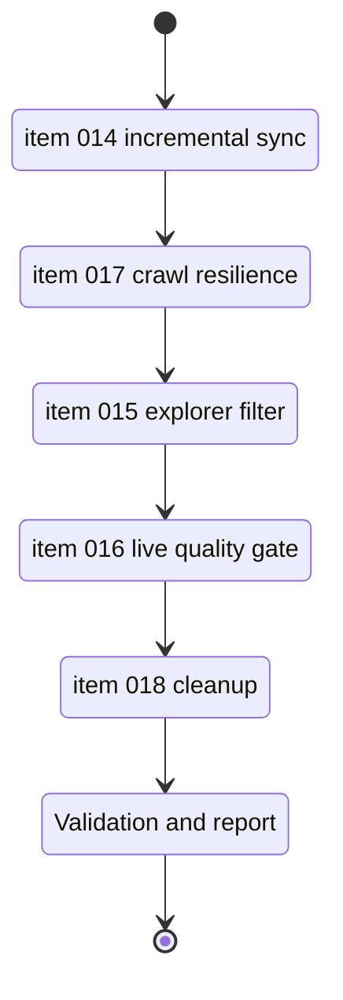

## task_009_pre_v2_live_hardening_milestone - Pre-V2 live hardening milestone
> From version: 1.0.0
> Schema version: 1.0
> Status: Ready
> Understanding: 95%
> Confidence: 92%
> Progress: 0%
> Complexity: High
> Theme: Operations
> Reminder: Keep this milestone focused on orchestrating the pre-V2 live hardening items. Do not pull hosted backend or Teams delivery into this task.

# Context
- This milestone coordinates the remaining pre-V2 work that sits between the local V1 release and the future hosted V2 line.
- The live export path is already real, but it still needs incremental sync, crawl resilience, live UI alignment, live quality gating, and cleanup discipline before V2 work starts.
- Each wave in this task should leave the repository in a commit-ready state and should be validated before moving to the next wave.

# Plan
- [ ] 1. Baseline the pre-V2 live path and confirm the current export, ingest, evaluate, and live UI states before changing behavior.
- [ ] 2. Execute item_014 and item_017 together as the first hardening wave: incremental live sync, resumable export, crawl checkpoints, progress visibility, memory guards, and artifact governance.
- [ ] 3. Execute item_015 as the second wave: make the selected site actually bound the live explorer results and keep list, detail, and navigation state aligned.
- [ ] 4. Execute item_016 as the third wave: build the live evaluation set, wire the deterministic quality gate, and record a live baseline that reflects exported SharePoint content.
- [ ] 5. Execute item_018 as the final pre-V2 hygiene wave: split any remaining broad items, clean the doc framing, and keep the roadmap clearly separated from hosted V2 delivery.
- [ ] 6. After each wave, run the relevant validation commands, update the linked Logics docs, and leave a reviewed commit checkpoint before starting the next wave.
- [ ] 7. Close the milestone only after all five backlog items are complete, the live validation path is green, and the remaining pre-V2 scope is clearly separated from V2.

# Delivery checkpoints
- Each wave must end in a coherent, commit-ready repository state.
- Do not start the next wave until the current wave has passed its relevant tests and quality checks.
- Keep the linked request, backlog items, and support docs updated during the wave that changes behavior.
- If the shared AI runtime is healthy, prefer `python logics/skills/logics.py flow assist commit-all` for the checkpoint commit of each meaningful wave.
- Do not mark the milestone complete until the live export, live ingest, live evaluation, and live UI checks have all been exercised in the final state.

# AC Traceability
- `item_014_incremental_live_sync_and_resumable_export` -> Wave 1 incremental sync and resumable export.
- `item_017_crawl_resilience_and_artifact_governance` -> Wave 1 crawl resilience, memory guards, and artifact governance.
- `item_015_live_explorer_site_filter_alignment` -> Wave 2 live explorer site filtering.
- `item_016_live_evaluation_set_and_quality_gate` -> Wave 3 live evaluation set and quality gate.
- `item_018_pre_v2_backlog_and_doc_cleanup` -> Wave 4 backlog cleanup and doc framing.

# Decision framing
- Product framing: Required
- Product signals: reliability, UX trust, live quality, roadmap clarity
- Product follow-up: Keep the local-first strategy aligned with the pre-V2 sequencing and the live corpus quality bar.
- Architecture framing: Required
- Architecture signals: sync orchestration, state and persistence, retrieval quality, audit and retention
- Architecture follow-up: Keep the sync policy, storage layout, and security boundary ADRs aligned with the milestone waves.

# Links
- Product brief(s): `logics/product/prod_001_local_first_development_and_test_strategy.md`
- Architecture decision(s): `logics/architecture/adr_005_explorer_ui_for_sharepoint_navigation.md`, `logics/architecture/adr_010_sharepoint_sync_orchestration_and_refresh_policy.md`, `logics/architecture/adr_014_deepvault_retrieval_ranking_quality_and_cost_policy.md`, `logics/architecture/adr_015_deepvault_security_audit_logging_and_retention_boundaries.md`, `logics/architecture/adr_016_deepvault_persistence_and_storage_layout.md`
- Request: `logics/request/req_001_live_corpus_hardening_and_pre_v2_cleanup.md`
- Backlog items: `logics/backlog/item_014_incremental_live_sync_and_resumable_export.md`, `logics/backlog/item_015_live_explorer_site_filter_alignment.md`, `logics/backlog/item_016_live_evaluation_set_and_quality_gate.md`, `logics/backlog/item_017_crawl_resilience_and_artifact_governance.md`, `logics/backlog/item_018_pre_v2_backlog_and_doc_cleanup.md`

# AI Context
- Summary: Orchestration milestone for the remaining pre-V2 live hardening items.
- Keywords: pre-V2, live export, incremental sync, explorer filter, evaluation gate, cleanup
- Use when: Use when sequencing the remaining hardening work before the hosted V2 line.
- Skip when: Skip when the work is already a single bounded backlog item or when the scope is hosted backend and Teams delivery.

# Validation
- `python3 logics/skills/logics-doc-linter/scripts/logics_lint.py --require-status`
- `python3 logics/skills/logics-relationship-linker/scripts/link_relations.py --out logics/RELATIONSHIPS.md`
- `python3 logics/skills/logics-indexer/scripts/generate_index.py --out logics/INDEX.md`
- `npm run export:live`
- `npm run ingest:live -- --input public/live-corpus.json`
- `npm run evaluate:live -- --input public/live-corpus.json`
- `VITE_DEEPVAULT_DATA_MODE=live npm run dev`
- `npm run e2e`

# Definition of Done (DoD)
- [ ] All five backlog items are complete and linked back to this milestone.
- [ ] Each wave passed its relevant validation before the next wave started.
- [ ] The live export, ingest, evaluation, and UI checks are green in the final state.
- [ ] The remaining pre-V2 work is clearly separated from hosted V2 delivery in the docs and roadmap views.
- [ ] Status is `Done` and progress is `100%`.

# Report
- Pending execution.

# Notes
- Derived from request `req_001_live_corpus_hardening_and_pre_v2_cleanup`.
- Keep this task bounded to orchestration, checkpoints, validation, and coordination of the linked backlog items.
