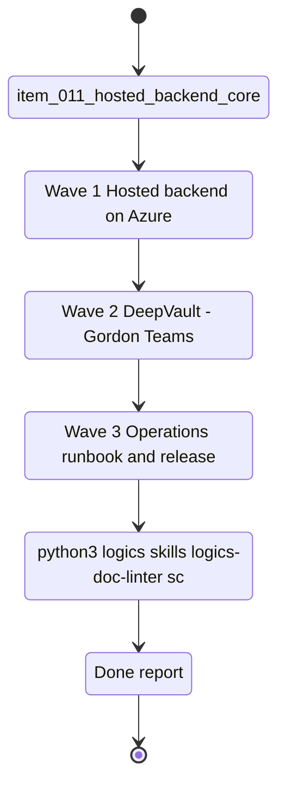

## task_010_v2_azure_and_teams_delivery - V2 Azure and Teams delivery
> From version: 0.0.2
> Schema version: 1.0
> Status: Draft
> Understanding: 95%
> Confidence: 92%
> Progress: 0%
> Complexity: High
> Theme: General
> Reminder: This task is V2 — do not prioritize or start until `task_001_local_hardening_and_pre_v2_delivery` is complete and the team is ready to introduce Azure and Teams dependencies. Update status/understanding/confidence/progress and linked references when you edit this doc.

# Context
This task consolidates all work that requires Azure hosting or Microsoft Teams.
It is deliberately deferred to V2. Nothing here should be started while local debugging and pre-V2 hardening are still in progress.
The scope covers: hosted backend deployment on Azure, the DeepVault - Gordon Teams bot, Microsoft identity mapping, permission enforcement in the channel, operations runbook, and the full V2 release readiness sequence.

**Start condition**: `task_001_local_hardening_and_pre_v2_delivery` must be `Done` and the team must have confirmed Azure prerequisites (subscription, App Registration, Key Vault, Bot Framework registration) before this task opens.

# Plan
- [ ] **Wave 1 — Hosted backend on Azure** (`item_011`): define the Azure hosting shape (compute, storage, Key Vault, monitoring); move ingestion orchestration, retrieval, and provider routing behind the hosted API contract; verify the backend is reachable by the local app and Teams.
- [ ] **Wave 2 — DeepVault - Gordon Teams channel** (`item_012`): register the bot, wire message routing to the hosted backend, enforce Microsoft identity mapping and permission checks for each answer, validate the end-to-end channel flow with traceability and provenance.
- [ ] **Wave 3 — Operations runbook and release readiness** (`item_013`): draft the runbook for deploy, rollback, disable, secrets, and smoke checks; add the release readiness checklist for approvals, monitoring, and incident response; confirm all launch gates before handoff.
- [ ] After each wave: run the relevant validation commands, update the linked Logics docs, and leave a reviewed commit checkpoint before starting the next wave.
- [ ] Close the task only when the hosted backend, Teams channel, and release checklist are all green end to end.

# Delivery checkpoints
- Each completed wave should leave the repository in a coherent, commit-ready state.
- Update the linked Logics docs during the wave that changes the behavior, not only at final closure.
- Prefer a reviewed commit checkpoint at the end of each meaningful wave instead of accumulating several undocumented partial states.
- If the shared AI runtime is active and healthy, use `python logics/skills/logics.py flow assist commit-all` to prepare the commit checkpoint for each meaningful step, item, or wave.
- Do not mark a wave or step complete until the relevant automated tests and quality checks have been run successfully.

# AC Traceability
- `item_011_hosted_backend_core` -> Azure hosting shape, runtime config, and shared backend contract.
- `item_012_teams_bot_channel_and_permissions` -> Teams routing, bot registration, Microsoft identity mapping, and permission checks.
- `item_013_v2_operations_runbook_and_release_readiness` -> runbook, approvals, monitoring, and launch safety.

# Decision framing
- Product framing: Required
- Product signals: hosted runtime, enterprise chat surface, production readiness, operational clarity
- Product follow-up: Keep the hosted production brief aligned with the Azure and Teams delivery slice.
- Architecture framing: Required
- Architecture signals: Azure hosting, bot auth, Microsoft identity, permissions, monitoring, release process
- Architecture follow-up: Keep the hosted backend, Teams, and security ADRs synchronized with this task.

# Links
- Product brief(s): `logics/product/prod_000_sharepoint_knowledge_graph_product_vision.md`, `logics/product/prod_002_hosted_production_strategy_with_teams_at_the_end.md`
- Architecture decision(s): `logics/architecture/adr_001_identity_and_access_model_for_sharepoint_knowledge_graph.md`, `logics/architecture/adr_004_teams_bot_architecture_for_llm_chat.md`, `logics/architecture/adr_006_runtime_configuration_and_operations.md`, `logics/architecture/adr_009_permission_aware_retrieval_and_source_filtering.md`, `logics/architecture/adr_013_hosted_backend_and_teams_chat_channel.md`, `logics/architecture/adr_015_deepvault_security_audit_logging_and_retention_boundaries.md`, `logics/architecture/adr_016_deepvault_persistence_and_storage_layout.md`
- Spec(s): `logics/specs/spec_001_deepvault_gordon_teams_channel_experience_and_rollout.md`, `logics/specs/spec_007_deepvault_hosted_backend_api_contract.md`
- Backlog item(s): `logics/backlog/item_011_hosted_backend_core.md`, `logics/backlog/item_012_teams_bot_channel_and_permissions.md`, `logics/backlog/item_013_v2_operations_runbook_and_release_readiness.md`
- Request(s): `logics/request/req_000_v0_bootstrap_and_initial_foundations.md`

# AI Context
- Summary: V2 delivery slice — Azure hosting, Teams channel, and release readiness for DeepVault. Deferred, do not start before V1 local hardening is done.
- Keywords: V2, Azure, Teams, hosted backend, bot, identity, runbook, release, production
- Use when: Use when the team is ready to introduce Azure and Teams dependencies after local hardening is complete.
- Skip when: Skip if any local debugging or V1 scope work is still open — use `task_009` instead.

# References
- `logics/skills/logics-flow-manager/SKILL.md`
- `logics/skills/logics-task-breakdown/SKILL.md`

# Validation
- `python3 logics/skills/logics-doc-linter/scripts/logics_lint.py --require-status`
- `python3 logics/skills/logics-relationship-linker/scripts/link_relations.py --out logics/RELATIONSHIPS.md`
- `python3 logics/skills/logics-global-reviewer/scripts/logics_global_review.py`
- `python3 logics/skills/logics-duplicate-detector/scripts/find_duplicates.py --min-score 0.55`

# Definition of Done (DoD)
- [ ] `task_001_local_hardening_and_pre_v2_delivery` is `Done` before this task starts.
- [ ] Azure prerequisites confirmed (subscription, App Registration, Key Vault, Bot Framework registration).
- [ ] All three waves complete and their backlog items linked back to this task.
- [ ] Each wave passed its relevant validation before the next wave started.
- [ ] Hosted backend, Teams channel, and release checklist are all green end to end.
- [ ] Status is `Done` and progress is `100%`.

# Report
- Not started. Deferred to V2.

# Notes
- This task intentionally consolidates what were previously task_003, task_004, task_006, task_007, and task_010.
- Do not pull local-only work into this task — that belongs in `task_009`.
- Keep Azure provisioning and Teams routing details here, not in local hardening work.
