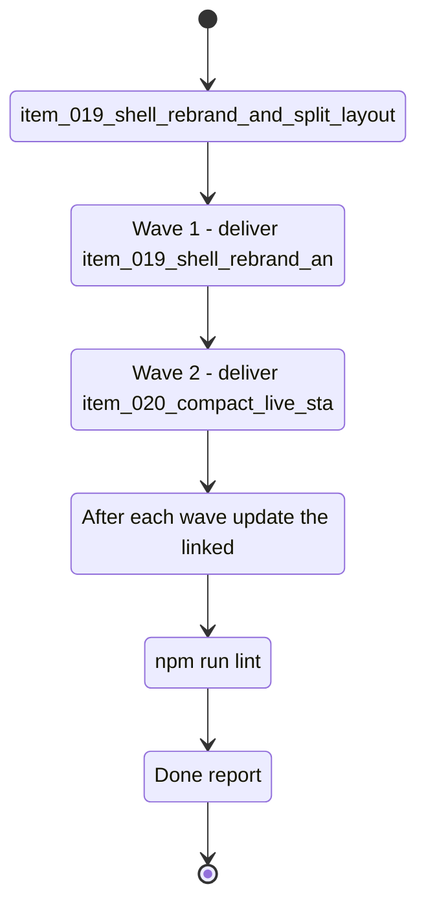

## task_011_nexus_v1_1_shell_and_live_state_delivery - Nexus V1.1 shell and live state delivery
> From version: 1.0.0
> Schema version: 1.0
> Status: In progress
> Understanding: 95%
> Confidence: 92%
> Progress: 50%
> Complexity: Medium
> Theme: UI
> Reminder: Update status/understanding/confidence/progress and linked request/backlog references when you edit this doc.

# Context
- Execute the two bounded delivery slices for Nexus V1.1 shell and live state delivery.

# Plan
- [x] Wave 1 - deliver `item_019_shell_rebrand_and_split_layout`: shell rebrand, title/subtitle copy, favicon, and split layout.
- [ ] Wave 2 - deliver `item_020_compact_live_state_and_sync_panels`: compact panels, hover details, and live-state color treatment.
- [x] After each wave, update the linked Logics docs, run the relevant validations, and leave a commit-ready checkpoint.
- [x] CHECKPOINT: if the shared AI runtime is active and healthy, run `python logics/skills/logics.py flow assist commit-all` for the current wave checkpoint.
- [x] GATE: do not close a wave or step until the relevant automated tests and quality checks have been run successfully.
- [ ] FINAL: Update related Logics docs and close the orchestration task only after both waves are complete.

# Delivery checkpoints
- Each completed wave should leave the repository in a coherent, commit-ready state.
- Update the linked Logics docs during the wave that changes the behavior, not only at final closure.
- Prefer a reviewed commit checkpoint at the end of each wave instead of accumulating several undocumented partial states.
- If the shared AI runtime is active and healthy, use `python logics/skills/logics.py flow assist commit-all` to prepare the commit checkpoint for each meaningful step, item, or wave.
- Do not mark a wave or step complete until the relevant automated tests and quality checks have been run successfully.

# AC Traceability
- item_019_shell_rebrand_and_split_layout -> Wave 1 shell rebrand and split layout.
- item_020_compact_live_state_and_sync_panels -> Wave 2 compact live state and sync panels.

# Decision framing
- Product framing: Not needed
- Product signals: (none detected)
- Product follow-up: No product brief follow-up is expected based on current signals.
- Architecture framing: Not needed
- Architecture signals: (none detected)
- Architecture follow-up: No architecture decision follow-up is expected based on current signals.

# Links
- Product brief(s): `logics/product/prod_001_local_first_development_and_test_strategy.md`
- Architecture decision(s): (none yet)
- Backlog item(s): `logics/backlog/item_019_shell_rebrand_and_split_layout.md`, `logics/backlog/item_020_compact_live_state_and_sync_panels.md`
- Request(s): `logics/request/req_003_nexus_v1_1_ui_and_product_polish.md`

# AI Context
- Summary: Nexus V1.1 shell and live state delivery
- Keywords: nexus, shell, and, live, state
- Use when: Use when executing the current implementation wave for Nexus V1.1 shell and live state delivery.
- Skip when: Skip when the work belongs to another backlog item or a different execution wave.
# Validation
- `npm run lint`
- `npm run typecheck`
- `npm run test`
- `npm run build`
- `npm run export:live`

# Definition of Done (DoD)
- [ ] Both waves are complete and their backlog items are linked back to this task.
- [ ] Each wave passed its relevant validation before the next wave started.
- [ ] The request, backlog items, and task docs stayed synchronized during the delivery.
- [ ] Each completed wave left a commit-ready checkpoint.
- [ ] Status is `Done` and progress is `100%`.

# Report
- Wave 1 completed:
  - Removed the left brand panel and replaced it with a compact Nexus wordmark line.
  - Renamed the primary shell title to `Nexus` and aligned the browser tab title.
  - Swapped the subtitle to use the real repository version from `VERSION`.
  - Rewrote the top-level copy to read like a commercial product surface.
  - Added a Nexus-branded favicon and kept the shell layout split with independent scrolling.
- Validation completed for wave 1:
  - `npm run lint`
  - `npm run typecheck`
  - `npm run test`
  - `npm run build`
