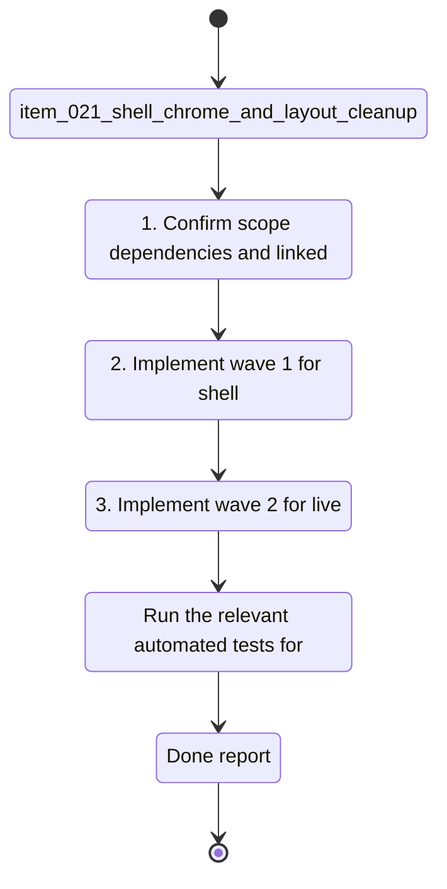

## task_012_nexus_v1_1_remaining_polish_orchestration - Nexus V1.1 remaining polish orchestration
> From version: 1.0.0
> Schema version: 1.0
> Status: Ready
> Understanding: 93%
> Confidence: 91%
> Progress: 75%
> Complexity: Medium
> Theme: General
> Reminder: Update status/understanding/confidence/progress and linked request/backlog references when you edit this doc.

# Context
- Orchestrate the remaining Nexus V1.1 polish request across the four bounded backlog items.

# Plan
- [x] 1. Confirm scope, dependencies, and linked acceptance criteria for `item_021`, `item_022`, `item_023`, and `item_024`.
- [x] 2. Implement wave 1 for shell chrome and layout cleanup.
- [x] 3. Implement wave 2 for live state and status density polish.
- [x] 4. Implement wave 3 for Bishop response flow and answer trace polish.
- [ ] 5. Implement wave 4 for path display and hover cleanup.
- [ ] 6. Validate each wave, keep the wave commit-ready, and update the linked Logics docs before continuing.
- [ ] CHECKPOINT: leave the current wave commit-ready and update the linked Logics docs before continuing.
- [ ] CHECKPOINT: if the shared AI runtime is active and healthy, run `python logics/skills/logics.py flow assist commit-all` for the current step, item, or wave commit checkpoint.
- [ ] GATE: do not close a wave or step until the relevant automated tests and quality checks have been run successfully.
- [ ] FINAL: Update related Logics docs and close the task when all four slices are complete.

# Delivery checkpoints
- Each completed wave should leave the repository in a coherent, commit-ready state.
- Update the linked Logics docs during the wave that changes the behavior, not only at final closure.
- Prefer a reviewed commit checkpoint at the end of each meaningful wave instead of accumulating several undocumented partial states.
- If the shared AI runtime is active and healthy, use `python logics/skills/logics.py flow assist commit-all` to prepare the commit checkpoint for each meaningful step, item, or wave.
- Do not mark a wave or step complete until the relevant automated tests and quality checks have been run successfully.

# AC Traceability
- AC1 -> Scope: Orchestrate the remaining Nexus V1.1 polish request across the four bounded backlog items. Proof: capture validation evidence in this doc.

# Decision framing
- Product framing: Not needed
- Product signals: (none detected)
- Product follow-up: No product brief follow-up is expected based on current signals.
- Architecture framing: Not needed
- Architecture signals: (none detected)
- Architecture follow-up: No architecture decision follow-up is expected based on current signals.

# Links
- Product brief(s): (none yet)
- Architecture decision(s): (none yet)
- Backlog item(s): `item_021_shell_chrome_and_layout_cleanup`, `item_022_live_state_and_status_density_polish`, `item_023_bishop_response_flow_and_answer_trace_polish`, `item_024_path_display_and_hover_cleanup`
- Request(s): `req_004_nexus_v1_1_remaining_polish_and_bishop_ux_follow_up`

# AI Context
- Summary: Nexus V1.1 remaining polish orchestration
- Keywords: nexus, remaining, polish, orchestration
- Use when: Use when executing the current implementation wave for Nexus V1.1 remaining polish orchestration.
- Skip when: Skip when the work belongs to another backlog item or a different execution wave.
# Validation
- Run the relevant automated tests for the changed surface before closing the current wave or step.
- Run the relevant lint or quality checks before closing the current wave or step.
- Confirm the completed wave leaves the repository in a commit-ready state.

# Definition of Done (DoD)
- [ ] Scope implemented and acceptance criteria covered.
- [ ] Validation commands executed and results captured.
- [ ] No wave or step was closed before the relevant automated tests and quality checks passed.
- [ ] Linked request/backlog/task docs updated during completed waves and at closure.
- [ ] Each completed wave left a commit-ready checkpoint or an explicit exception is documented.
- [ ] Status is `Done` and progress is `100%`.

# Report
- Wave 1 completed: shell chrome and layout cleanup shipped, including subtitle removal, left-menu analytics removal, and product-facing top copy.
- Validation passed for wave 1: `rtk npm run test -- tests/app.spec.tsx`, `rtk npm run lint`, `rtk npm run typecheck`, `rtk npm run build`.
- Wave 2 completed: live state labels and compact status density updated, including shorter live state wording and a compact last refresh value.
- Validation passed for wave 2: `rtk npm run test`, `rtk npm run lint`, `rtk npm run typecheck`, `rtk npm run build`.
- Wave 3 completed: Bishop now shows a visible thinking step, disables send while answering, and resolves to the final grounded answer after a short delay.
- Validation passed for wave 3: `rtk npm run test`, `rtk npm run lint`, `rtk npm run typecheck`, `rtk npm run build`.
