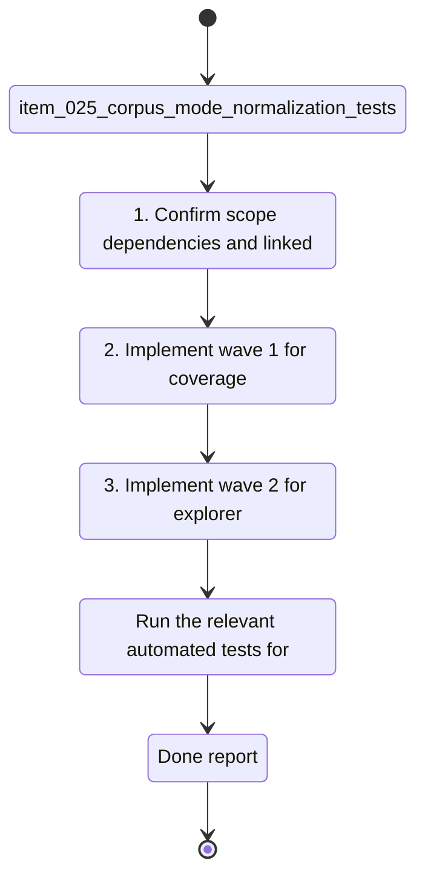

## task_013_coverage_and_explorer_polish_orchestration - Coverage and explorer polish orchestration
> From version: 1.0.0
> Schema version: 1.0
> Status: Done
> Understanding: 93%
> Confidence: 90%
> Progress: 100%
> Complexity: Medium
> Theme: UI
> Reminder: Keep this task focused on the three follow-up requests and their six backlog slices. Split again if a wave grows beyond one coherent implementation pass.

# Context
- Orchestrate the coverage uplift and explorer visual polish follow-ups across three bounded waves.

# Plan
- [x] 1. Confirm scope, dependencies, and linked acceptance criteria for `item_025`, `item_026`, `item_027`, `item_028`, `item_029`, and `item_030`.
- [x] 2. Implement wave 1 for coverage foundations.
- [x] 3. Implement wave 2 for explorer card hierarchy and visual polish.
- [x] 4. Implement wave 3 for compact paths in explorer excerpts and summaries.
- [x] 5. Validate each wave, keep the wave commit-ready, and update the linked Logics docs before continuing.
- [x] CHECKPOINT: leave the current wave commit-ready and update the linked Logics docs before continuing.
- [x] CHECKPOINT: if the shared AI runtime is active and healthy, run `python logics/skills/logics.py flow assist commit-all` for the current step, item, or wave commit checkpoint.
- [x] GATE: do not close a wave or step until the relevant automated tests and quality checks have been run successfully.
- [x] FINAL: Update related Logics docs and close the task when all six slices are complete.

# Delivery checkpoints
- Each completed wave should leave the repository in a coherent, commit-ready state.
- Update the linked Logics docs during the wave that changes the behavior, not only at final closure.
- Prefer a reviewed commit checkpoint at the end of each meaningful wave instead of accumulating several undocumented partial states.
- If the shared AI runtime is active and healthy, use `python logics/skills/logics.py flow assist commit-all` to prepare the commit checkpoint for each meaningful step, item, or wave.
- Do not mark a wave or step complete until the relevant automated tests and quality checks have been run successfully.

# AC Traceability
- AC1 -> Scope: Orchestrate the coverage uplift and explorer visual polish follow-ups across three bounded waves. Proof: capture validation evidence in this doc.
- AC5 -> TODO: map this acceptance criterion to scope. Proof: TODO.
- AC6 -> TODO: map this acceptance criterion to scope. Proof: TODO.

# Decision framing
- Product framing: Not needed
- Product signals: (none detected)
- Product follow-up: No product brief follow-up is expected based on current signals.
- Architecture framing: Not needed
- Architecture signals: (none detected)
- Architecture follow-up: No architecture decision follow-up is expected based on current signals.

# Links
- Product brief(s): (none yet)
- Architecture decision(s): (none yet)
- Backlog item(s): `item_025_corpus_mode_normalization_tests`, `item_026_live_corpus_fetch_branch_coverage`, `item_027_deepvault_retrieval_branch_coverage`, `item_028_explorer_card_hierarchy_cleanup`, `item_029_explorer_badge_and_source_line_polish`, `item_030_compact_paths_in_explorer_excerpts_and_summaries`
- Request(s): `req_005_coverage_uplift_for_corpus_mode_live_fetch_and_deepvault_core`, `req_006_explorer_card_hierarchy_and_visual_polish`, `req_007_compact_paths_in_explorer_excerpts_and_summaries`

# AI Context
- Summary: Coverage and explorer polish orchestration
- Keywords: coverage, explorer, polish, orchestration
- Use when: Use when executing the current implementation wave for Coverage and explorer polish orchestration.
- Skip when: Skip when the work belongs to another backlog item or a different execution wave.
# Validation
- Run the relevant automated tests for the changed surface before closing the current wave or step.
- Run the relevant lint or quality checks before closing the current wave or step.
- Confirm the completed wave leaves the repository in a commit-ready state.

# Definition of Done (DoD)
- [x] Scope implemented and acceptance criteria covered.
- [x] Validation commands executed and results captured.
- [x] No wave or step was closed before the relevant automated tests and quality checks passed.
- [x] Linked request/backlog/task docs updated during completed waves and at closure.
- [x] Each completed wave left a commit-ready checkpoint or an explicit exception is documented.
- [x] Status is `Done` and progress is `100%`.

# Report
- Wave 1 completed: corpus mode normalization, live corpus fetch branches, and deepvault retrieval paths are covered with focused tests.
- Validation passed for wave 1: `rtk npm run test:coverage`, `rtk npm run lint`, `rtk npm run typecheck`.
- Wave 2 completed: explorer cards now read with a clearer title hierarchy and a less dominant score badge.
- Validation passed for wave 2: `rtk npm run test`, `rtk npm run lint`, `rtk npm run typecheck`, `rtk npm run build`.
- Wave 3 completed: compact paths now render inline in explorer summaries and source excerpts, with the full path preserved on hover/copy affordances.
- Validation passed for wave 3: `rtk npm run test -- tests/app.spec.tsx`, `rtk npm run lint`, `rtk npm run typecheck`.
