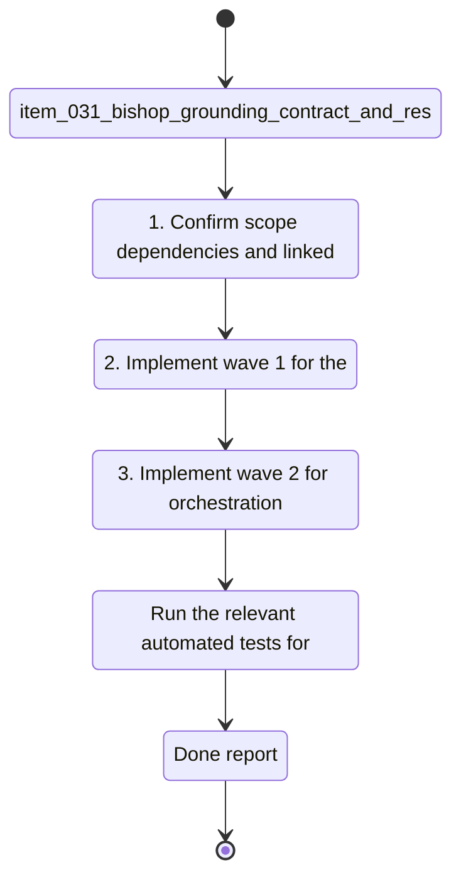

## task_014_bishop_llm_orchestration_delivery - Bishop LLM orchestration delivery
> From version: 1.0.0
> Schema version: 1.0
> Status: In progress
> Understanding: 94%
> Confidence: 92%
> Progress: 67%
> Complexity: Medium
> Theme: General
> Reminder: Update status/understanding/confidence/progress and linked request/backlog references when you edit this doc.

# Context
- Execute the Bishop LLM orchestration delivery across three bounded waves.

# Plan
- [x] 1. Confirm scope, dependencies, and linked acceptance criteria for `item_031`, `item_032`, and `item_033`.
- [x] 2. Implement wave 1 for the grounding contract and response shape.
- [x] 3. Implement wave 2 for orchestration and fallback handling.
- [ ] 4. Implement wave 3 for trace, status, and evaluation coverage.
- [ ] 5. Validate each wave, keep the wave commit-ready, and update the linked Logics docs before continuing.
- [ ] CHECKPOINT: leave the current wave commit-ready and update the linked Logics docs before continuing.
- [ ] CHECKPOINT: if the shared AI runtime is active and healthy, run `python logics/skills/logics.py flow assist commit-all` for the current step, item, or wave commit checkpoint.
- [ ] GATE: do not close a wave or step until the relevant automated tests and quality checks have been run successfully.
- [ ] FINAL: Update related Logics docs and close the task when all three slices are complete.

# Delivery checkpoints
- Each completed wave should leave the repository in a coherent, commit-ready state.
- Update the linked Logics docs during the wave that changes the behavior, not only at final closure.
- Prefer a reviewed commit checkpoint at the end of each meaningful wave instead of accumulating several undocumented partial states.
- If the shared AI runtime is active and healthy, use `python logics/skills/logics.py flow assist commit-all` to prepare the commit checkpoint for each meaningful step, item, or wave.
- Do not mark a wave or step complete until the relevant automated tests and quality checks have been run successfully.

# AC Traceability
- AC1 -> Scope: Execute the bounded delivery slice for Bishop LLM orchestration delivery. Proof: capture validation evidence in this doc.

# Decision framing
- Product framing: Not needed
- Product signals: (none detected)
- Product follow-up: No product brief follow-up is expected based on current signals.
- Architecture framing: Not needed
- Architecture signals: (none detected)
- Architecture follow-up: No architecture decision follow-up is expected based on current signals.

# Links
- Product brief(s): (none yet)
- Architecture decision(s): `adr_017_bishop_llm_orchestration_after_local_grounding`
- Backlog item(s): `item_031_bishop_grounding_contract_and_response_shape`, `item_032_bishop_llm_orchestration_and_fallback`, `item_033_bishop_trace_status_and_evaluation_coverage`
- Request(s): `req_008_bishop_llm_orchestration_after_local_grounding`

# AI Context
- Summary: Bishop LLM orchestration delivery
- Keywords: bishop, llm, orchestration
- Use when: Use when executing the current implementation wave for Bishop LLM orchestration delivery.
- Skip when: Skip when the work belongs to another backlog item or a different execution wave.
# Validation
- Run the relevant automated tests for the changed surface before closing the current wave or step.
- Run the relevant lint or quality checks before closing the current wave or step.
- Confirm the completed wave leaves the repository in a commit-ready state.

# Definition of Done (DoD)
- [ ] Scope implemented and acceptance criteria covered.
- [ ] Validation commands executed and results captured.
- [ ] No wave or step was closed before the relevant automated tests and quality checks passed.
- [ ] Linked request/backlog/task docs updated during completed waves and at closure.
- [ ] Each completed wave left a commit-ready checkpoint or an explicit exception is documented.
- [ ] Status is `Done` and progress is `100%`.

# Report
- Wave 1: pending grounding contract implementation.
- Wave 2 completed: Bishop now runs through a dedicated orchestration helper with a remote endpoint path and local fallback.
- Wave 3: pending trace and evaluation coverage.
- Wave 1 completed: Bishop grounding is now split into a reusable contract and the local answer synthesis contract remains intact.
- Validation passed for wave 1: `rtk npm run test -- tests/bishop.spec.ts tests/deepvault.spec.ts`, `rtk npm run lint`, `rtk npm run typecheck`.
- Wave 2 completed: Bishop UI now awaits the orchestration result, keeps the thinking state visible, and falls back locally when no remote endpoint is configured.
- Validation passed for wave 2: `rtk npm run test -- tests/bishop.spec.ts tests/app.spec.tsx tests/deepvault.spec.ts`, `rtk npm run lint`, `rtk npm run typecheck`.
