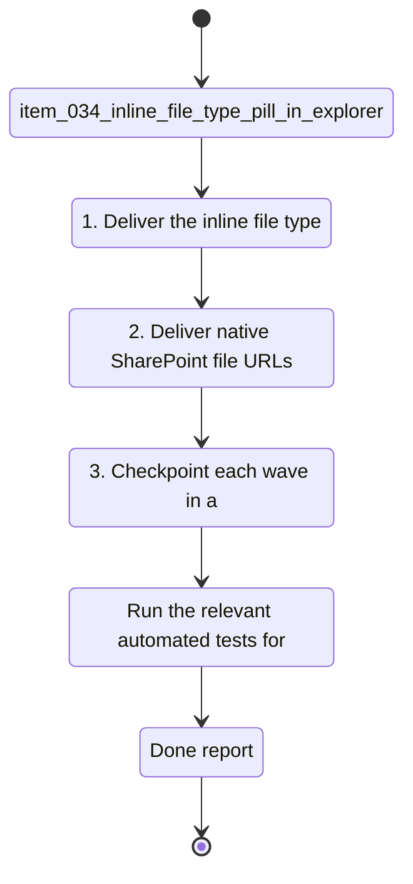

## task_015_sharepoint_file_link_and_file_type_ui_delivery - SharePoint file link and file type UI delivery
> From version: 1.0.0
> Schema version: 1.0
> Status: Done
> Understanding: 94%
> Confidence: 92%
> Progress: 100%
> Complexity: Medium
> Theme: UI
> Reminder: Update status/understanding/confidence/progress and linked request/backlog references when you edit this doc.

# Context
- Execute the bounded delivery slice for SharePoint file link and file type UI delivery.

# Plan
- [x] 1. Deliver the inline file type pill and compact title row polish.
- [x] 2. Deliver native SharePoint file URLs, fallback resolution, and link coverage.
- [x] 3. Checkpoint each wave in a commit-ready state, validate it, and update the linked Logics docs.
- [ ] CHECKPOINT: leave the current wave commit-ready and update the linked Logics docs before continuing.
- [ ] CHECKPOINT: if the shared AI runtime is active and healthy, run `python logics/skills/logics.py flow assist commit-all` for the current step, item, or wave commit checkpoint.
- [ ] GATE: do not close a wave or step until the relevant automated tests and quality checks have been run successfully.
- [ ] FINAL: Update related Logics docs

# Delivery checkpoints
- Each completed wave should leave the repository in a coherent, commit-ready state.
- Update the linked Logics docs during the wave that changes the behavior, not only at final closure.
- Prefer a reviewed commit checkpoint at the end of each meaningful wave instead of accumulating several undocumented partial states.
- If the shared AI runtime is active and healthy, use `python logics/skills/logics.py flow assist commit-all` to prepare the commit checkpoint for each meaningful step, item, or wave.
- Do not mark a wave or step complete until the relevant automated tests and quality checks have been run successfully.

# AC Traceability
- AC1 -> Scope: Execute the bounded delivery slice for SharePoint file link and file type UI delivery. Proof: capture validation evidence in this doc.

# Decision framing
- Product framing: Not needed
- Product signals: (none detected)
- Product follow-up: No product brief follow-up is expected based on current signals.
- Architecture framing: Not needed
- Architecture signals: (none detected)
- Architecture follow-up: No architecture decision follow-up is expected based on current signals.

# Links
- Product brief(s): (none yet)
- Architecture decision(s): (none yet)
- Backlog item(s): `item_034_inline_file_type_pill_in_explorer_title_row`, `item_035_compact_title_row_spacing_and_regression_checks`, `item_036_use_native_sharepoint_file_weburl`, `item_037_fallback_file_link_resolution_and_link_tests`
- Request(s): `req_009_explorer_file_type_pill_inline_with_title`, `req_010_fix_sharepoint_file_links_in_explorer`

# AI Context
- Summary: SharePoint file link and file type UI delivery
- Keywords: sharepoint, file, link, and, type
- Use when: Use when executing the current implementation wave for SharePoint file link and file type UI delivery.
- Skip when: Skip when the work belongs to another backlog item or a different execution wave.
# References
- `logics/skills/logics-ui-steering/SKILL.md`

# Validation
- Run the relevant automated tests for the changed surface before closing the current wave or step.
- Run the relevant lint or quality checks before closing the current wave or step.
- Confirm the completed wave leaves the repository in a commit-ready state.

# Definition of Done (DoD)
- [ ] Scope implemented and acceptance criteria covered.
- [ ] Validation commands executed and results captured.
- [ ] No wave or step was closed before the relevant automated tests and quality checks passed.
- [ ] Linked request/backlog/task docs updated during completed waves and at closure.
- [ ] Each completed wave left a commit-ready checkpoint or an explicit exception is documented.
- [ ] Status is `Done` and progress is `100%`.

# Report
- Wave 1 completed: Explorer file type pill now sits inline with the title, and the row is more compact.
- Wave 2 completed: Explorer file clicks now resolve to SharePoint web URLs with a safe fallback path, and the helper coverage is in place.
