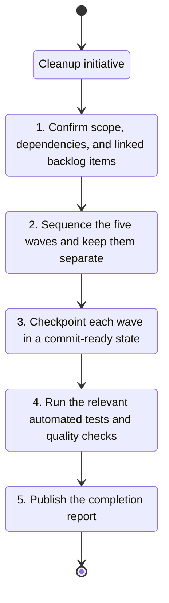

## task_016_orchestrate_technical_debt_cleanup_waves - Orchestrate technical debt cleanup waves
> From version: 1.0.0
> Schema version: 1.0
> Status: Ready
> Understanding: 95%
> Confidence: 90%
> Progress: 0%
> Complexity: Medium
> Theme: General
> Reminder: Update status/understanding/confidence/progress and linked request/backlog references when you edit this doc.

# Context
- Orchestrate the five bounded cleanup waves created from `req_011_audit_de_dette_technique_et_cleanup_structurel`.
- Keep the execution order explicit so refactors, contract cleanup, export hardening, and workflow hygiene stay separated.
- Recommended wave order:
  - Wave 1: `item_042_clean_logics_workflow_hygiene_and_references`
  - Wave 2: `item_038_refactor_app_shell_and_ui_state`
  - Wave 3: `item_039_split_deepvault_retrieval_and_evaluation_helpers`
  - Wave 4: `item_040_clarify_bishop_orchestration_contract`
  - Wave 5: `item_041_harden_live_export_and_checkpoint_handling`

# Plan
- [ ] 1. Confirm the five sibling backlog items, their boundaries, and their execution order.
- [ ] 2. Orchestrate the UI and shell wave first, then the retrieval and Bishop waves, then the export and workflow hygiene waves.
- [ ] 3. Keep each wave commit-ready, validate it, and update the linked Logics docs before moving on.
- [ ] CHECKPOINT: leave the current wave commit-ready and update the linked Logics docs before continuing.
- [ ] CHECKPOINT: if the shared AI runtime is active and healthy, run `python logics/skills/logics.py flow assist commit-all` for the current step, item, or wave commit checkpoint.
- [ ] GATE: do not close a wave or step until the relevant automated tests and quality checks have been run successfully.
- [ ] FINAL: update the request, backlog, and task docs once all waves are closed.

# Delivery checkpoints
- Each completed wave should leave the repository in a coherent, commit-ready state.
- Update the linked Logics docs during the wave that changes the behavior, not only at final closure.
- Prefer a reviewed commit checkpoint at the end of each meaningful wave instead of accumulating several undocumented partial states.
- If the shared AI runtime is active and healthy, use `python logics/skills/logics.py flow assist commit-all` to prepare the commit checkpoint for each meaningful step, item, or wave.
- Do not mark a wave or step complete until the relevant automated tests and quality checks have been run successfully.

# AC Traceability
- AC1 -> Plan: Orchestrate the five sibling backlog items in bounded waves. Proof: capture validation evidence in this doc.

# Decision framing
- Product framing: Not needed
- Product signals: (none detected)
- Product follow-up: No product brief follow-up is expected based on current signals.
- Architecture framing: Not needed
- Architecture signals: (none detected)
- Architecture follow-up: No architecture decision follow-up is expected based on current signals.

# Links
- Product brief(s): (none yet)
- Architecture decision(s): (none yet)
- Backlog items: `item_038_refactor_app_shell_and_ui_state`, `item_039_split_deepvault_retrieval_and_evaluation_helpers`, `item_040_clarify_bishop_orchestration_contract`, `item_041_harden_live_export_and_checkpoint_handling`, `item_042_clean_logics_workflow_hygiene_and_references`
- Architecture decisions: `adr_018_split_the_app_shell_and_ui_state_boundaries`, `adr_019_split_deepvault_retrieval_and_evaluation_helpers`, `adr_020_clarify_bishop_orchestration_states_and_response_contract`, `adr_021_harden_live_export_and_checkpoint_boundaries`
- Request(s): `req_011_audit_de_dette_technique_et_cleanup_structurel`

# AI Context
- Summary: Orchestrate technical debt cleanup waves
- Keywords: orchestrate, technical, debt, cleanup, waves
- Use when: Use when executing the current implementation wave for Orchestrate technical debt cleanup waves.
- Skip when: Skip when the work belongs to another backlog item or a different execution wave.
# Validation
- Run `npm run lint` and `npm run typecheck` after code waves.
- Run `npm run test` after library and orchestration waves.
- Run `npm run build` and `npm run e2e` before finalizing the initiative.
- Run `python logics/skills/logics-doc-linter/scripts/logics_lint.py` and refresh `logics/INDEX.md` after workflow hygiene changes.
- Confirm each completed wave leaves the repository in a commit-ready state.

# Definition of Done (DoD)
- [ ] Scope implemented and acceptance criteria covered.
- [ ] Validation commands executed and results captured.
- [ ] No wave or step was closed before the relevant automated tests and quality checks passed.
- [ ] Linked request, backlog, and task docs were updated during completed waves and at closure.
- [ ] Each completed wave left a commit-ready checkpoint or an explicit exception is documented.
- [ ] Status is `Done` and progress is `100%`.

# Report
