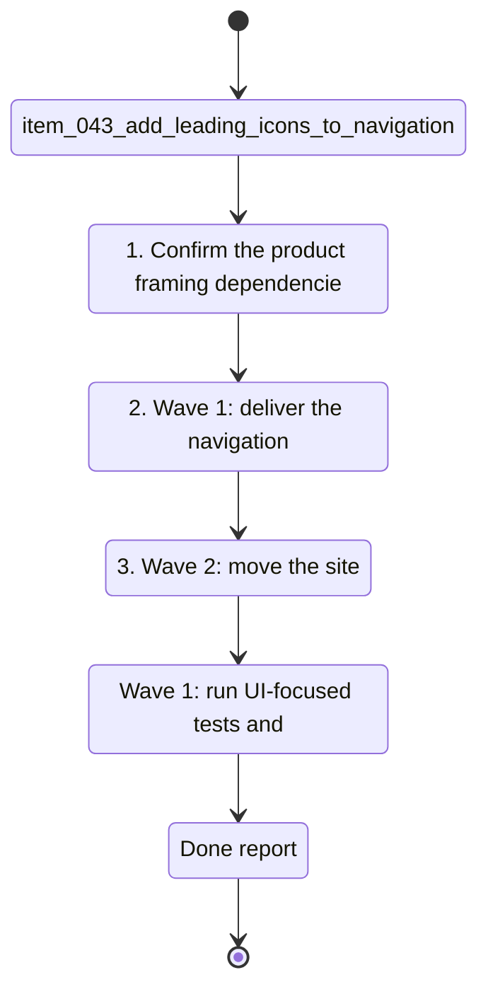

## task_017_orchestrate_navigation_and_runtime_ui_changes - Orchestrate navigation and runtime UI changes
> From version: 1.0.0
> Schema version: 1.0
> Status: Done
> Understanding: 96%
> Confidence: 92%
> Progress: 100%
> Complexity: Medium
> Theme: UI
> Reminder: Update status/understanding/confidence/progress and linked request/backlog references when you edit this doc.

# Context
- Orchestrate the three UI slices that improve navigation clarity and runtime placement without changing the underlying corpus behavior.
- Recommended wave order:
  1. `item_043_add_leading_icons_to_navigation`
  2. `item_044_move_site_selector_into_runtime`
  3. `item_045_move_runtime_under_sync_status`
- Keep the navigation icons, runtime site scope, and runtime panel move separate so each wave stays commit-ready.
- Update the linked Logics docs after each wave, not only at the end.
- Treat the first wave as pure navigation affordance work, the second wave as context selection work, and the third wave as layout consolidation work.
- Use the product brief as the shared framing for all three waves, but keep the implementation slices isolated.

# Plan
- [ ] 1. Confirm the product framing, dependencies, and wave boundaries for the three sibling backlog items.
- [ ] 2. Wave 1: deliver the navigation icons, validate the menu behavior, and checkpoint the slice in a commit-ready state.
- [ ] 3. Wave 2: move the site selector into runtime, validate scope behavior, and checkpoint the slice in a commit-ready state.
- [ ] 4. Wave 3: move runtime under Sync status, validate the layout and control visibility, and checkpoint the slice in a commit-ready state.
- [ ] 5. Close out the task by updating the request, backlog, task, and product docs once all three waves are complete.
- [ ] CHECKPOINT: leave the current wave commit-ready and update the linked Logics docs before continuing.
- [ ] CHECKPOINT: if the shared AI runtime is active and healthy, run `python logics/skills/logics.py flow assist commit-all` for the current step, item, or wave commit checkpoint.
- [ ] GATE: do not close a wave or step until the relevant automated tests and quality checks have been run successfully.
- [ ] FINAL: update the related Logics docs and summarize the delivered UI changes.

# Delivery checkpoints
- Each completed wave should leave the repository in a coherent, commit-ready state.
- Update the linked Logics docs during the wave that changes the behavior, not only at final closure.
- Prefer a reviewed commit checkpoint at the end of each meaningful wave instead of accumulating several undocumented partial states.
- If the shared AI runtime is active and healthy, use `python logics/skills/logics.py flow assist commit-all` to prepare the commit checkpoint for each meaningful step, item, or wave.
- Do not mark a wave or step complete until the relevant automated tests and quality checks have been run successfully.

# AC Traceability
- AC1 -> Scope: Orchestrate the three UI slices that improve navigation clarity and runtime placement without changing the underlying corpus behavior. Proof: capture validation evidence in this doc.

# Decision framing
- Product framing: Required
- Product signals: navigation and discoverability
- Product follow-up: Create or link a product brief before implementation moves deeper into delivery.
- Architecture framing: Not needed
- Architecture signals: (none detected)
- Architecture follow-up: No architecture decision follow-up is expected based on current signals.

# Links
- Product brief(s): `prod_003_navigation_and_runtime_control_clarity`
- Architecture decision(s): (none yet)
- Backlog items: `item_043_add_leading_icons_to_navigation`, `item_044_move_site_selector_into_runtime`, `item_045_move_runtime_under_sync_status`
- Request(s): `req_012_add_leading_icons_to_navigation`, `req_013_move_site_selector_into_runtime`, `req_014_move_runtime_under_sync_status`

# AI Context
- Summary: Orchestrate navigation and runtime UI changes
- Keywords: orchestrate, navigation, and, runtime, changes
- Use when: Use when executing the current implementation wave for Orchestrate navigation and runtime UI changes.
- Skip when: Skip when the work belongs to another backlog item or a different execution wave.
# References
- `logics/skills/logics-ui-steering/SKILL.md`

# Validation
- Wave 1: run UI-focused tests and lint checks around navigation rendering and keyboard behavior.
- Wave 2: run UI-focused tests and lint checks around runtime scope selection and corpus filtering.
- Wave 3: run UI-focused tests and lint checks around the Sync status layout and runtime panel placement.
- After each wave, confirm the repository is commit-ready before moving to the next slice.
- Finish workflow executed on 2026-04-11.
- Linked backlog/request close verification passed.

# Definition of Done (DoD)
- [x] Scope implemented and acceptance criteria covered.
- [x] Validation commands executed and results captured.
- [x] No wave or step was closed before the relevant automated tests and quality checks passed.
- [x] Linked request/backlog/task docs updated during completed waves and at closure.
- [x] Each completed wave left a commit-ready checkpoint or an explicit exception is documented.
- [x] Status is `Done` and progress is `100%`.

# Report
- Wave 1 report: added leading icons to the sidebar navigation buttons and kept the labels and tab order unchanged.
- Wave 2 report: moved the site selector into the runtime control group, scoped Explorer and Bishop to the active site, and kept the site selection accessible from Sync status.
- Wave 3 report: moved the runtime controls into Sync status, kept the selected scope visible there, and removed the duplicate sidebar control.
- Finished on 2026-04-11.
- Linked backlog item(s): `item_043_add_leading_icons_to_navigation`, `item_044_move_site_selector_into_runtime`, `item_045_move_runtime_under_sync_status`
- Related request(s): `req_012_add_leading_icons_to_navigation`, `req_013_move_site_selector_into_runtime`, `req_014_move_runtime_under_sync_status`
