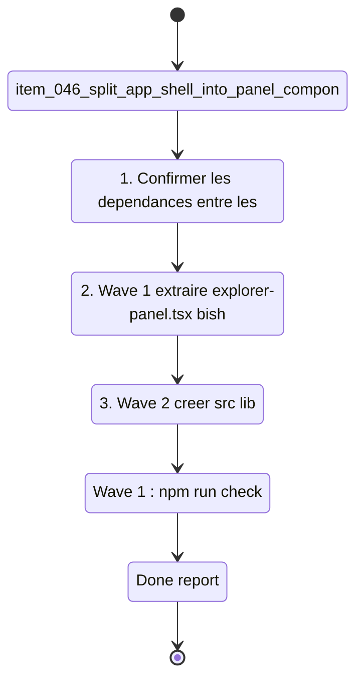

## task_018_structural_refactoring_and_resilience_foundation - Structural refactoring and resilience foundation
> From version: 1.0.1
> Schema version: 1.0
> Status: Done
> Understanding: 92%
> Confidence: 89%
> Progress: 100%
> Complexity: Medium
> Theme: Architecture / Quality
> Reminder: Update status/understanding/confidence/progress and linked request/backlog references when you edit this doc.

# Context
- Orchestrate trois waves de refactoring structurel issues de `req_015_architecture_robustness_and_product_improvements`.
- Ces waves ne changent aucun comportement visible — elles réduisent la surface de maintenance et posent les fondations pour les items suivants.
- Recommended wave order :
  1. `item_046_split_app_shell_into_panel_components` — extraire les trois panels de app-shell.tsx
  2. `item_047_extract_scoring_module_and_barrel_exports` — isoler scoring.ts + barrel exports
  3. `item_048_react_error_boundaries_for_panels` — wrapper chaque panel dans un ErrorBoundary
- Wave 3 (Error Boundaries) doit être réalisée après Wave 1 si les panels sont extraits, mais peut aussi wrapper les panels inlinés dans app-shell si Wave 1 est différée.
- Chaque wave doit rester commit-ready et passer `npm run check` avant de passer à la suivante.

# Plan
- [x] 1. Confirmer les dépendances entre les trois waves (notamment Wave 3 après Wave 1 pour panels/).
- [x] 2. Wave 1 — extraire `explorer-panel.tsx`, `bishop-panel.tsx`, `sync-panel.tsx` sous `src/components/panels/` ; réduire app-shell.tsx au layout et navigation ; vérifier que `tests/app.spec.tsx` passe sans modification.
- [x] 3. Wave 2 — créer `src/lib/scoring.ts` avec les poids et la fonction de scoring ; mettre à jour deepvault.ts pour importer scoring.ts ; ajouter `index.ts` dans `src/lib/`, `src/hooks/`, `src/components/`.
- [x] 4. Wave 3 — créer un composant `<ErrorBoundary>` générique dans `src/components/` ; wrapper les trois panels dans app-shell.tsx (ou dans les fichiers panels/ si Wave 1 est faite).
- [x] 5. Fermer la task en mettant à jour les backlog items et les requests liés.
- [x] CHECKPOINT: laisser chaque wave commit-ready et mettre à jour les docs Logics avant de continuer.
- [ ] CHECKPOINT: si le runtime Logics est actif, lancer `python logics/skills/logics.py flow assist commit-all` après chaque wave.
- [x] GATE: ne pas fermer une wave avant que `npm run check` passe.

# Delivery checkpoints
- Après Wave 1 : `npm run check` passe, app-shell.tsx < 200 lignes.
- Après Wave 2 : `npm run test` passe, scoring.ts existe et est importé depuis deepvault.ts.
- Après Wave 3 : `npm run check` passe, chaque panel est wrappé dans un ErrorBoundary distinct.

# AC Traceability
- item_046 AC1-AC4 -> Wave 1. Proof: capture validation evidence in this doc.
- item_047 AC1-AC4 -> Wave 2. Proof: capture validation evidence in this doc.
- item_048 AC1-AC4 -> Wave 3. Proof: capture validation evidence in this doc.

# Decision framing
- Product framing: Not needed
- Architecture framing: Required
- Architecture signals: component boundaries, testability, resilience
- Architecture follow-up: Vérifier les ADR existants (adr_018, adr_019) avant Wave 1 et 2 pour aligner l'implémentation.

# Links
- Product brief(s): (none yet)
- Architecture decision(s): `adr_018_split_the_app_shell_and_ui_state_boundaries`, `adr_019_split_deepvault_retrieval_and_evaluation_helpers`
- Derived from `item_046_split_app_shell_into_panel_components`, `item_047_extract_scoring_module_and_barrel_exports`, `item_048_react_error_boundaries_for_panels`
- Request(s): `req_015_architecture_robustness_and_product_improvements`

# AI Context
- Summary: Refactoring structurel en 3 waves : split app-shell en panels/, extraction scoring.ts + barrel exports, ajout Error Boundaries.
- Keywords: refactoring, app-shell, panels, scoring, barrel exports, error boundary, architecture
- Use when: Use when executing the structural cleanup waves from req_015.
- Skip when: Skip when the work targets tests, Bishop LLM integration, or infrastructure hardening.

# References
- `logics/skills/logics-ui-steering/SKILL.md`

# Validation
- Wave 1 : `npm run check` (lint + typecheck + test + build + evaluate).
- Wave 2 : `npm run test` pour vérifier les tests de retrieval existants.
- Wave 3 : `npm run check` complet.

# Definition of Done (DoD)
- [ ] Scope implémenté et critères d'acceptance couverts.
- [ ] Commandes de validation exécutées et résultats capturés.
- [ ] Aucune wave fermée avant que les checks automatiques passent.
- [ ] Docs Logics liés mis à jour pendant et à la fermeture.
- [ ] Chaque wave a laissé un checkpoint commit-ready.
- [ ] Status à `Done` et progress à `100%`.
# Report
- Wave 1 completed: extracted the Explorer, Bishop, and Sync panels into `src/components/panels/`, leaving `app-shell.tsx` responsible for layout and navigation only.
- Wave 1 completed: added export helpers for Explorer and Bishop so the app shell no longer owns inline export assembly.
- Wave 1 completed: validated the split with `rtk npm run test -- tests/app.spec.tsx tests/deepvault-graph.spec.ts tests/live-export-state.spec.ts tests/corpus-loader.spec.ts`, `rtk npm run typecheck`, `rtk npm run lint`, `rtk npm run build`, and `rtk npm run check`.
- Wave 2 completed: extracted scoring logic into `src/lib/scoring.ts` and re-exported the public surface through `src/lib/index.ts`, `src/hooks/index.ts`, and `src/components/index.ts`.
- Wave 2 completed: validated the scoring slice with `rtk npm run test -- tests/scoring.spec.ts tests/deepvault.spec.ts tests/app.spec.tsx`, `rtk npm run typecheck`, `rtk npm run lint`, `rtk npm run build`, and `rtk npm run check`.
- Wave 3 completed: added `src/components/error-boundary.tsx`, wrapped the Explorer, Bishop, and Sync panels in distinct boundaries, and covered the isolation behavior with `tests/error-boundary.spec.tsx`.
- Wave 3 completed: validated the boundary slice with `rtk npm run test -- tests/error-boundary.spec.tsx tests/app.spec.tsx tests/scoring.spec.ts tests/deepvault.spec.ts` and `rtk npm run check`.
