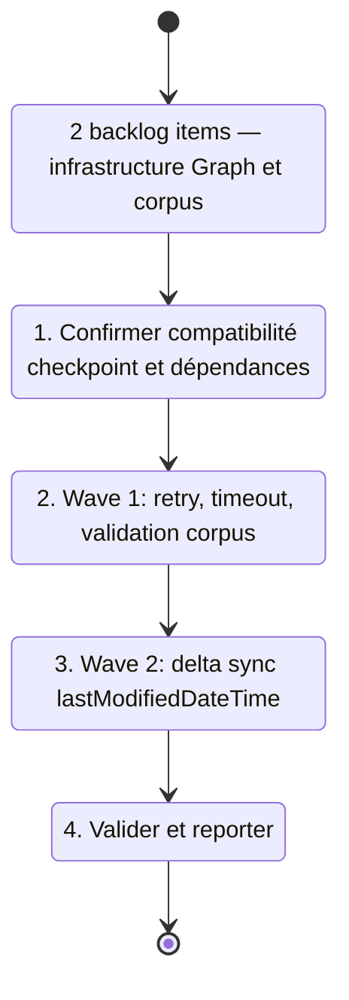

## task_019_infrastructure_hardening_graph_and_corpus - Infrastructure hardening: Graph API and corpus
> From version: 1.0.0
> Schema version: 1.0
> Status: Ready
> Understanding: 88%
> Confidence: 83%
> Progress: 0%
> Complexity: Medium
> Theme: Infrastructure / Quality
> Reminder: Update status/understanding/confidence/progress and linked request/backlog references when you edit this doc.

# Context
- Orchestrate deux waves d'infrastructure issues de `req_015_architecture_robustness_and_product_improvements`.
- Ces waves ciblent la couche scripts/data et n'impactent pas l'UI ni les composants React.
- Recommended wave order :
  1. `item_049_graph_api_retry_timeout_and_corpus_validation` — retry backoff, timeout, validation schéma corpus
  2. `item_054_corpus_delta_sync_via_graph_lastmodified` — delta sync via lastModifiedDateTime
- Wave 1 est une prérequis de stabilité avant Wave 2 : il faut que les appels Graph soient robustes avant d'ajouter la logique de delta.
- Vérifier la compatibilité du format de checkpoint existant (`scripts/live-export-state.ts`) avant de démarrer Wave 2.

# Plan
- [ ] 1. Vérifier le format de checkpoint dans `scripts/live-export-state.ts` pour confirmer la compatibilité avec Wave 2 (extension sans breaking change).
- [ ] 2. Wave 1 — créer un wrapper fetch Graph avec retry (max 3, backoff 1s/2s/4s) sur 429 et 5xx ; ajouter `AbortController` + timeout configurable (défaut 30s) ; ajouter validation de schéma corpus au chargement dans `src/data/corpus.ts`.
- [ ] 3. Décider Zod vs assertions TypeScript pour la validation corpus (documenter le choix dans un ADR si Zod est ajouté comme dépendance runtime).
- [ ] 4. Wave 2 — étendre le checkpoint avec un champ `syncedAt` ; filtrer les documents par `lastModifiedDateTime > syncedAt` dans `scripts/export-live.ts` ; ajouter le mode dry-run avec stats (skipped vs ingested).
- [ ] 5. Fermer la task en mettant à jour les backlog items et les requests liés.
- [ ] CHECKPOINT: laisser chaque wave commit-ready avant de continuer.
- [ ] GATE: ne pas fermer une wave avant que `npm run check` passe.

# Delivery checkpoints
- Après Wave 1 : `npm run check` passe, le wrapper retry est utilisé dans tous les appels Graph identifiables, la validation corpus lève une erreur explicite sur données malformées.
- Après Wave 2 : `npm run export:live --dry-run` affiche le ratio skipped/ingested ; le checkpoint est rétrocompatible avec les fichiers existants.

# AC Traceability
- item_049 AC1-AC5 -> Wave 1. Proof: capture validation evidence in this doc.
- item_054 AC1-AC5 -> Wave 2. Proof: capture validation evidence in this doc.

# Decision framing
- Product framing: Not needed
- Architecture framing: Required
- Architecture signals: resilience, contracts and integration, runtime and boundaries, data model
- Architecture follow-up: Créer un ADR si Zod est introduit comme dépendance runtime (décision structurante). Documenter la stratégie tombstone (docs supprimés de SharePoint) comme hors scope de Wave 2.

# Links
- Product brief(s): (none yet)
- Architecture decision(s): (none yet — à créer si Zod ajouté)
- Derived from `item_049_graph_api_retry_timeout_and_corpus_validation`, `item_054_corpus_delta_sync_via_graph_lastmodified`
- Request(s): `req_015_architecture_robustness_and_product_improvements`

# AI Context
- Summary: Hardening infrastructure en 2 waves : retry/timeout/validation Graph API (Wave 1), delta sync corpus via lastModifiedDateTime (Wave 2).
- Keywords: graph api, retry, backoff, timeout, abortcontroller, validation, corpus, delta sync, lastModifiedDateTime, checkpoint
- Use when: Use when hardening the live export pipeline or improving corpus loading robustness.
- Skip when: Skip when the work targets UI components, Bishop LLM, or test coverage.

# Validation
- Wave 1 : `npm run check` complet + test manuel du wrapper retry sur un appel Graph avec réseau dégradé simulé.
- Wave 2 : `npm run export:live --dry-run` + vérification que les checkpoints existants se chargent sans erreur.

# Definition of Done (DoD)
- [ ] Scope implémenté et critères d'acceptance couverts.
- [ ] Commandes de validation exécutées et résultats capturés.
- [ ] Aucune wave fermée avant que les checks automatiques passent.
- [ ] Docs Logics liés mis à jour pendant et à la fermeture.
- [ ] Chaque wave a laissé un checkpoint commit-ready.
- [ ] Status à `Done` et progress à `100%`.
# Report
