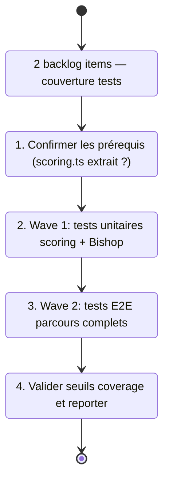

## task_020_test_coverage_expansion - Test coverage expansion
> From version: 1.0.0
> Schema version: 1.0
> Status: In progress
> Understanding: 90%
> Confidence: 87%
> Progress: 50%
> Complexity: Medium
> Theme: Quality
> Reminder: Update status/understanding/confidence/progress and linked request/backlog references when you edit this doc.

# Context
- Orchestrate deux waves de couverture de tests issues de `req_015_architecture_robustness_and_product_improvements`.
- Ces waves ajoutent uniquement des tests — aucune modification du code applicatif n'est attendue.
- Recommended wave order :
  1. `item_051_unit_tests_scoring_and_bishop_contract` — tests unitaires Vitest (scoring cas limites + Bishop fallback 500)
  2. `item_050_e2e_full_workflow_coverage` — tests E2E Playwright (4 parcours fonctionnels complets)
- Commencer par les tests unitaires (plus rapides à écrire et à valider) avant les tests E2E.
- Wave 1 est idéalement réalisée après `task_018` Wave 2 (extraction scoring.ts) pour placer les tests dans `tests/scoring.spec.ts`.

# Plan
- [x] 1. Vérifier si `task_018` Wave 2 (scoring.ts) est réalisée — adapter le fichier spec cible en conséquence (`tests/scoring.spec.ts` si oui, `tests/deepvault.spec.ts` extension si non).
- [x] 2. Wave 1 — ajouter dans Vitest : (a) test scoring query vide → score 0 sans exception ; (b) test scoring doc sans `title` → pas de crash ; (c) test stop words seuls → 0 résultats ; (d) test Bishop fallback sur remote 500 → fallback local activé avec résultat valide.
- [x] 3. Valider `npm run test:coverage` maintient les seuils (90% lignes, 85% branches, 80% fonctions) après Wave 1.
- [ ] 4. Wave 2 — ajouter dans Playwright (`tests/e2e/`) : (a) recherche sans résultats ; (b) rôle guest + sources restricted Bishop ; (c) changement rôle guest → admin et vérification du compte sources ; (d) switch mock↔live et vérification indicateur de mode.
- [ ] 5. Décider si AC4 Wave 2 (switch live) utilise un corpus live fixture ou est conditionnel à l'env.
- [ ] 6. Fermer la task en mettant à jour les backlog items et les requests liés.
- [ ] CHECKPOINT: laisser chaque wave commit-ready avant de continuer.
- [ ] GATE: ne pas fermer Wave 1 avant que `npm run test:coverage` passe les seuils ; ne pas fermer Wave 2 avant que `npm run e2e` passe.

# Delivery checkpoints
- Après Wave 1 : `rtk npm run test:coverage` passe les seuils (90/85/80), les tests unitaires Bishop/scoring sont verts.
- Après Wave 2 : `npm run e2e` passe avec les 4 nouveaux scénarios, chaque test < 30s.

# AC Traceability
- item_051 AC1-AC5 -> Wave 1. Proof: capture validation evidence in this doc.
- item_050 AC1-AC5 -> Wave 2. Proof: capture validation evidence in this doc.

# Decision framing
- Product framing: Not needed
- Architecture framing: Not needed
- Architecture follow-up: Si le switch mock↔live nécessite un corpus live fixture, décider du format minimal et le créer dans `tests/fixtures/` avant Wave 2.

# Links
- Product brief(s): (none yet)
- Architecture decision(s): (none yet)
- Derived from `item_051_unit_tests_scoring_and_bishop_contract`, `item_050_e2e_full_workflow_coverage`
- Request(s): `req_015_architecture_robustness_and_product_improvements`

# AI Context
- Summary: Expansion de la couverture de tests en 2 waves : tests unitaires Vitest pour scoring et Bishop fallback (Wave 1), tests E2E Playwright pour 4 parcours complets (Wave 2).
- Keywords: vitest, playwright, e2e, tests, scoring, bishop, fallback, coverage, workflow, rôle, corpus
- Use when: Use when expanding test coverage for retrieval edge cases, Bishop resilience, or critical UI workflows.
- Skip when: Skip when the work targets code changes, infrastructure, or PWA features.

# Validation
- Wave 1 : `npm run test:coverage` — seuils 90/85/80 maintenus.
- Wave 2 : `npm run e2e` — tous les scénarios passent sous 30s chacun.
- `npm run check` complet à la fermeture.

# Definition of Done (DoD)
- [ ] Scope implémenté et critères d'acceptance couverts.
- [ ] Commandes de validation exécutées et résultats capturés.
- [ ] Aucune wave fermée avant que les checks automatiques passent.
- [ ] Docs Logics liés mis à jour pendant et à la fermeture.
- [ ] Chaque wave a laissé un checkpoint commit-ready.
- [ ] Status à `Done` et progress à `100%`.
# Report
- Wave 1 completed: added Vitest coverage for scoring query-empty and stop-word-only behavior, Bishop remote 500 fallback, and Anthropic provider failure branches while keeping the code surface unchanged.
- Wave 1 validated: `rtk npm run test:coverage` now passes with global coverage above the required thresholds.
- Wave 2 remains open: Playwright E2E scenarios are still pending.
