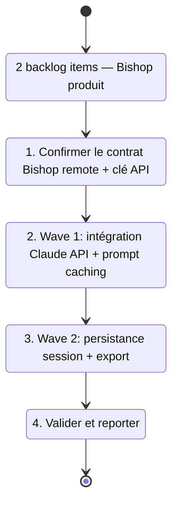

## task_021_bishop_intelligence_and_ux - Bishop intelligence and UX
> From version: 1.0.0
> Schema version: 1.0
> Status: Ready
> Understanding: 87%
> Confidence: 82%
> Progress: 0%
> Complexity: High
> Theme: Product / Architecture
> Reminder: Update status/understanding/confidence/progress and linked request/backlog references when you edit this doc.

# Context
- Orchestrate deux waves produit sur Bishop issues de `req_015_architecture_robustness_and_product_improvements`.
- Ces waves font évoluer Bishop d'un outil de recherche déterministe vers un assistant conversationnel persistant avec export.
- Recommended wave order :
  1. `item_052_bishop_claude_api_integration` — brancher Claude API sur le remote mode Bishop avec prompt caching
  2. `item_053_bishop_session_persistence_and_export` — persistance session localStorage + boutons export JSON/MD
- Wave 1 est le changement le plus structurant (nouveau provider LLM) ; Wave 2 est additive et moins risquée.
- Wave 1 nécessite `ANTHROPIC_API_KEY` dans l'environnement — documenter dans `.env.exemple` avant de démarrer.
- L'orchestration layer dans `src/lib/bishop.ts` est déjà en place — le remote mode et le fallback local existent.

# Plan
- [ ] 1. Confirmer le contrat du remote mode Bishop dans `src/lib/bishop.ts` (format de l'appel, format de réponse attendu) et relire `adr_017_bishop_llm_orchestration_after_local_grounding`.
- [ ] 2. Ajouter `ANTHROPIC_API_KEY` et `VITE_BISHOP_MODEL` au fichier `.env.exemple` avec documentation.
- [ ] 3. Wave 1 — installer `@anthropic-ai/sdk` ; implémenter l'appel Claude dans le remote mode Bishop avec le corpus groundé comme contexte ; activer le prompt caching (system prompt + corpus groundé marqués `cache_control: ephemeral`) ; vérifier le fallback local si la clé est absente.
- [ ] 4. Décider le system prompt Bishop (ton, format de réponse, règles de citation sources) — le documenter dans le code ou un fichier dédié.
- [ ] 5. Wave 2 — persister l'historique Bishop dans `localStorage` (clé `deepvault_bishop_history`, max 50 messages) ; restaurer au chargement ; ajouter un bouton "Exporter" sur Bishop (JSON + MD) et sur Explorer (JSON) ; ajouter un bouton "Effacer l'historique".
- [ ] 6. Fermer la task en mettant à jour les backlog items et les requests liés.
- [ ] CHECKPOINT: laisser chaque wave commit-ready avant de continuer.
- [ ] GATE: ne pas fermer Wave 1 avant que le fallback local (sans clé API) passe `npm run check` ; ne pas fermer Wave 2 avant que `npm run check` passe.

# Delivery checkpoints
- Après Wave 1 : `npm run check` passe, Bishop retourne une vraie réponse Claude en mode remote, le fallback local s'active sans clé API.
- Après Wave 2 : `npm run check` passe, l'historique Bishop persiste après rechargement, les boutons export téléchargent un fichier valide.

# AC Traceability
- item_052 AC1-AC5 -> Wave 1. Proof: capture validation evidence in this doc.
- item_053 AC1-AC6 -> Wave 2. Proof: capture validation evidence in this doc.

# Decision framing
- Product framing: Required
- Product signals: qualité des réponses Bishop, productivité analyste, livrables
- Product follow-up: Valider le system prompt Bishop et le format d'export Markdown avec les utilisateurs cibles avant Wave 1.
- Architecture framing: Required
- Architecture signals: contracts and integration, security and identity, runtime and boundaries
- Architecture follow-up: Créer un ADR pour le contrat d'appel Bishop → Claude (format prompt, gestion tokens, caching strategy) avant démarrer Wave 1.

# Links
- Product brief(s): (none yet)
- Architecture decision(s): `adr_017_bishop_llm_orchestration_after_local_grounding`
- Derived from `item_052_bishop_claude_api_integration`, `item_053_bishop_session_persistence_and_export`
- Request(s): `req_015_architecture_robustness_and_product_improvements`

# AI Context
- Summary: Bishop en 2 waves : intégration Claude API avec prompt caching (Wave 1), persistance session localStorage et export JSON/MD (Wave 2).
- Keywords: bishop, claude api, anthropic sdk, prompt caching, llm, remote mode, fallback, session, localStorage, export, markdown
- Use when: Use when implementing real LLM responses in Bishop or adding session persistence and export features.
- Skip when: Skip when the work targets structural refactoring, tests, or PWA features.

# References
- `logics/skills/logics-ui-steering/SKILL.md`

# Validation
- Wave 1 : `npm run check` complet + test manuel d'une question Bishop avec clé API + test fallback sans clé.
- Wave 2 : `npm run check` + vérification manuelle persistance après F5 + vérification du fichier exporté.

# Definition of Done (DoD)
- [ ] Scope implémenté et critères d'acceptance couverts.
- [ ] Commandes de validation exécutées et résultats capturés.
- [ ] Aucune wave fermée avant que les checks automatiques passent.
- [ ] Docs Logics liés mis à jour pendant et à la fermeture.
- [ ] Chaque wave a laissé un checkpoint commit-ready.
- [ ] Status à `Done` et progress à `100%`.
# Report
