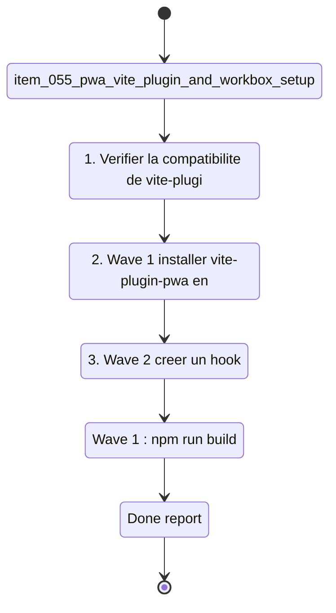

## task_022_pwa_progressive_web_app_delivery - PWA progressive web app delivery
> From version: 1.0.0
> Schema version: 1.0
> Status: Done
> Understanding: 88%
> Confidence: 84%
> Progress: 100%
> Complexity: Medium
> Theme: Infrastructure / UX / PWA
> Reminder: Update status/understanding/confidence/progress and linked request/backlog references when you edit this doc.

# Context
- Orchestrate les quatre waves PWA issues de `req_016_pwa_install_and_offline_first`.
- Ces waves rendent DeepVault Nexus installable en tant qu'application native, maintenable via un bandeau de mise à jour, et fonctionnelle hors-ligne en mode mock.
- Recommended wave order :
  1. `item_055_pwa_vite_plugin_and_workbox_setup` — fondation PWA bloquante (plugin, manifeste, SW, stratégie cache)
  2. `item_056_pwa_install_button_in_header` — bouton Install dans le header
  3. `item_057_pwa_update_banner` — bandeau mise à jour
  4. `item_058_pwa_offline_cache_and_mock_fallback` — cache offline + fallback corpus mock
- Wave 1 est un prérequis bloquant pour les trois autres — ne pas démarrer Wave 2, 3, ou 4 sans SW valide et manifeste en place.
- Wave 2 et Wave 3 sont indépendantes l'une de l'autre une fois Wave 1 réalisée — elles peuvent être réalisées dans n'importe quel ordre ou en parallèle.
- Vérifier la compatibilité de `vite-plugin-pwa` avec Vite 6.x avant d'intégrer.
- Préparer ou créer les icônes PWA (192×192, 512×512) avant Wave 1.

# Plan
- [x] 1. Vérifier la compatibilité de `vite-plugin-pwa` avec la version Vite actuelle (`package.json`) et identifier la version compatible ; préparer ou générer les icônes PWA 192×192 et 512×512.
- [x] 2. Wave 1 — installer `vite-plugin-pwa` en devDependency ; configurer le plugin dans `vite.config.ts` avec `registerType: 'prompt'`, `devOptions: { enabled: false }` ; créer `public/manifest.webmanifest` avec `name`, `short_name`, `theme_color`, `background_color`, `display: standalone`, icônes ; configurer Workbox avec `CacheFirst` pour assets statiques et `NetworkFirst` pour les appels Graph ; valider que `npm run build` génère `dist/sw.js`.
- [x] 3. Wave 2 — créer un hook `useInstallPrompt` qui capture `beforeinstallprompt` ; ajouter un composant `<InstallButton>` dans le header ; masquer si `display-mode: standalone` ou si l'événement n'est pas disponible ; masquer après installation.
- [x] 4. Wave 3 — utiliser le hook `useRegisterSW` de `vite-plugin-pwa` ; créer un composant `<UpdateBanner>` non-bloquant qui apparaît quand `needRefresh === true` ; bouton "Mettre à jour" appelle `updateServiceWorker(true)` ; bouton "Ignorer" masque le bandeau pour la session.
- [x] 5. Wave 4 — vérifier que `pilot-corpus.json` est bien inclus dans le cache Workbox (assets statiques) ; implémenter le basculement automatique vers le corpus mock si le mode live échoue en offline ; ajouter l'indicateur visuel "Hors-ligne — corpus mock" ; ajouter un test E2E Playwright offline (`page.context().setOffline(true)`).
- [x] 6. Fermer la task en mettant à jour les backlog items et la request liée.
- [x] CHECKPOINT: laisser chaque wave commit-ready avant de continuer.
- [x] GATE: ne pas démarrer Wave 2/3/4 sans que Wave 1 soit validée ; ne pas fermer une wave avant que `npm run check` passe.

# Delivery checkpoints
- Après Wave 1 : `npm run build` génère `dist/sw.js` ; manifeste valide (Lighthouse ou vérification manuelle) ; `npm run check` passe.
- Après Wave 2 : bouton Install visible sur Chrome desktop avec app non installée ; masqué en standalone.
- Après Wave 3 : bandeau visible après simulation d'une nouvelle version SW (forcer `needRefresh: true` en test) ; bouton Mettre à jour recharge la page.
- Après Wave 4 : `npm run e2e` passe avec le test offline ; fallback corpus mock visible avec indicateur.

# AC Traceability
- item_055 AC1-AC6 -> Wave 1. Proof: capture validation evidence in this doc.
- item_056 AC1-AC5 -> Wave 2. Proof: capture validation evidence in this doc.
- item_057 AC1-AC4 -> Wave 3. Proof: capture validation evidence in this doc.
- item_058 AC1-AC5 -> Wave 4. Proof: capture validation evidence in this doc.

# Decision framing
- Product framing: Consider
- Product signals: onboarding, discoverability, fiabilité hors-ligne
- Product follow-up: Valider le libellé des boutons ("Installer l'app" / "Mettre à jour") et le positionnement du bandeau (top vs bottom) avant Wave 2/3.
- Architecture framing: Required
- Architecture signals: cache strategy, runtime and boundaries
- Architecture follow-up: Documenter dans un ADR la stratégie de cache PWA (CacheFirst vs NetworkFirst par type de ressource) et justifier pourquoi le corpus live n'est pas mis en cache.

# Links
- Product brief(s): (none yet)
- Architecture decision(s): (none yet — à créer pour la stratégie cache)
- Derived from `item_055_pwa_vite_plugin_and_workbox_setup`, `item_056_pwa_install_button_in_header`, `item_057_pwa_update_banner`, `item_058_pwa_offline_cache_and_mock_fallback`
- Request(s): `req_016_pwa_install_and_offline_first`

# AI Context
- Summary: Delivery PWA en 4 waves : fondation vite-plugin-pwa + Workbox (Wave 1), bouton Install (Wave 2), bandeau mise à jour (Wave 3), cache offline + fallback mock (Wave 4).
- Keywords: pwa, vite-plugin-pwa, workbox, service worker, manifest, install button, update banner, offline, cache, fallback, mock corpus
- Use when: Use when implementing the PWA install flow, update notifications, or offline support.
- Skip when: Skip when the work targets structural refactoring, Bishop LLM, or test coverage expansion.

# References
- `logics/skills/logics-ui-steering/SKILL.md`

# Validation
- Wave 1 : `npm run build` + inspection `dist/sw.js` + validation manifeste.
- Wave 2 : test manuel sur Chrome desktop (bouton visible / masqué en standalone).
- Wave 3 : test manuel du bandeau (simuler `needRefresh: true`).
- Wave 4 : `npm run e2e` avec test offline + vérification manuelle fallback mock.
- `npm run check` complet à la fermeture.

# Definition of Done (DoD)
- [ ] Scope implémenté et critères d'acceptance couverts.
- [ ] Commandes de validation exécutées et résultats capturés.
- [ ] Aucune wave fermée avant que les checks automatiques passent.
- [ ] Docs Logics liés mis à jour pendant et à la fermeture.
- [ ] Chaque wave a laissé un checkpoint commit-ready.
- [ ] Status à `Done` et progress à `100%`.
# Report
- Wave 1 completed: `vite-plugin-pwa` installed and configured with prompt registration, SW disabled in dev, static manifest added, and square icon assets prepared.
- Wave 1 validated: `rtk npm run build` generated `dist/sw.js` and `rtk npm run check` passed.
- Wave 2 completed: the header now captures `beforeinstallprompt`, shows an install button when the app is installable, and hides it in standalone mode or when the API is unavailable.
- Wave 2 validated: `rtk npm run test -- tests/pwa.spec.tsx tests/app.spec.tsx`, `rtk npm run typecheck`, and `rtk npm run lint` passed.
- Wave 3 completed: the shell now shows a non-blocking update banner when a refresh is pending, with update and dismiss actions.
- Wave 3 validated: `rtk npm run test -- tests/pwa.spec.tsx tests/app.spec.tsx`, `rtk npm run typecheck`, and `rtk npm run lint` passed.
- Wave 4 completed: the app now falls back to the bundled mock corpus when live mode is unavailable offline, shows the `Offline — corpus mock` indicator, and passes the offline Playwright check.
- Wave 4 validated: `rtk npm run test -- tests/corpus.spec.ts tests/live-corpus-hook.spec.tsx tests/app.spec.tsx`, `rtk npm run e2e`, and `VITE_DEEPVAULT_DATA_MODE=live rtk npm run e2e -- tests/e2e/live-mode.spec.ts` passed.
- Closure completed: the linked backlog items and request were marked `Done`, and the PWA delivery task can now be closed cleanly.
