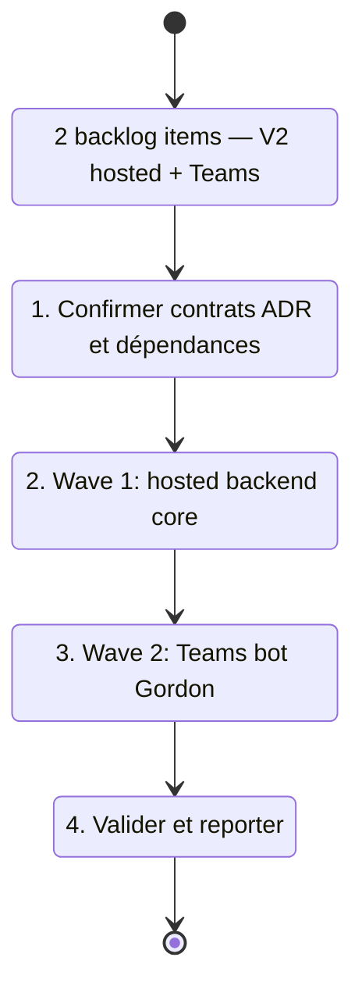

## task_023_v2_hosted_backend_and_teams_bot_delivery - V2 hosted backend and Teams bot delivery
> From version: 0.0.1
> Schema version: 1.0
> Status: Ready
> Understanding: 93%
> Confidence: 88%
> Progress: 0%
> Complexity: High
> Theme: General
> Reminder: Update status/understanding/confidence/progress and linked request/backlog references when you edit this doc.

# Context
- Orchestrate les deux waves V2 qui font passer DeepVault d'une app locale vers une surface hébergée et un bot Teams.
- Ces waves sont séquentiellement dépendantes : le backend hébergé (item_011) doit être livré avant le bot Teams (item_012).
- Recommended wave order :
  1. `item_011_v2_hosted_backend_core` — API surface hébergée, contrats runtime partagés, routage provider
  2. `item_012_v2_teams_bot_channel_and_permissions` — enregistrement DeepVault-Gordon, routing message, identity Microsoft, permission checks
- Ne pas démarrer Wave 2 (Teams) sans que l'API backend de Wave 1 expose le contrat client attendu par le bot.
- Les ADRs `adr_013`, `adr_001`, `adr_009` définissent les contrats d'identité, de permission et de canal — les relire avant chaque wave.

# Plan
- [ ] 1. Relire `adr_013_hosted_backend_and_teams_chat_channel`, `adr_001_identity_and_access_model`, `adr_009_permission_aware_retrieval_and_source_filtering` pour confirmer les contrats avant de démarrer.
- [ ] 2. Wave 1 — implémenter l'API surface hébergée (endpoints ingestion, retrieval, provider routing) ; vérifier que le contrat est channel-agnostic et réutilisable par le client Teams.
- [ ] 3. Wave 2 — enregistrer DeepVault-Gordon dans Azure Bot Service ; implémenter le routing de messages vers le backend ; mapper l'identité Microsoft ; appliquer les permission checks.
- [ ] 4. Fermer la task en mettant à jour les backlog items et les docs liés.
- [ ] CHECKPOINT: laisser chaque wave commit-ready et mettre à jour les docs Logics avant de continuer.
- [ ] CHECKPOINT: si le runtime Logics est actif, lancer `python logics/skills/logics.py flow assist commit-all` après chaque wave.
- [ ] GATE: ne pas démarrer Wave 2 avant que le contrat API de Wave 1 soit validé et stable.
- [ ] FINAL: mettre à jour les backlog items, la request et les ADRs liés à la fermeture.

# Delivery checkpoints
- Après Wave 1 : l'API hébergée expose les endpoints documentés dans adr_013 ; les tests d'intégration passent ; le contrat est prêt pour la consommation Teams.
- Après Wave 2 : DeepVault-Gordon répond aux messages Teams avec des réponses groundées et respecte le modèle de permission Microsoft.

# AC Traceability
- item_011 AC1-AC3 -> Wave 1. Proof: capture validation evidence in this doc.
- item_012 AC1-AC3 -> Wave 2. Proof: capture validation evidence in this doc.

# Decision framing
- Product framing: Required
- Product signals: hosted runtime, enterprise chat channel, governance, user trust
- Product follow-up: Aligner le product brief `prod_000` avec l'état réel de la livraison avant Wave 2.
- Architecture framing: Required
- Architecture signals: deployment target, bot auth, identity mapping, permission-aware chat, shared contracts
- Architecture follow-up: Mettre à jour `adr_013` si le contrat API évolue pendant Wave 1 avant que Teams le consomme.

# Links
- Product brief(s): `prod_000_sharepoint_knowledge_graph_product_vision`
- Architecture decision(s): `adr_001_identity_and_access_model_for_sharepoint_knowledge_graph`, `adr_009_permission_aware_retrieval_and_source_filtering`, `adr_013_hosted_backend_and_teams_chat_channel`
- Derived from `item_011_v2_hosted_backend_core`, `item_012_v2_teams_bot_channel_and_permissions`
- Request(s): `req_000_v0_bootstrap_and_initial_foundations`, `req_002_v2_azure_and_teams_foundation`

# AI Context
- Summary: Delivery V2 en 2 waves séquentielles : hosted backend core (Wave 1) puis bot Teams DeepVault-Gordon (Wave 2).
- Keywords: v2, hosted backend, api, teams, bot, gordon, identity, permissions, microsoft, azure
- Use when: Use when implementing the V2 hosted backend or the Teams bot channel.
- Skip when: Skip when the work is local-only, PWA, or Bishop LLM integration.

# Validation
- Wave 1 : lint + typecheck + tests d'intégration sur le contrat API hébergé.
- Wave 2 : test end-to-end du routing Teams → backend → réponse groundée.
- `npm run check` ou équivalent backend à chaque wave.

# Definition of Done (DoD)
- [ ] Scope implémenté et critères d'acceptance couverts.
- [ ] Commandes de validation exécutées et résultats capturés.
- [ ] Aucune wave fermée avant que les checks automatiques passent.
- [ ] Docs Logics liés mis à jour pendant et à la fermeture.
- [ ] Chaque wave a laissé un checkpoint commit-ready.
- [ ] Status à `Done` et progress à `100%`.

# Report
