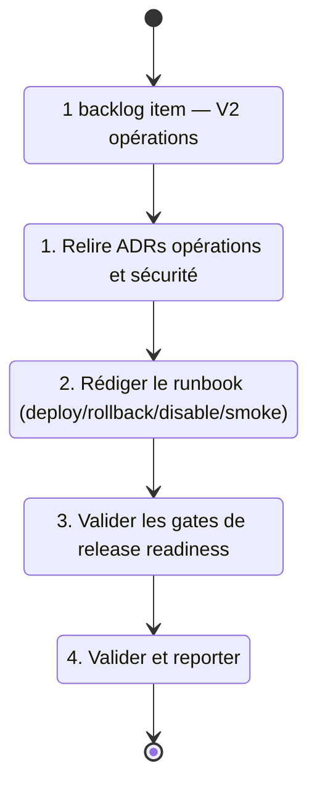

## task_024_v2_operations_runbook_and_release_readiness - V2 operations runbook and release readiness
> From version: 0.0.4
> Schema version: 1.0
> Status: Ready
> Understanding: 92%
> Confidence: 88%
> Progress: 0%
> Complexity: Medium
> Theme: General
> Reminder: Update status/understanding/confidence/progress and linked request/backlog references when you edit this doc.

# Context
- Délivrer le runbook opérationnel V2 et les gates de release readiness pour un déploiement hébergé sûr.
- Cette task est indépendante des waves backend/Teams (task_023) mais doit être terminée avant le lancement V2.
- Le runbook couvre les chemins deploy, rollback, disable, et smoke-check pour le runtime DeepVault hébergé.
- Les gates de readiness couvrent les secrets, le monitoring, les approbations, et la réponse aux incidents.
- Relire `adr_006_runtime_configuration_and_operations` et `adr_015_deepvault_security_audit_logging_and_retention_boundaries` avant de démarrer.

# Plan
- [ ] 1. Relire `adr_006_runtime_configuration_and_operations` et `adr_015_deepvault_security_audit_logging_and_retention_boundaries` pour confirmer les contraintes opérationnelles.
- [ ] 2. Rédiger le runbook avec les procédures : deploy, rollback, disable (kill switch), smoke-check post-deploy.
- [ ] 3. Formaliser la checklist de release readiness : secrets en place, monitoring actif, approbations obtenues, plan de réponse aux incidents documenté.
- [ ] 4. Valider que la checklist est actionnable (chaque gate a un owner et un critère binaire pass/fail).
- [ ] 5. Fermer la task en mettant à jour l'item et les docs liés.
- [ ] CHECKPOINT: laisser le runbook dans un état commit-ready avant d'attaquer les gates.
- [ ] CHECKPOINT: si le runtime Logics est actif, lancer `python logics/skills/logics.py flow assist commit-all` après chaque étape significative.
- [ ] GATE: ne pas fermer la task avant que chaque gate de release readiness soit binaire (pass/fail) et assignée.
- [ ] FINAL: mettre à jour l'item backlog, la request liée et les ADRs à la fermeture.

# Delivery checkpoints
- Après le runbook : procédures deploy/rollback/disable/smoke documentées, relues et commit-ready.
- Après les gates : checklist release readiness validée par le responsable V2 — chaque critère est binaire et a un owner.

# AC Traceability
- item_013 AC1 -> Runbook: deploy, rollback, disable, smoke-check couverts. Proof: capture validation evidence in this doc.
- item_013 AC2 -> Gates: secrets, monitoring, approbations, incident response couverts. Proof: capture validation evidence in this doc.
- item_013 AC3 -> Scope: slice borné, pas d'élargissement vers UX ou re-architecture. Proof: capture validation evidence in this doc.

# Decision framing
- Product framing: Not needed
- Product signals: production readiness, supportability, release safety
- Architecture framing: Required
- Architecture signals: Azure release process, rollback, secrets, audit boundaries
- Architecture follow-up: Mettre à jour `adr_006` et `adr_015` si les procédures révèlent des gaps dans les contrats opérationnels existants.

# Links
- Product brief(s): `prod_002_hosted_production_strategy_with_teams_at_the_end`
- Architecture decision(s): `adr_006_runtime_configuration_and_operations`, `adr_013_hosted_backend_and_teams_chat_channel`, `adr_015_deepvault_security_audit_logging_and_retention_boundaries`
- Derived from `item_013_v2_operations_runbook_and_release_readiness`
- Request(s): `req_000_v0_bootstrap_and_initial_foundations`

# AI Context
- Summary: Runbook opérationnel V2 et gates de release readiness pour un déploiement hébergé sûr (deploy, rollback, disable, smoke-check, secrets, monitoring).
- Keywords: v2, runbook, operations, release readiness, deploy, rollback, disable, smoke-check, secrets, monitoring, incident
- Use when: Use when preparing the V2 hosted release or reviewing operational safety gates.
- Skip when: Skip when the work targets product features, UI, or the local-only runtime.

# Validation
- Runbook relu et approuvé par le responsable V2.
- Checklist release readiness : chaque item a un owner, un critère binaire, et est coché avant le lancement.

# Definition of Done (DoD)
- [ ] Scope implémenté et critères d'acceptance couverts.
- [ ] Commandes de validation exécutées et résultats capturés.
- [ ] Aucune étape fermée avant que les checks passent.
- [ ] Docs Logics liés mis à jour pendant et à la fermeture.
- [ ] Checklist de release readiness entièrement remplie.
- [ ] Status à `Done` et progress à `100%`.

# Report
