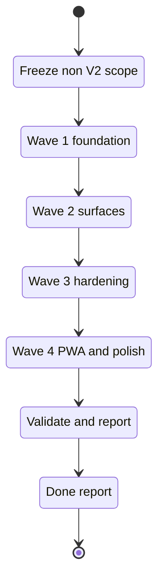

## task_025_non_v2_delivery_orchestration_and_validation_hardening - Non-V2 delivery orchestration and validation hardening
> From version: 1.0.0
> Schema version: 1.0
> Status: In progress
> Understanding: 97%
> Confidence: 93%
> Progress: 99%
> Complexity: High
> Theme: General
> Reminder: Update status/understanding/confidence/progress and linked request/backlog references when you edit this doc.

# Context
- Orchestrate the full non-V2 delivery program across the existing requests, backlog items, and implementation tasks.
- Keep the scope strictly outside `V2`: do not touch any `V2` request, backlog, or task doc in this wave.
- Sequence the work so foundation, retrieval, UI, Bishop, hardening, and PWA work each lands in a commit-ready state.
- Require validation at every wave so the work is not rushed or merged without tests.

## Wave map
- Wave 1: foundation and retrieval baseline
  - Tasks: `task_001_v1_local_companion_vertical_slice`, `task_002_v1_ingestion_sync_and_retrieval_hardening`, `task_005_v1_local_development_and_validation_milestone`, `task_008_v1_retrieval_evaluation_set_and_quality_gates`, `task_009_local_hardening_and_v1_scope_evolution`
  - Goal: stabilize the local product path, sync path, retrieval path, and quality gates before touching higher-level polish.
- Wave 2: shell, explorer, and runtime surfaces
  - Tasks: `task_011_nexus_v1_1_shell_and_live_state_delivery`, `task_012_nexus_v1_1_remaining_polish_orchestration`, `task_013_coverage_and_explorer_polish_orchestration`, `task_015_sharepoint_file_link_and_file_type_ui_delivery`, `task_017_orchestrate_navigation_and_runtime_ui_changes`
  - Goal: finish the visible product surfaces and keep runtime behavior aligned with the shell.
- Wave 3: Bishop orchestration and answer quality
  - Tasks: `task_014_bishop_llm_orchestration_delivery`, `task_021_bishop_intelligence_and_ux`
  - Goal: make the Bishop path reliable, traceable, and defensible before expanding adjacent UX.
- Wave 4: hardening, refactoring, and test coverage
  - Tasks: `task_016_orchestrate_technical_debt_cleanup_waves`, `task_018_structural_refactoring_and_resilience_foundation`, `task_019_infrastructure_hardening_graph_and_corpus`, `task_020_test_coverage_expansion`
  - Goal: reduce structural risk, improve resilience, and raise coverage before final polish work.
- Wave 5: PWA and final polish
  - Tasks: `task_022_pwa_progressive_web_app_delivery`
  - Goal: finish the progressive web app work only after the core flows and tests are stable.

# Plan
- [x] 1. Freeze the non-V2 source set and confirm the exact request, backlog, and task coverage to be orchestrated.
- [x] 2. Execute Wave 1 first and keep it limited to the local companion, ingestion, sync, retrieval, and evaluation baseline.
- [x] 3. Execute Wave 2 next and keep it limited to the shell, explorer, runtime, and UI surface work.
- [x] 4. Execute Wave 3 after that and keep it limited to Bishop orchestration and answer quality work.
- [x] 5. Execute Wave 4 next and keep it limited to refactoring, resilience, infrastructure hardening, and coverage uplift.
- [x] 6. Execute Wave 5 last and keep the PWA work behind the earlier stability gates.
- [ ] 7. Keep each wave commit-ready, validate it, and update the linked Logics docs before moving on.
- [x] CHECKPOINT: leave the current wave commit-ready and update the linked Logics docs before continuing.
- [ ] CHECKPOINT: if the shared AI runtime is active and healthy, run `python logics/skills/logics.py flow assist commit-all` for the current step, item, or wave commit checkpoint.
- [ ] GATE: do not close a wave or step until the relevant automated tests and quality checks have been run successfully.
- [ ] FINAL: update the related Logics docs, close the orchestration task, and leave no `V2` scope touched by mistake.

# Delivery checkpoints
- Each completed wave should leave the repository in a coherent, commit-ready state.
- Update the linked Logics docs during the wave that changes the behavior, not only at final closure.
- Prefer a reviewed commit checkpoint at the end of each meaningful wave instead of accumulating several undocumented partial states.
- If the shared AI runtime is active and healthy, use `python logics/skills/logics.py flow assist commit-all` to prepare the commit checkpoint for each meaningful step, item, or wave.
- Do not mark a wave or step complete until the relevant automated tests and quality checks have been run successfully.

# AC Traceability
- AC1 -> Scope: Freeze the non-V2 program and explicitly exclude all `V2` docs. Proof: list the covered requests, backlog items, and tasks here.
- AC2 -> Scope: Orchestrate the remaining non-V2 work in coherent waves. Proof: record each wave in the report section.
- AC3 -> Validation: Require lint, typecheck, test, and build checks before closing each wave. Proof: paste command results in the report section.
- AC4 -> Documentation: Update the linked Logics docs during the wave that changed behavior. Proof: keep the links current and note the doc updates in the report.

# Decision framing
- Product framing: Not needed
- Product signals: (none detected)
- Product follow-up: No product brief follow-up is expected based on current signals.
- Architecture framing: Not needed
- Architecture signals: (none detected)
- Architecture follow-up: No architecture decision follow-up is expected based on current signals.

# Links
- Product brief(s): (none yet)
- Architecture decision(s): (none yet)
- Derived from: `task_001_v1_local_companion_vertical_slice`, `task_002_v1_ingestion_sync_and_retrieval_hardening`, `task_005_v1_local_development_and_validation_milestone`, `task_008_v1_retrieval_evaluation_set_and_quality_gates`, `task_009_local_hardening_and_v1_scope_evolution`, `task_011_nexus_v1_1_shell_and_live_state_delivery`, `task_012_nexus_v1_1_remaining_polish_orchestration`, `task_013_coverage_and_explorer_polish_orchestration`, `task_014_bishop_llm_orchestration_delivery`, `task_015_sharepoint_file_link_and_file_type_ui_delivery`, `task_016_orchestrate_technical_debt_cleanup_waves`, `task_017_orchestrate_navigation_and_runtime_ui_changes`, `task_018_structural_refactoring_and_resilience_foundation`, `task_019_infrastructure_hardening_graph_and_corpus`, `task_020_test_coverage_expansion`, `task_021_bishop_intelligence_and_ux`, `task_022_pwa_progressive_web_app_delivery`
- Request(s): `req_001_v1_local_hardening_and_scope_evolution`, `req_003_nexus_v1_1_ui_and_product_polish`, `req_004_nexus_v1_1_remaining_polish_and_bishop_ux_follow_up`, `req_005_coverage_uplift_for_corpus_mode_live_fetch_and_deepvault_core`, `req_006_explorer_card_hierarchy_and_visual_polish`, `req_007_compact_paths_in_explorer_excerpts_and_summaries`, `req_008_bishop_llm_orchestration_after_local_grounding`, `req_009_explorer_file_type_pill_inline_with_title`, `req_010_fix_sharepoint_file_links_in_explorer`, `req_011_audit_de_dette_technique_et_cleanup_structurel`, `req_012_add_leading_icons_to_navigation`, `req_013_move_site_selector_into_runtime`, `req_014_move_runtime_under_sync_status`, `req_015_architecture_robustness_and_product_improvements`, `req_016_pwa_install_and_offline_first`
- Backlog item(s): `item_000_v1_graph_discovery_and_pilot_scope`, `item_001_v1_sharepoint_ingestion_and_sync_pipeline`, `item_002_v1_hybrid_knowledge_store_and_retrieval`, `item_003_v1_explorer_ui_for_sharepoint_navigation`, `item_005_v1_runtime_config_and_operations`, `item_006_v1_local_companion_app_for_explorer_and_chat`, `item_007_v1_llm_provider_abstraction_for_openai_and_gemini`, `item_008_v1_local_explorer_shell_and_navigation`, `item_009_v1_local_chat_surface_and_answer_flow`, `item_010_v1_local_sync_status_and_operational_view`, `item_014_v1_incremental_live_sync_and_resumable_export`, `item_015_v1_live_explorer_site_filter_alignment`, `item_016_v1_live_evaluation_set_and_quality_gate`, `item_017_v1_crawl_resilience_and_artifact_governance`, `item_019_shell_rebrand_and_split_layout`, `item_020_compact_live_state_and_sync_panels`, `item_021_shell_chrome_and_layout_cleanup`, `item_022_live_state_and_status_density_polish`, `item_023_bishop_response_flow_and_answer_trace_polish`, `item_024_path_display_and_hover_cleanup`, `item_025_corpus_mode_normalization_tests`, `item_026_live_corpus_fetch_branch_coverage`, `item_027_deepvault_retrieval_branch_coverage`, `item_028_explorer_card_hierarchy_cleanup`, `item_029_explorer_badge_and_source_line_polish`, `item_030_compact_paths_in_explorer_excerpts_and_summaries`, `item_031_bishop_grounding_contract_and_response_shape`, `item_032_bishop_llm_orchestration_and_fallback`, `item_033_bishop_trace_status_and_evaluation_coverage`, `item_034_inline_file_type_pill_in_explorer_title_row`, `item_035_compact_title_row_spacing_and_regression_checks`, `item_036_use_native_sharepoint_file_weburl`, `item_037_fallback_file_link_resolution_and_link_tests`, `item_038_refactor_app_shell_and_ui_state`, `item_039_split_deepvault_retrieval_and_evaluation_helpers`, `item_040_clarify_bishop_orchestration_contract`, `item_041_harden_live_export_and_checkpoint_handling`, `item_042_clean_logics_workflow_hygiene_and_references`, `item_043_add_leading_icons_to_navigation`, `item_044_move_site_selector_into_runtime`, `item_045_move_runtime_under_sync_status`, `item_046_split_app_shell_into_panel_components`, `item_047_extract_scoring_module_and_barrel_exports`, `item_048_react_error_boundaries_for_panels`, `item_049_graph_api_retry_timeout_and_corpus_validation`, `item_050_e2e_full_workflow_coverage`, `item_051_unit_tests_scoring_and_bishop_contract`, `item_052_bishop_claude_api_integration`, `item_053_bishop_session_persistence_and_export`, `item_054_corpus_delta_sync_via_graph_lastmodified`, `item_055_pwa_vite_plugin_and_workbox_setup`, `item_056_pwa_install_button_in_header`, `item_057_pwa_update_banner`, `item_058_pwa_offline_cache_and_mock_fallback`
- Task(s): `task_001_v1_local_companion_vertical_slice`, `task_002_v1_ingestion_sync_and_retrieval_hardening`, `task_005_v1_local_development_and_validation_milestone`, `task_008_v1_retrieval_evaluation_set_and_quality_gates`, `task_009_local_hardening_and_v1_scope_evolution`, `task_011_nexus_v1_1_shell_and_live_state_delivery`, `task_012_nexus_v1_1_remaining_polish_orchestration`, `task_013_coverage_and_explorer_polish_orchestration`, `task_014_bishop_llm_orchestration_delivery`, `task_015_sharepoint_file_link_and_file_type_ui_delivery`, `task_016_orchestrate_technical_debt_cleanup_waves`, `task_017_orchestrate_navigation_and_runtime_ui_changes`, `task_018_structural_refactoring_and_resilience_foundation`, `task_019_infrastructure_hardening_graph_and_corpus`, `task_020_test_coverage_expansion`, `task_021_bishop_intelligence_and_ux`, `task_022_pwa_progressive_web_app_delivery`

# AI Context
- Summary: Non-V2 delivery orchestration and validation hardening
- Keywords: non-v2, orchestration, validation, hardening, waves
- Use when: Use when executing the current implementation wave for Non-V2 delivery orchestration and validation hardening.
- Skip when: Skip when the work belongs to another backlog item or a different execution wave.
# Validation
- Run `rtk npm run lint` before closing each wave.
- Run `rtk npm run typecheck` before closing each wave.
- Run `rtk npm run test` for every code-bearing wave, and add focused tests when a wave only touches a narrow surface.
- Run `rtk npm run build` before the final closure, and run `rtk npm run e2e` if the surface changes affect browser flows.
- Run `rtk python3 logics/skills/logics-doc-linter/scripts/logics_lint.py` after any linked Logics doc updates.
- Confirm each completed wave leaves the repository in a commit-ready state.

# Definition of Done (DoD)
- [ ] Scope implemented and acceptance criteria covered.
- [ ] Validation commands executed and results captured.
- [ ] No wave or step was closed before the relevant automated tests and quality checks passed.
- [ ] Linked request/backlog/task docs updated during completed waves and at closure.
- [ ] Each completed wave left a commit-ready checkpoint or an explicit exception is documented.
- [ ] Status is `Done` and progress is `100%`.

# Report
- Wave 1 started: hardened `fetchLiveCorpus` to reject malformed live corpus payloads, distinguish parse failures from network failures, and keep the mock fallback path explicit.
- Wave 1 continued: covered `useLiveCorpus` with hook-level tests for successful live promotion and invalid-payload fallback to mock data.
- Wave 1 checkpointed again: added retrieval and explorer coverage for site-scoped ranking, denied-source exclusion, and top-result ordering.
- Wave 1 checkpointed again: added app-level coverage that keeps the explorer detail pane scoped when the site filter changes.
- Wave 1 checkpointed again: covered `useLiveCorpus` reset behavior when live mode is not requested, ensuring the hook stays on mock data without making a fetch call.
- Wave 1 checkpointed again: added sync-summary coverage for latest-run selection and pending-site behavior with no sync history.
- Wave 1 checkpointed again: added role-scoped summary coverage for guest and admin so sync and corpus counts stay truthful across access levels.
- Wave 1 checkpointed again: added retrieval scoring coverage so title-led matches and permitted results stay in the expected order.
- Wave 1 checkpointed again: added search result coverage for site filters and result limits so query scope stays bounded.
- Wave 2 started: added navigation accessibility coverage for the active tab state so shell behavior stays explicit for users and tests.
- Wave 2 checkpointed again: added live fallback badge coverage so the shell reflects missing live corpus data when live mode is requested.
- Wave 2 checkpointed again: added sync panel note and count coverage with a scoped assertion on the recent run card so the displayed sync metrics stay anchored to the correct run.
- Wave 2 checkpointed again: added answer-trace coverage so the Bishop response panel now waits for the final answer before validating status, chunk, token, and latency metrics.
- Wave 3 started: Bishop remote routing now supports OpenAI and Gemini as primary providers while keeping Claude available as a third provider, with provider-specific remote payload tests and fallback coverage.
- Wave 3 completed: Bishop session persistence and export now cover `localStorage` restore, 50-message cap, Bishop JSON/MD export, Explorer JSON/MD export, and clear-history behavior.
- Wave 4 started: Graph export and corpus loading are now safer because malformed corpus payloads are rejected explicitly and checkpoint reads ignore invalid payloads instead of silently accepting them.
- Wave 4 continued: live export now reuses the checkpoint corpus, compares `lastModifiedDateTime` against the last sync, skips unchanged documents, persists `syncedAt`, and reports dry-run stats without writing files.
- Wave 4 continued: split `src/components/app-shell.tsx` into dedicated panel components and export helpers so the shell now owns only layout/navigation while the panels can be tested independently.
- Wave 4 continued: extracted scoring helpers into `src/lib/scoring.ts`, added barrel exports for `src/lib/`, `src/hooks/`, and `src/components/`, and kept the retrieval behavior unchanged.
- Wave 4 continued: wrapped Explorer, Bishop, and Sync in distinct Error Boundaries and verified that a rendering failure stays isolated to the panel that throws.
- Wave 4 continued: wrapped Explorer, Bishop, and Sync in distinct Error Boundaries and verified that a rendering failure stays isolated to the panel that throws.
- Wave 4 continued: expanded the unit-test coverage slice with scoring edge cases and Bishop fallback branches, then re-ran `rtk npm run test:coverage` successfully above the threshold.
- Wave 4 completed: extended the Playwright suite with empty-search, guest-restricted Bishop, role switch, and live-mode badge scenarios, then validated both the default and live-mode E2E runs.
- Wave 5 started: PWA foundation now installs `vite-plugin-pwa`, emits `dist/sw.js`, and ships the manifest plus square icons.
- Wave 5 continued: the header now captures `beforeinstallprompt` and exposes the install affordance only when the app is installable, with standalone and unsupported-browser hiding covered by tests.
- Wave 5 continued: the shell now shows a non-blocking update banner when a new service worker is waiting, with explicit dismiss and update actions.
- Validation passed: `rtk npm run check` (run with elevated execution to clear the `tsx` IPC sandbox restriction).
- Validation passed: `rtk npm run test -- tests/corpus.spec.ts tests/bishop.spec.ts`
- Validation passed: `rtk npm run test -- tests/corpus.spec.ts tests/live-corpus-hook.spec.tsx`
- Validation passed: `rtk npm run test -- tests/deepvault.spec.ts tests/corpus.spec.ts tests/live-corpus-hook.spec.tsx`
- Validation passed: `rtk npm run test -- tests/app.spec.tsx tests/deepvault.spec.ts tests/corpus.spec.ts tests/live-corpus-hook.spec.tsx`
- Validation passed: `rtk npm run test -- tests/app.spec.tsx tests/deepvault.spec.ts tests/corpus.spec.ts`
- Validation passed: `rtk npm run test -- tests/live-corpus-hook.spec.tsx tests/corpus.spec.ts`
- Validation passed: `rtk npm run test -- tests/deepvault.spec.ts tests/corpus.spec.ts`
- Validation passed: `rtk npm run test -- tests/deepvault.spec.ts tests/corpus.spec.ts`
- Validation passed: `rtk npm run test -- tests/app.spec.tsx tests/deepvault.spec.ts tests/corpus.spec.ts`
- Validation passed: `rtk npm run typecheck`
- Validation passed: `rtk npm run lint`
- Validation passed: `rtk npm run build`
- Validation passed: `rtk npm run test -- tests/app.spec.tsx tests/deepvault.spec.ts tests/corpus.spec.ts`
- Validation passed: `rtk npm run test:coverage`
- Validation passed: `rtk npm run e2e`
- Validation passed: `VITE_DEEPVAULT_DATA_MODE=live rtk npm run e2e -- tests/e2e/live-mode.spec.ts`
- Validation passed: `rtk python3 logics/skills/logics-doc-linter/scripts/logics_lint.py --require-status --format text`
- Correction: Waves 1, 2, 3, and 4 are complete, and Wave 5 is now in progress with the PWA foundation in place.
