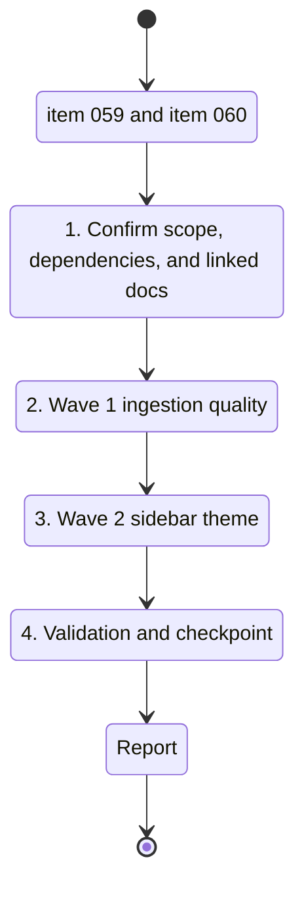

## task_026_live_corpus_and_sidebar_theme_delivery_waves - Live corpus metadata and sidebar theme delivery waves
> From version: 1.1.0
> Schema version: 1.0
> Status: Ready
> Understanding: 88%
> Confidence: 84%
> Progress: 0%
> Complexity: Medium
> Theme: General
> Reminder: Update status/understanding/confidence/progress and linked request/backlog references when you edit this doc.

# Context
- Derived from backlog item `item_059_improve_ingestion_metadata_and_chunking_for_bishop_hints`.
- Derived from backlog item `item_060_add_a_discrete_light_and_dark_theme_switch_in_the_sidebar`.
- Source files: `logics/backlog/item_059_improve_ingestion_metadata_and_chunking_for_bishop_hints.md`, `logics/backlog/item_060_add_a_discrete_light_and_dark_theme_switch_in_the_sidebar.md`.
- Related request(s): `req_017_improve_ingestion_metadata_and_chunking_for_bishop_hints`, `req_018_add_a_discrete_light_and_dark_theme_switch_in_the_sidebar`.
- This orchestration task coordinates two bounded delivery slices so they can be executed in separate waves without mixing write paths.
- Wave 1 improves ingestion metadata, chunking, and retrieval hints.
- Wave 2 adds the sidebar theme switch, local persistence, and shell styling updates.

# Plan
- [ ] 1. Confirm scope, dependencies, and linked acceptance criteria for both backlog items.
- [ ] 2. Wave 1: implement ingestion metadata, chunking, and retrieval signal improvements with tests.
- [ ] 3. Wave 2: implement the sidebar theme switch, persistence, and shell styling with tests.
- [ ] 4. Checkpoint each wave in a commit-ready state, validate it, and update the linked Logics docs.
- [ ] CHECKPOINT: leave the current wave commit-ready and update the linked Logics docs before continuing.
- [ ] CHECKPOINT: if the shared AI runtime is active and healthy, run `python logics/skills/logics.py flow assist commit-all` for the current step, item, or wave commit checkpoint.
- [ ] GATE: do not close a wave or step until the relevant automated tests and quality checks have been run successfully.
- [ ] FINAL: Update related Logics docs and capture validation evidence

# Delivery checkpoints
- Each completed wave should leave the repository in a coherent, commit-ready state.
- Update the linked Logics docs during the wave that changes the behavior, not only at final closure.
- Prefer a reviewed commit checkpoint at the end of each meaningful wave instead of accumulating several undocumented partial states.
- If the shared AI runtime is active and healthy, use `python logics/skills/logics.py flow assist commit-all` to prepare the commit checkpoint for each meaningful step, item, or wave.
- Do not mark a wave or step complete until the relevant automated tests and quality checks have been run successfully.

# AC Traceability
- AC1 -> Scope: Ingestion persists richer metadata that can be used for retrieval, including at least document title, site name, path, tags, and structural context from the source when available.. Proof: capture validation evidence in this doc.
- AC2 -> Scope: Chunking preserves section or heading context so a chunk can be traced back to the part of the document that produced it.. Proof: capture validation evidence in this doc.
- AC3 -> Scope: Short or vague questions surface more relevant sources when the corpus contains a matching document or section.. Proof: capture validation evidence in this doc.
- AC4 -> Scope: Bishop improvement hints use the richer corpus signal and are no longer limited to a generic "add a better title or site name" fallback.. Proof: capture validation evidence in this doc.
- AC5 -> Scope: The new ingestion and ranking behavior is covered by tests for corpus loading, retrieval quality, and Bishop hint generation.. Proof: capture validation evidence in this doc.
- AC6 -> Scope: Permission-aware filtering and local-first behavior remain unchanged.. Proof: capture validation evidence in this doc.

# Decision framing
- Product framing: Required
- Product signals: navigation and discoverability, experience scope
- Product follow-up: Keep the linked product brief in sync with the sidebar theme slice before implementation moves deeper into delivery.
- Architecture framing: Required
- Architecture signals: data model and persistence, state and sync, security and identity
- Architecture follow-up: Keep the linked architecture decisions in sync before irreversible implementation work starts.

# Links
- Product brief(s): `logics/product/prod_003_navigation_and_runtime_control_clarity.md`
- Architecture decision(s): `logics/architecture/adr_016_deepvault_persistence_and_storage_layout.md`, `logics/architecture/adr_022_separate_runtime_controls_from_sync_operations.md`
- Derived from `logics/backlog/item_059_improve_ingestion_metadata_and_chunking_for_bishop_hints.md`
- Derived from `logics/backlog/item_060_add_a_discrete_light_and_dark_theme_switch_in_the_sidebar.md`
- Request(s): `req_017_improve_ingestion_metadata_and_chunking_for_bishop_hints`, `req_018_add_a_discrete_light_and_dark_theme_switch_in_the_sidebar`

# AI Context
- Summary: Coordinate live corpus quality and sidebar theme delivery waves
- Keywords: ingestion, metadata, chunking, retrieval, ranking, bishop, hint, corpus, theme, sidebar, persistence
- Use when: Use when framing a two-wave delivery that improves retrieval quality and adds a discrete sidebar theme switch.
- Skip when: Skip when the work targets only one of the slices or unrelated sync operations.
# References
- `logics/skills/logics-ui-steering/SKILL.md`

# Validation
- Wave 1 validation:
  - `rtk npm run test -- tests/corpus-mode.spec.ts tests/use-entra-settings.spec.ts tests/live-corpus-hook.spec.tsx`
  - `rtk npm run typecheck`
- Wave 2 validation:
  - `rtk npm run test -- tests/use-entra-settings.spec.ts tests/live-corpus-hook.spec.tsx`
  - `rtk npm run lint`
  - `rtk npm run build`
- Confirm each completed wave leaves the repository in a commit-ready state.

# Definition of Done (DoD)
- [ ] Scope implemented and acceptance criteria covered.
- [ ] Validation commands executed and results captured.
- [ ] No wave or step was closed before the relevant automated tests and quality checks passed.
- [ ] Linked request/backlog/task docs updated during completed waves and at closure.
- [ ] Each completed wave left a commit-ready checkpoint or an explicit exception is documented.
- [ ] Status is `Done` and progress is `100%`.

# Report
- Wave 1 and Wave 2 remain pending.
