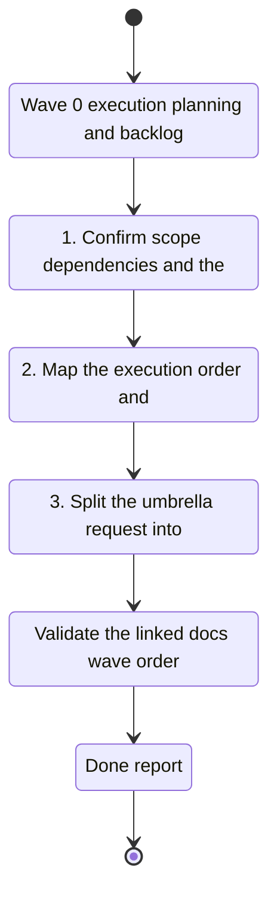

## task_026_wave_0_execution_planning_and_backlog_split_for_the_full_implementation_plan - Wave 0 execution planning and backlog split for the full implementation plan
> From version: 1.1.0
> Schema version: 1.0
> Status: Done
> Understanding: 100%
> Confidence: 100%
> Progress: 100%
> Complexity: High
> Theme: General
> Reminder: Update status/understanding/confidence/progress and linked request/backlog references when you edit this doc.

# Context
- Execute Wave 0 as the planning and splitting step for the full implementation plan.
- Confirm the dependency order across navigation and runtime clarity, worker and CLI parity, ops shell, corpus quality, and theme polish.
- Split the umbrella request into bounded backlog items before implementation starts.
- Make sure the split captures every referenced product brief and ADR explicitly, so no named decision or product direction is lost during grooming.
- Keep the traceability tight enough that each backlog item can point back to the exact product and architecture references it implements.
- Keep the implementation grounded in the current local-first codebase while preparing the app for a dedicated worker and shared corpus artifacts.
- Leave the repository in a clean, commit-ready state with the plan docs synchronized.

# Plan
- [x] 1. Confirm scope, dependencies, and the final set of streams covered by the umbrella request.
- [x] 2. Map the execution order and wave boundaries for the five streams.
- [x] 3. Split the umbrella request into bounded backlog items for execution, and ensure each item explicitly references the product briefs and ADRs it covers.
- [x] 4. Verify that no referenced brief or ADR is omitted from the wave map or the resulting backlog split.
- [x] 5. Update the linked Logics docs so the plan remains synchronized.
- [x] CHECKPOINT: leave the current wave commit-ready and update the linked Logics docs before continuing.
- [x] CHECKPOINT: if the shared AI runtime is active and healthy, run `python logics/skills/logics.py flow assist commit-all` for the current step, item, or wave commit checkpoint.
- [x] GATE: do not close the wave until the relevant document validation and coherence checks have been run successfully.
- [x] FINAL: Update related Logics docs and capture the final wave map

# Delivery checkpoints
- Each completed wave should leave the repository in a coherent, commit-ready state.
- Update the linked Logics docs during the wave that changes the behavior, not only at final closure.
- Prefer a reviewed commit checkpoint at the end of each meaningful wave instead of accumulating several undocumented partial states.
- If the shared AI runtime is active and healthy, use `python logics/skills/logics.py flow assist commit-all` to prepare the commit checkpoint for each meaningful step, item, or wave.
- Do not mark a wave or step complete until the relevant automated tests and quality checks have been run successfully.

# AC Traceability
- AC1 -> Scope: Confirm the final scope, dependencies, and stream order for the full implementation plan. Proof: capture validation evidence in this doc.
- AC2 -> Scope: Split the umbrella request into bounded backlog items that preserve traceability to every referenced product brief and ADR. Proof: capture validation evidence in this doc.
- AC3 -> Scope: Verify that no referenced brief or ADR is omitted from the wave map or backlog split. Proof: capture validation evidence in this doc.
- AC4 -> Scope: Update the linked Logics docs so the plan stays synchronized. Proof: capture validation evidence in this doc.

# Decision framing
- Product framing: Required
- Product signals: navigation and discoverability, experience scope, operational clarity
- Product follow-up: Keep the linked product briefs aligned with the wave map.
- Architecture framing: Required
- Architecture signals: plan alignment and dependency sequencing
- Architecture follow-up: Keep the linked architecture decisions aligned with the wave map.

# Links
- Product brief(s): `logics/product/prod_003_navigation_and_runtime_control_clarity.md`, `logics/product/prod_005_split_sync_status_into_dedicated_operations_screens.md`, `logics/product/prod_006_improve_ingestion_metadata_and_chunking_for_bishop_hints.md`, `logics/product/prod_007_add_a_discrete_light_and_dark_theme_switch_in_the_sidebar.md`, `logics/product/prod_008_make_ingestion_and_live_export_operable_across_app_and_cli.md`
- Architecture decision(s): `logics/architecture/adr_022_separate_runtime_controls_from_sync_operations.md`, `logics/architecture/adr_023_split_execution_runtime_from_the_app_and_share_corpus_artifacts.md`, `logics/architecture/adr_024_split_sync_status_into_dedicated_operations_screens.md`, `logics/architecture/adr_025_add_a_discrete_light_and_dark_theme_switch_with_persisted_shell_mode.md`, `logics/architecture/adr_026_improve_ingestion_metadata_and_chunking_for_bishop_hints.md`
- Derived from `logics/request/req_017_implement_the_full_app_worker_corpus_and_shell_plan.md`
- Request(s): `req_017_implement_the_full_app_worker_corpus_and_shell_plan`

# AI Context
- Summary: Wave 0 planning and backlog split for the full implementation plan.
- Keywords: wave 0, planning, backlog split, execution order, dependency mapping, docs
- Use when: Use when preparing the wave map before implementation begins.
- Skip when: Skip when the work is already in a specific implementation backlog item.
# Validation
- Validate the linked docs, wave order, and traceability before closing the wave.
- Confirm the completed wave leaves the repository in a commit-ready state.

# Definition of Done (DoD)
- [x] Scope implemented and acceptance criteria covered.
- [x] Validation commands executed and results captured.
- [x] No wave or step was closed before the relevant automated tests and quality checks passed.
- [x] Linked request/backlog/task docs updated during completed waves and at closure.
- [x] Each completed wave left a commit-ready checkpoint or an explicit exception is documented.
- [x] Status is `Done` and progress is `100%`.

# Report
- Wave 0 planning output is complete.
- The final scope was confirmed across the five streams: navigation and runtime ownership, worker and CLI parity, ops shell decomposition, corpus quality, and theme polish.
- The umbrella request was split into five bounded backlog items and five downstream tasks, with explicit traceability to every referenced product brief and ADR.
- The wave map is synchronized in the request, the task chain, the roadmap, and the derived backlog items.
- The planning wave is closed; the downstream implementation slices now carry the execution work and remain linked back to this split.
