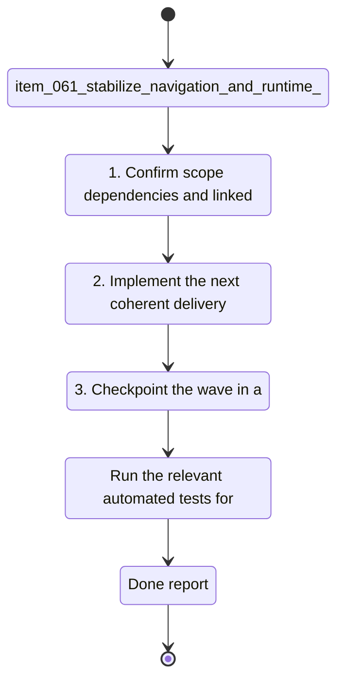

## task_029_stabilize_navigation_and_runtime_ownership - Stabilize navigation and runtime ownership
> From version: 1.1.0
> Schema version: 1.0
> Status: Done
> Understanding: 94%
> Confidence: 90%
> Progress: 100%
> Complexity: Medium
> Theme: General
> Reminder: Update status/understanding/confidence/progress and linked request/backlog references when you edit this doc.

# Context
- Derived from backlog item `item_061_stabilize_navigation_and_runtime_ownership`.
- Source file: `logics/backlog/item_061_stabilize_navigation_and_runtime_ownership.md`.
- Related request(s): `req_017_implement_the_full_app_worker_corpus_and_shell_plan`.
- Stabilize the sidebar navigation and runtime ownership so the app has a clear execution context.
- Keep the runtime controls, site scope, and navigation affordances easy to find without adding clutter.
- Preserve the current behavior while making the boundary between app shell and runtime controls obvious.

# Plan
- [x] 1. Confirm scope, dependencies, and linked acceptance criteria.
- [x] 2. Implement the next coherent delivery wave from the backlog item.
- [x] 3. Checkpoint the wave in a commit-ready state, validate it, and update the linked Logics docs.
- [x] CHECKPOINT: leave the current wave commit-ready and update the linked Logics docs before continuing.
- [x] CHECKPOINT: if the shared AI runtime is active and healthy, run `python logics/skills/logics.py flow assist commit-all` for the current step, item, or wave commit checkpoint.
- [x] GATE: do not close a wave or step until the relevant automated tests and quality checks have been run successfully.
- [x] FINAL: Update related Logics docs

# Delivery checkpoints
- Each completed wave should leave the repository in a coherent, commit-ready state.
- Update the linked Logics docs during the wave that changes the behavior, not only at final closure.
- Prefer a reviewed commit checkpoint at the end of each meaningful wave instead of accumulating several undocumented partial states.
- If the shared AI runtime is active and healthy, use `python logics/skills/logics.py flow assist commit-all` to prepare the commit checkpoint for each meaningful step, item, or wave.
- Do not mark a wave or step complete until the relevant automated tests and quality checks have been run successfully.

# AC Traceability
- AC1 -> Scope: The sidebar uses leading icons and remains easy to scan. Proof: unified data-driven `NAV_SECTIONS` in `app-shell.tsx` renders all 5 nav items with SVG icons. Test `renders leading icons on every sidebar nav item (AC1)` validates all items have `.nav-item-icon svg`.
- AC2 -> Scope: Runtime controls and site scope live in the intended shell location and are clearly owned. Proof: test `keeps runtime controls in Settings and operations in Sync (AC2/AC5)` validates role/provider/scope live in Settings and ingest/evaluate/refresh live in Sync.
- AC3 -> Scope: The active runtime context remains visible without changing behavior. Proof: test `displays runtime context pills in the topbar across all tabs (AC3)` validates topbar badges persist across Explorer, Bishop, and Sync tabs.
- AC4 -> Scope: Navigation and runtime placement stay usable on smaller screens and with keyboard navigation. Proof: test `supports keyboard tab navigation through sidebar items (AC4)` validates sequential tab focus. Test `provides distinct aria-labels on sidebar nav sections (AC1/AC4)` validates ARIA landmarks. CSS media queries handle responsive stacking.
- AC5 -> Scope: The app's ownership model for sidebar, settings, and sync stays consistent. Proof: test `keeps runtime controls in Settings and operations in Sync (AC2/AC5)` validates mutual exclusion of concerns between panels.

# Decision framing
- Product framing: Required
- Product signals: pricing and packaging, navigation and discoverability, experience scope
- Product follow-up: Create or link a product brief before implementation moves deeper into delivery.
- Architecture framing: Required
- Architecture signals: data model and persistence, runtime and boundaries, state and sync
- Architecture follow-up: Create or link an architecture decision before irreversible implementation work starts.

# Links
- Product brief(s): `prod_003_navigation_and_runtime_control_clarity`
- Architecture decision(s): `adr_022_separate_runtime_controls_from_sync_operations`
- Derived from `item_061_stabilize_navigation_and_runtime_ownership`
- Request(s): `req_017_implement_the_full_app_worker_corpus_and_shell_plan`

# AI Context
- Summary: Stabilize navigation and runtime ownership.
- Keywords: navigation, runtime, sidebar, site scope, settings, sync ownership
- Use when: Use when implementing or reviewing the navigation and runtime ownership stream.
- Skip when: Skip when the change is unrelated to the navigation and runtime boundary.
# References
- `logics/skills/logics-ui-steering/SKILL.md`

# Validation
- Run the relevant automated tests for the changed surface before closing the current wave or step.
- Run the relevant lint or quality checks before closing the current wave or step.
- Confirm the completed wave leaves the repository in a commit-ready state.

# Definition of Done (DoD)
- [x] Scope implemented and acceptance criteria covered.
- [x] Validation commands executed and results captured.
- [x] No wave or step was closed before the relevant automated tests and quality checks passed.
- [x] Linked request/backlog/task docs updated during completed waves and at closure.
- [x] Each completed wave left a commit-ready checkpoint or an explicit exception is documented.
- [x] Status is `Done` and progress is `100%`.

# Report
