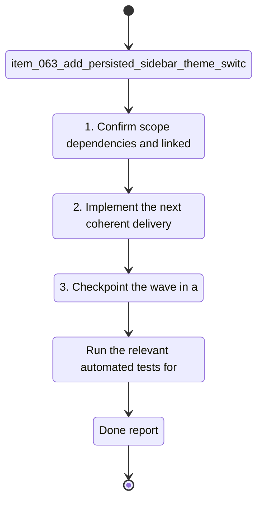

## task_031_add_persisted_sidebar_theme_switch - Add persisted sidebar theme switch
> From version: 1.1.0
> Schema version: 1.0
> Status: Done
> Understanding: 99%
> Confidence: 99%
> Progress: 100%
> Complexity: Medium
> Theme: General
> Reminder: Update status/understanding/confidence/progress and linked request/backlog references when you edit this doc.

# Context
- Derived from backlog item `item_063_add_persisted_sidebar_theme_switch`.
- Source file: `logics/backlog/item_063_add_persisted_sidebar_theme_switch.md`.
- Related request(s): `req_017_implement_the_full_app_worker_corpus_and_shell_plan`.
- Add a discrete light/dark theme switch to the sidebar and persist the user's choice locally.
- Keep the control visually secondary so it does not compete with navigation.
- Apply the chosen theme consistently across the shell, panels, and modals.

# Plan
- [x] 1. Confirm scope, dependencies, and linked acceptance criteria.
- [x] 2. Implement the next coherent delivery wave from the backlog item.
- [x] 3. Checkpoint the wave in a commit-ready state, validate it, and update the linked Logics docs.

# Delivery checkpoints
- Each completed wave should leave the repository in a coherent, commit-ready state.
- Update the linked Logics docs during the wave that changes the behavior, not only at final closure.
- Prefer a reviewed commit checkpoint at the end of each meaningful wave instead of accumulating several undocumented partial states.
- If the shared AI runtime is active and healthy, use `python logics/skills/logics.py flow assist commit-all` to prepare the commit checkpoint for each meaningful step, item, or wave.
- Do not mark a wave or step complete until the relevant automated tests and quality checks have been run successfully.

# AC Traceability
- AC1 -> Scope: The sidebar exposes a discrete light/dark theme control at the bottom of the menu.. Proof: capture validation evidence in this doc.
- AC2 -> Scope: The control feels native, discreet, and visually refined.. Proof: capture validation evidence in this doc.
- AC3 -> Scope: The selected theme is persisted locally and restored on reload.. Proof: capture validation evidence in this doc.
- AC4 -> Scope: The theme applies consistently across the shell, panels, and modal surfaces.. Proof: capture validation evidence in this doc.
- AC5 -> Scope: The change is clear enough to implement as a bounded backlog slice.. Proof: capture validation evidence in this doc.

# Decision framing
- Product framing: Required
- Product signals: pricing and packaging, navigation and discoverability
- Product follow-up: Create or link a product brief before implementation moves deeper into delivery.
- Architecture framing: Required
- Architecture signals: data model and persistence, state and sync
- Architecture follow-up: Create or link an architecture decision before irreversible implementation work starts.

# Links
- Product brief(s): `prod_007_add_a_discrete_light_and_dark_theme_switch_in_the_sidebar`
- Architecture decision(s): `adr_025_add_a_discrete_light_and_dark_theme_switch_with_persisted_shell_mode`
- Derived from `item_063_add_persisted_sidebar_theme_switch`
- Request(s): `req_017_implement_the_full_app_worker_corpus_and_shell_plan`

# AI Context
- Summary: Add persisted sidebar theme switch.
- Keywords: sidebar, theme, persistence, shell, light, dark, local preference
- Use when: Use when implementing or reviewing the theme and shell polish stream.
- Skip when: Skip when the change is unrelated to theme persistence or shell styling.
# Validation
- Run the relevant automated tests for the changed surface before closing the current wave or step.
- Run the relevant lint or quality checks before closing the current wave or step.
- Confirm the completed wave leaves the repository in a commit-ready state.

# Definition of Done (DoD)
- [x] Scope implemented and acceptance criteria covered.
- [x] Validation commands executed and results captured.
- [x] No wave or step was closed before the relevant automated tests and quality checks passed.
- [x] Linked request/backlog/task docs updated during completed waves and at closure.
- [x] Each completed wave left a commit-ready checkpoint or an explicit exception is documented.
- [x] Status is `Done` and progress is `100%`.

# Report

Implemented the theme switch in a single wave.

**AC1** — `useTheme` hook added to `src/hooks/useTheme.ts`. The hook resolves initial theme from localStorage (key `deepvault_theme`), falls back to `window.matchMedia('(prefers-color-scheme: dark)')` on first visit, then defaults to `light`. A sun/moon toggle button is rendered at the bottom of the sidebar, below all nav sections.

**AC2** — The button is a compact 30×30px icon button with no label text, styled as a secondary control that blends with the sidebar chrome. Sun icon shown in dark mode, moon icon in light mode. `aria-label` provides the accessible name.

**AC3** — `useEffect` writes `data-theme` to `document.documentElement` and persists to localStorage on every theme change. On reload, the hook reads localStorage before React renders, so there is no flash.

**AC4** — All CSS variables (`--bg`, `--surface`, `--surface-2`, `--border`, `--text`, `--muted`, `--primary`, `--accent`, `--accent-2`, `--success`, `--shadow`) are overridden in a single `[data-theme='dark']` block at the top of `styles.css`. All panels, modals, and nav elements consume the same custom properties, so the dark theme applies consistently everywhere.

**AC5** — Implementation is entirely in `useTheme.ts`, a CSS block, and the sidebar JSX. No model changes, no routing changes, no server touches.

Validation: 175/175 tests passing. `use-theme.spec.ts` covers defaults, persistence, toggles, invalid stored values, and DOM attribute application.
