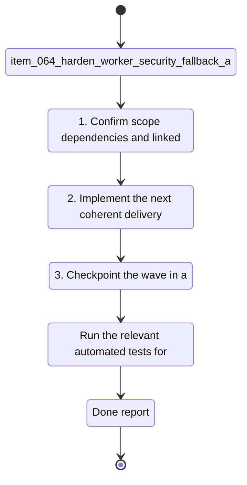

## task_032_harden_worker_security_fallback_and_audit_boundaries - Harden worker security, fallback, and audit boundaries
> From version: 1.1.1
> Schema version: 1.0
> Status: Done
> Understanding: 96%
> Confidence: 94%
> Progress: 100%
> Complexity: High
> Theme: General
> Reminder: Update status/understanding/confidence/progress and linked request/backlog references when you edit this doc. Decision resolved: remote worker control uses a bearer-token style shared secret and `read_only` is the default fallback.
> Maintenance edit: completed the worker hardening wave and captured validation.

# Context
- Derived from backlog item `item_064_harden_worker_security_fallback_and_audit_boundaries`.
- Source file: `logics/backlog/item_064_harden_worker_security_fallback_and_audit_boundaries.md`.
- Related request(s): `req_017_implement_the_full_app_worker_corpus_and_shell_plan`.
- The worker split needs explicit guardrails for remote transport, fallback, and audit so the app can trust the published corpus and job history.
- Remote control is expected to travel over authenticated HTTPS with a bearer-token style shared secret, while local control remains inside the trust boundary.
- The first fallback should be `read_only` when a published corpus exists but the worker is unavailable; stricter deployments can still opt into `block`.
- The current implementation slice covers boundary and CLI parity, but it does not yet fully codify the operational safety model from ADR 023.
- Without those rules, remote-worker usage remains harder to reason about and harder to support during failure or version mismatch scenarios.

# Plan
- [x] 1. Confirm scope, dependencies, and linked acceptance criteria.
- [x] 2. Implement the next coherent delivery wave from the backlog item.
- [x] 3. Checkpoint the wave in a commit-ready state, validate it, and update the linked Logics docs.
- [x] CHECKPOINT: leave the current wave commit-ready and update the linked Logics docs before continuing.
- [x] CHECKPOINT: if the shared AI runtime is active and healthy, run `python logics/skills/logics.py flow assist commit-all` for the current step, item, or wave commit checkpoint.
- [x] GATE: do not close a wave or step until the relevant automated tests and quality checks have been run successfully.
- [x] FINAL: Update related Logics docs

# Delivery checkpoints
- Each completed wave should leave the repository in a coherent, commit-ready state.
- Update the linked Logics docs during the wave that changes the behavior, not only at final closure.
- Prefer a reviewed commit checkpoint at the end of each meaningful wave instead of accumulating several undocumented partial states.
- If the shared AI runtime is active and healthy, use `python logics/skills/logics.py flow assist commit-all` to prepare the commit checkpoint for each meaningful step, item, or wave.
- Do not mark a wave or step complete until the relevant automated tests and quality checks have been run successfully.

# AC Traceability
- AC1 -> Scope: Remote worker requests are authenticated and reject unauthenticated or incompatible calls.. Proof: capture validation evidence in this doc.
- AC2 -> Scope: App fallback states are explicit for reachable, unreachable, and incompatible worker or corpus conditions.. Proof: capture validation evidence in this doc.
- AC3 -> Scope: Job and manifest records include launched-by, client, and effective-config details needed for audit.. Proof: capture validation evidence in this doc.
- AC4 -> Scope: Concurrency and retention rules are codified instead of implied.. Proof: capture validation evidence in this doc.
- AC5 -> Scope: Tests cover remote failure, compatibility, and fallback behavior.. Proof: capture validation evidence in this doc.

# Decision framing
- Product framing: Required
- Product signals: pricing and packaging, engagement loop
- Product follow-up: Create or link a product brief before implementation moves deeper into delivery.
- Architecture framing: Required
- Architecture signals: data model and persistence, runtime and boundaries, security and identity
- Architecture follow-up: Create or link an architecture decision before irreversible implementation work starts.

# Links
- Product brief(s): `prod_008_make_ingestion_and_live_export_operable_across_app_and_cli`
- Architecture decision(s): `adr_023_split_execution_runtime_from_the_app_and_share_corpus_artifacts`
- Derived from `item_064_harden_worker_security_fallback_and_audit_boundaries`
- Request(s): `req_017_implement_the_full_app_worker_corpus_and_shell_plan`

# AI Context
- Summary: Harden worker security, fallback, and audit boundaries.
- Keywords: worker, security, fallback, audit, retention, compatibility, remote worker
- Use when: Use when implementing or reviewing the remaining worker safety guardrails.
- Skip when: Skip when the change is unrelated to worker transport or fallback behavior.
# References
- `logics/skills/logics-ui-steering/SKILL.md`

# Validation
- Run the relevant automated tests for the changed surface before closing the current wave or step.
- Run the relevant lint or quality checks before closing the current wave or step.
- Confirm the completed wave leaves the repository in a commit-ready state.

# Definition of Done (DoD)
- [x] Scope implemented and acceptance criteria covered.
- [x] Validation commands executed and results captured.
- [x] No wave or step was closed before the relevant automated tests and quality checks passed.
- [x] Linked request/backlog/task docs updated during completed waves and at closure.
- [x] Each completed wave left a commit-ready checkpoint or an explicit exception is documented.
- [x] Status is `Done` and progress is `100%`.

# Report
- Implemented remote worker hardening with validation for remote HTTPS + token requirements, audit metadata on job requests, and authenticated EventSource URLs for remote jobs.
- Job console output now carries worker mode and fallback context, and failed remote starts provide an explicit read-only fallback message when configured.
- Validation: `rtk npm run test -- tests/worker-client.spec.ts tests/use-theme.spec.ts tests/app.spec.tsx tests/use-sync-operations.spec.tsx tests/corpus.spec.ts tests/corpus-loader.spec.ts tests/live-corpus-hook.spec.tsx tests/live-export-state.spec.ts`
- Validation: `rtk npm run typecheck`
- Validation: `rtk npm run lint`
