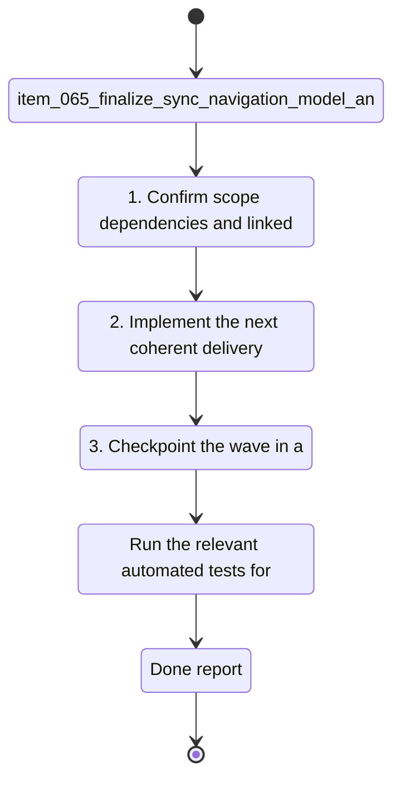

## task_033_finalize_sync_navigation_model_and_recovery_entry_points - Finalize sync navigation model and recovery entry points
> From version: 1.1.1
> Schema version: 1.0
> Status: Ready
> Understanding: 94%
> Confidence: 92%
> Progress: 5%
> Complexity: Medium
> Theme: General
> Reminder: Update status/understanding/confidence/progress and linked request/backlog references when you edit this doc. Decision resolved: use explicit routes with fixed `Status -> Operations -> History -> Config -> Recovery` ordering.

# Context
- Derived from backlog item `item_065_finalize_sync_navigation_model_and_recovery_entry_points`.
- Source file: `logics/backlog/item_065_finalize_sync_navigation_model_and_recovery_entry_points.md`.
- Related request(s): `req_017_implement_the_full_app_worker_corpus_and_shell_plan`.
- The sync split exists, but the exact navigation model, recovery entry points, and deep-link behavior still need to be locked down so the experience does not feel fragmented.
- The first implementation should use explicit routes rather than tabs or nested panels so deep links and recovery entry points stay predictable.
- Operators need a clear way to move between summary, operations, history, config, and recovery without relearning the app each time.
- Keep the screen ordering fixed as `Status -> Operations -> History -> Config -> Recovery` unless a later item explicitly changes the flow.
- The product brief still leaves the first-iteration navigation shape open enough that the implementation could drift.

# Plan
- [ ] 1. Confirm scope, dependencies, and linked acceptance criteria.
- [ ] 2. Implement the next coherent delivery wave from the backlog item.
- [ ] 3. Checkpoint the wave in a commit-ready state, validate it, and update the linked Logics docs.
- [ ] CHECKPOINT: leave the current wave commit-ready and update the linked Logics docs before continuing.
- [ ] CHECKPOINT: if the shared AI runtime is active and healthy, run `python logics/skills/logics.py flow assist commit-all` for the current step, item, or wave commit checkpoint.
- [ ] GATE: do not close a wave or step until the relevant automated tests and quality checks have been run successfully.
- [ ] FINAL: Update related Logics docs

# Delivery checkpoints
- Each completed wave should leave the repository in a coherent, commit-ready state.
- Update the linked Logics docs during the wave that changes the behavior, not only at final closure.
- Prefer a reviewed commit checkpoint at the end of each meaningful wave instead of accumulating several undocumented partial states.
- If the shared AI runtime is active and healthy, use `python logics/skills/logics.py flow assist commit-all` to prepare the commit checkpoint for each meaningful step, item, or wave.
- Do not mark a wave or step complete until the relevant automated tests and quality checks have been run successfully.

# AC Traceability
- AC1 -> Scope: Dedicated screens are reachable with stable labels and a single obvious default path.. Proof: capture validation evidence in this doc.
- AC2 -> Scope: Deep links or equivalent shortcuts preserve the current summary or operation context.. Proof: capture validation evidence in this doc.
- AC3 -> Scope: Recovery guidance is reachable from the operational flow without hunting through the UI.. Proof: capture validation evidence in this doc.
- AC4 -> Scope: Keyboard navigation and small-screen behavior remain usable after the model is finalized.. Proof: capture validation evidence in this doc.
- AC5 -> Scope: Tests cover the summary-to-detail handoff and the navigation labels.. Proof: capture validation evidence in this doc.

# Decision framing
- Product framing: Required
- Product signals: navigation and discoverability
- Product follow-up: Create or link a product brief before implementation moves deeper into delivery.
- Architecture framing: Required
- Architecture signals: data model and persistence, state and sync
- Architecture follow-up: Create or link an architecture decision before irreversible implementation work starts.

# Links
- Product brief(s): `prod_005_split_sync_status_into_dedicated_operations_screens`
- Architecture decision(s): `adr_024_split_sync_status_into_dedicated_operations_screens`
- Derived from `item_065_finalize_sync_navigation_model_and_recovery_entry_points`
- Request(s): `req_017_implement_the_full_app_worker_corpus_and_shell_plan`

# AI Context
- Summary: Finalize sync navigation model and recovery entry points.
- Keywords: sync status, navigation, recovery, deep link, operations, history, config
- Use when: Use when implementing or reviewing the residual sync navigation follow-up.
- Skip when: Skip when the change is unrelated to sync screen routing or recovery access.
# References
- `logics/skills/logics-ui-steering/SKILL.md`

# Validation
- Run the relevant automated tests for the changed surface before closing the current wave or step.
- Run the relevant lint or quality checks before closing the current wave or step.
- Confirm the completed wave leaves the repository in a commit-ready state.

# Definition of Done (DoD)
- [ ] Scope implemented and acceptance criteria covered.
- [ ] Validation commands executed and results captured.
- [ ] No wave or step was closed before the relevant automated tests and quality checks passed.
- [ ] Linked request/backlog/task docs updated during completed waves and at closure.
- [ ] Each completed wave left a commit-ready checkpoint or an explicit exception is documented.
- [ ] Status is `Done` and progress is `100%`.

# Report
