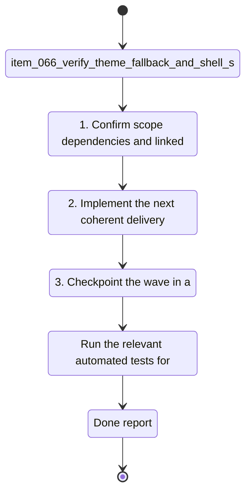

## task_034_verify_theme_fallback_and_shell_surface_coverage - Verify theme fallback and shell surface coverage
> From version: 1.1.1
> Schema version: 1.0
> Status: Ready
> Understanding: 94%
> Confidence: 92%
> Progress: 5%
> Complexity: Medium
> Theme: General
> Reminder: Update status/understanding/confidence/progress and linked request/backlog references when you edit this doc. Decision resolved: first-launch system fallback, then persisted preference authority.

# Context
- Derived from backlog item `item_066_verify_theme_fallback_and_shell_surface_coverage`.
- Source file: `logics/backlog/item_066_verify_theme_fallback_and_shell_surface_coverage.md`.
- Related request(s): `req_017_implement_the_full_app_worker_corpus_and_shell_plan`.
- The sidebar theme switch exists, but the fallback rule and shell-wide surface coverage still need explicit verification so the behavior stays predictable.
- On the first launch, the shell should honor system appearance only when no user preference exists; after that, the persisted preference becomes authoritative.
- The open product and ADR questions leave room for the control to drift between system-driven and user-driven behavior.
- If modal and panel surfaces do not consume the same tokens, the theme will feel inconsistent even when the switch works.

# Plan
- [ ] 1. Confirm scope, dependencies, and linked acceptance criteria.
- [ ] 2. Implement the next coherent delivery wave from the backlog item.
- [ ] 3. Checkpoint the wave in a commit-ready state, validate it, and update the linked Logics docs.
- [ ] CHECKPOINT: leave the current wave commit-ready and update the linked Logics docs before continuing.
- [ ] CHECKPOINT: if the shared AI runtime is active and healthy, run `python logics/skills/logics.py flow assist commit-all` for the current step, item, or wave commit checkpoint.
- [ ] GATE: do not close a wave or step until the relevant automated tests and quality checks have been run successfully.
- [ ] FINAL: Update related Logics docs

# Delivery checkpoints
- Each completed wave should leave the repository in a coherent, commit-ready state.
- Update the linked Logics docs during the wave that changes the behavior, not only at final closure.
- Prefer a reviewed commit checkpoint at the end of each meaningful wave instead of accumulating several undocumented partial states.
- If the shared AI runtime is active and healthy, use `python logics/skills/logics.py flow assist commit-all` to prepare the commit checkpoint for each meaningful step, item, or wave.
- Do not mark a wave or step complete until the relevant automated tests and quality checks have been run successfully.

# AC Traceability
- AC1 -> Scope: The first load behavior follows the intended system or persisted preference fallback rule.. Proof: capture validation evidence in this doc.
- AC2 -> Scope: Once the user chooses a mode, the persisted preference becomes authoritative on reload.. Proof: capture validation evidence in this doc.
- AC3 -> Scope: Shell tokens cover panels, modals, and navigation surfaces consistently.. Proof: capture validation evidence in this doc.
- AC4 -> Scope: Accessibility and keyboard interaction remain intact for the theme control.. Proof: capture validation evidence in this doc.
- AC5 -> Scope: Tests cover reload persistence and shell-wide application of the selected theme.. Proof: capture validation evidence in this doc.

# Decision framing
- Product framing: Required
- Product signals: pricing and packaging, navigation and discoverability
- Product follow-up: Create or link a product brief before implementation moves deeper into delivery.
- Architecture framing: Required
- Architecture signals: data model and persistence, state and sync
- Architecture follow-up: Create or link an architecture decision before irreversible implementation work starts.

# Links
- Product brief(s): `prod_007_add_a_discrete_light_and_dark_theme_switch_in_the_sidebar`
- Architecture decision(s): `adr_025_add_a_discrete_light_and_dark_theme_switch_with_persisted_shell_mode`
- Derived from `item_066_verify_theme_fallback_and_shell_surface_coverage`
- Request(s): `req_017_implement_the_full_app_worker_corpus_and_shell_plan`

# AI Context
- Summary: Verify theme fallback and shell surface coverage.
- Keywords: theme, persistence, fallback, shell, panels, modals, accessibility
- Use when: Use when implementing or reviewing the remaining theme follow-up.
- Skip when: Skip when the change is unrelated to shell appearance persistence.
# Validation
- Run the relevant automated tests for the changed surface before closing the current wave or step.
- Run the relevant lint or quality checks before closing the current wave or step.
- Confirm the completed wave leaves the repository in a commit-ready state.

# Definition of Done (DoD)
- [ ] Scope implemented and acceptance criteria covered.
- [ ] Validation commands executed and results captured.
- [ ] No wave or step was closed before the relevant automated tests and quality checks passed.
- [ ] Linked request/backlog/task docs updated during completed waves and at closure.
- [ ] Each completed wave left a commit-ready checkpoint or an explicit exception is documented.
- [ ] Status is `Done` and progress is `100%`.

# Report
