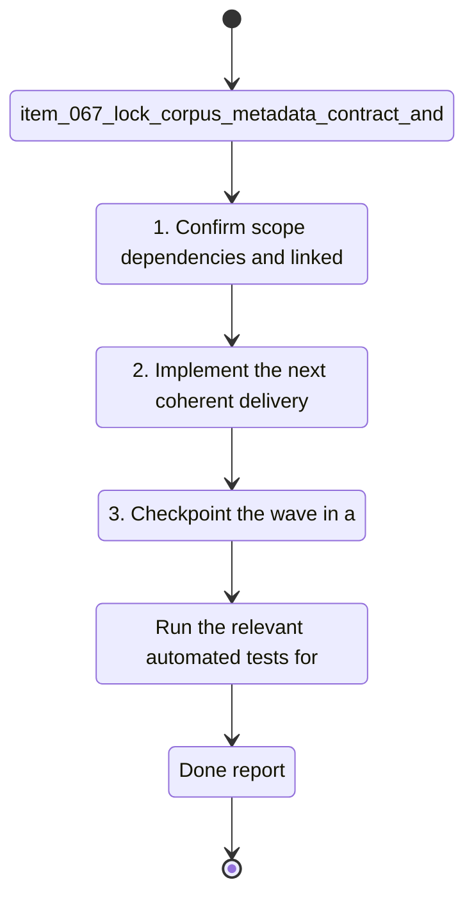

## task_035_lock_corpus_metadata_contract_and_required_fields - Lock corpus metadata contract and required fields
> From version: 1.1.0
> Schema version: 1.0
> Status: Ready
> Understanding: 93%
> Confidence: 91%
> Progress: 0%
> Complexity: Medium
> Theme: General
> Reminder: Update status/understanding/confidence/progress and linked request/backlog references when you edit this doc.

# Context
- Derived from backlog item `item_067_lock_corpus_metadata_contract_and_required_fields`.
- Source file: `logics/backlog/item_067_lock_corpus_metadata_contract_and_required_fields.md`.
- Related request(s): `req_017_implement_the_full_app_worker_corpus_and_shell_plan`.
- Section-aware chunking and stronger hints exist, but the corpus contract still needs a clear line between required metadata and optional extensions so future ingestion changes stay stable.
- The open product question around mandatory structural fields could otherwise lead to drift between documents, scoring, and hint generation.
- A stable contract is needed before the next round of corpus changes expands the shape further.

# Plan
- [ ] 1. Confirm scope, dependencies, and linked acceptance criteria.
- [ ] 2. Implement the next coherent delivery wave from the backlog item.
- [ ] 3. Checkpoint the wave in a commit-ready state, validate it, and update the linked Logics docs.
- [ ] CHECKPOINT: leave the current wave commit-ready and update the linked Logics docs before continuing.
- [ ] CHECKPOINT: if the shared AI runtime is active and healthy, run `python logics/skills/logics.py flow assist commit-all` for the current step, item, or wave commit checkpoint.
- [ ] GATE: do not close a wave or step until the relevant automated tests and quality checks have been run successfully.
- [ ] FINAL: Update related Logics docs

# Delivery checkpoints
- Each completed wave should leave the repository in a coherent, commit-ready state.
- Update the linked Logics docs during the wave that changes the behavior, not only at final closure.
- Prefer a reviewed commit checkpoint at the end of each meaningful wave instead of accumulating several undocumented partial states.
- If the shared AI runtime is active and healthy, use `python logics/skills/logics.py flow assist commit-all` to prepare the commit checkpoint for each meaningful step, item, or wave.
- Do not mark a wave or step complete until the relevant automated tests and quality checks have been run successfully.

# AC Traceability
- AC1 -> Scope: The required and optional corpus metadata fields are explicitly documented and validated.. Proof: capture validation evidence in this doc.
- AC2 -> Scope: The schema and loading rules enforce the contract without breaking existing corpus content.. Proof: capture validation evidence in this doc.
- AC3 -> Scope: Retrieval and Bishop hint generation continue to consume the same signal contract across documents.. Proof: capture validation evidence in this doc.
- AC4 -> Scope: Tests cover corpus loading, signal extraction, and hint generation against the locked contract.. Proof: capture validation evidence in this doc.

# Decision framing
- Product framing: Consider
- Product signals: pricing and packaging
- Product follow-up: Review whether a product brief is needed before scope becomes harder to change.
- Architecture framing: Required
- Architecture signals: data model and persistence, contracts and integration, runtime and boundaries, state and sync
- Architecture follow-up: Create or link an architecture decision before irreversible implementation work starts.

# Links
- Product brief(s): `prod_006_improve_ingestion_metadata_and_chunking_for_bishop_hints`
- Architecture decision(s): `adr_026_improve_ingestion_metadata_and_chunking_for_bishop_hints`
- Derived from `item_067_lock_corpus_metadata_contract_and_required_fields`
- Request(s): `req_017_implement_the_full_app_worker_corpus_and_shell_plan`

# AI Context
- Summary: Lock corpus metadata contract and required fields.
- Keywords: corpus, metadata, schema, retrieval, hints, validation, contract
- Use when: Use when implementing or reviewing the remaining corpus contract follow-up.
- Skip when: Skip when the change is unrelated to corpus metadata shape.
# References
- `logics/skills/logics-ui-steering/SKILL.md`

# Validation
- Run the relevant automated tests for the changed surface before closing the current wave or step.
- Run the relevant lint or quality checks before closing the current wave or step.
- Confirm the completed wave leaves the repository in a commit-ready state.

# Definition of Done (DoD)
- [ ] Scope implemented and acceptance criteria covered.
- [ ] Validation commands executed and results captured.
- [ ] No wave or step was closed before the relevant automated tests and quality checks passed.
- [ ] Linked request/backlog/task docs updated during completed waves and at closure.
- [ ] Each completed wave left a commit-ready checkpoint or an explicit exception is documented.
- [ ] Status is `Done` and progress is `100%`.

# Report
