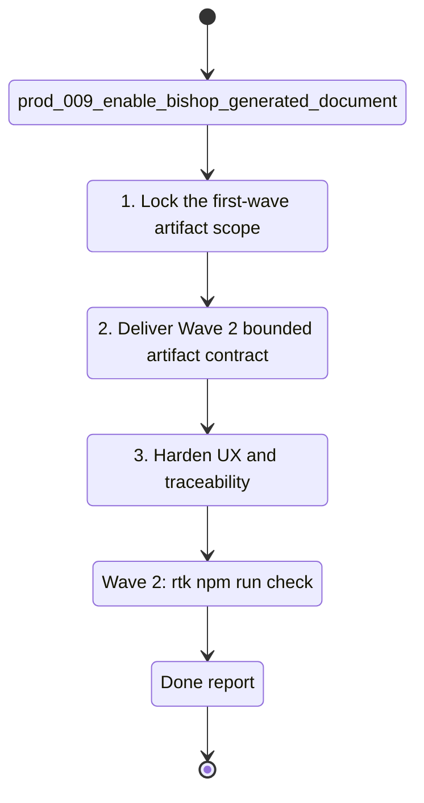

## task_036_orchestrate_bishop_generated_document_artifacts - Orchestrate Bishop generated document artifacts
> From version: 1.3.0
> Schema version: 1.0
> Status: Done
> Understanding: 98%
> Confidence: 95%
> Progress: 100%
> Complexity: High
> Theme: Product / Architecture
> Reminder: Update status/understanding/confidence/progress and linked product/backlog/task references when you edit this doc.

# Context
- Orchestrate the full delivery program for `prod_009_enable_bishop_generated_document_artifacts`.
- The product goal is to let Bishop return simple downloadable artifacts instead of stopping at prose and copy-paste instructions.
- Keep the first waves intentionally bounded around text-like artifacts and a clear user contract before expanding to richer document formats.
- Treat artifact generation as a Bishop outcome with its own product and contract rules, not as a generic side effect of any answer.

## Wave map
- Wave 1: product and contract framing
  - Goal: lock the user-facing scope, supported first-wave artifact types, request triggers, and failure semantics.
  - Expected outputs: linked backlog item(s), response-contract decision, and explicit first-wave product guardrails.
- Wave 2: first-wave artifact response contract
  - Goal: teach Bishop to return bounded downloadable artifacts for explicit requests in `.txt`, `.md`, `.json`, and `.csv`.
  - Expected outputs: artifact-aware response shape, a `Download` button in the Bishop message header before the `100%` and `?` pills, a dedicated `Artifact` row with `Download` in the right-side trace panel under `Confidence`, safe file naming, and validation for unsupported requests.
- Wave 3: UX hardening and traceability
  - Goal: make artifact generation understandable and trustworthy in the chat flow.
  - Expected outputs: better empty/error states, provenance alignment between answer and artifact, and tests for the full artifact path.
- Wave 4: worker-boundary preparation for richer formats
  - Goal: prepare the product boundary for larger or richer generated documents without overloading the in-app Bishop path.
  - Expected outputs: explicit hand-off rules for richer formats, follow-up architecture links, and a bounded roadmap for `.docx`, `.pdf`, or other worker-backed outputs.

# Plan
- [x] 1. Wave 1 — lock the first shipped scope from `prod_009_enable_bishop_generated_document_artifacts`: explicit artifact intent, supported lightweight formats, naming rules, and unsupported-format behavior.
- [x] 2. Wave 1 — create or update the linked backlog item(s) and architecture decision(s) needed to formalize the Bishop artifact response contract.
- [x] 3. Wave 2 — implement the bounded artifact response shape for first-wave formats (`.txt`, `.md`, `.json`, `.csv`) and expose a `Download` affordance both in the Bishop message header before the confidence and improvement pills and in a dedicated `Artifact` row under `Confidence` in the right-side trace panel.
- [x] 4. Wave 2 — keep a normal Bishop text answer in every artifact-bearing turn, and add the file only when the request is explicitly document-oriented.
- [x] 5. Wave 2 — add validation coverage for artifact generation success, unsupported requests, malformed artifact payloads, and normal answer-only behavior.
- [x] 6. Wave 3 — harden the UX so users can distinguish grounded answer, downloadable artifact, unsupported format, and generation failure without ambiguity.
- [x] 7. Wave 3 — keep provenance, traceability, and artifact messaging aligned in the same Bishop turn.
- [x] 8. Wave 4 — define the boundary for richer or heavier document outputs and document when the worker path becomes mandatory.
- [x] 9. Update linked Logics docs during each wave, not only at final closure.
- [x] CHECKPOINT: leave each wave commit-ready before moving to the next one.
- [x] GATE: do not close a wave until the relevant automated tests and linked docs are updated.
- [x] FINAL: close the orchestration task only when the first-wave artifact flow is documented, validated, and linked follow-up work for richer formats is explicit.

# Delivery checkpoints
- After Wave 1: the first-wave product scope is frozen and the missing backlog / architecture links exist.
- After Wave 2: Bishop can return a downloadable artifact for supported text-like formats inside the current chat flow.
- After Wave 2: the artifact-bearing message exposes a visible `Download` button in the header before the `100%` and `?` pills.
- After Wave 2: the right-side trace panel exposes a dedicated `Artifact` row with `Download` under `Confidence` when the selected answer includes a file.
- After Wave 2: artifact-bearing turns still include a normal Bishop answer and do not degrade into file-only output.
- After Wave 3: the artifact path is understandable enough to trust in normal usage and test coverage.
- After Wave 4: the product boundary between in-app artifacts and worker-backed richer documents is explicit.

# AC Traceability
- AC1 -> Wave 1. Freeze the first-wave artifact product scope and supported formats. Proof: linked product/backlog/architecture refs and updated scope text.
- AC2 -> Wave 2. Deliver a bounded Bishop artifact response contract for supported formats. Proof: artifact-aware response path, header-level `Download` UI, and `Artifact` trace-panel row under `Confidence`.
- AC3 -> Wave 2. Preserve normal answer-only behavior when no artifact is requested, and preserve a normal text answer when an artifact is requested. Proof: focused tests for answer-only and artifact-bearing turns.
- AC4 -> Wave 3. Make unsupported or failed artifact generation understandable. Proof: explicit UI states and validation coverage.
- AC5 -> Wave 3. Keep artifact generation traceable inside the same Bishop turn. Proof: answer trace and artifact affordance remain aligned.
- AC6 -> Wave 4. Define the richer-format boundary and follow-up path. Proof: documented worker hand-off rules and linked follow-up refs.

# Decision framing
- Product framing: Required
- Product signals: user outcome completion, Bishop usefulness, friction removal, download affordance clarity
- Product follow-up: Re-check whether the first-wave format list should stay limited to `.txt`, `.md`, `.json`, and `.csv` after Wave 1.
- Architecture framing: Required
- Architecture signals: response contract, artifact transport, browser-vs-worker boundary, payload size limits
- Architecture follow-up: Capture the Bishop artifact response contract and worker escalation boundary in an ADR before or during Wave 2.

# Links
- Product brief(s): `logics/product/prod_009_enable_bishop_generated_document_artifacts.md`
- Architecture decision(s): `adr_017_bishop_llm_orchestration_after_local_grounding`, `adr_020_clarify_bishop_orchestration_states_and_response_contract`, `adr_028_bound_bishop_generated_artifact_response_and_download_contract`
- Derived from: `prod_009_enable_bishop_generated_document_artifacts`
- Request(s): (none yet)
- Backlog item(s): `item_068_deliver_bishop_first_wave_generated_artifact_contract`
- Task(s): (this orchestration task)

# AI Context
- Summary: Orchestrate Bishop generated document artifacts from product framing through first-wave artifact delivery and richer-format boundary planning.
- Keywords: bishop, artifacts, generated documents, download, response contract, traceability, worker boundary
- Use when: Use when planning or delivering Bishop file-generation work from the product brief through the first bounded implementation waves.
- Skip when: Skip when the work is unrelated to Bishop outputs or does not change generated artifact behavior.

# Validation
- Run `rtk npm run typecheck` for every code-bearing wave.
- Run focused `rtk npm run test -- ...` suites for Bishop contract and app UI changes during Waves 2 and 3.
- Run `rtk npm run check` before closing Wave 2 or Wave 3.
- Run `rtk python3 logics/skills/logics-doc-linter/scripts/logics_lint.py --require-status --format text` after updating linked Logics docs.

# Definition of Done (DoD)
- [x] Scope implemented and acceptance criteria covered for the shipped wave.
- [x] Validation commands executed and results captured.
- [x] Linked product / backlog / architecture docs updated during the wave.
- [x] Each completed wave left a commit-ready checkpoint.
- [x] Status moved to `Done` only when the bounded first-wave artifact path is complete and richer-format follow-up is explicitly linked.

# Report
- Delivered a bounded first-wave Bishop artifact contract for explicit `.txt`, `.md`, `.json`, and `.csv` requests.
- Added `artifact`, `artifactStatus`, and `artifactNotice` to the Bishop response path, with explicit handling for unsupported formats and malformed remote payloads.
- Exposed `Download` in the Bishop message header before the confidence and improvement pills and added an `Artifact` row under `Confidence` in the right-side trace panel.
- Kept a normal Bishop text answer in artifact-bearing turns and surfaced artifact notices in the same turn for traceability.
- Captured the shipped contract and richer-format boundary in `item_068`, `adr_028`, and `spec_007`.
- Validation:
  - `rtk npm run test -- tests/bishop.spec.ts tests/app-ui.spec.tsx tests/bishop-panel.spec.tsx tests/use-bishop-conversation.spec.tsx tests/file-download.spec.ts`
  - `rtk npm run typecheck`
