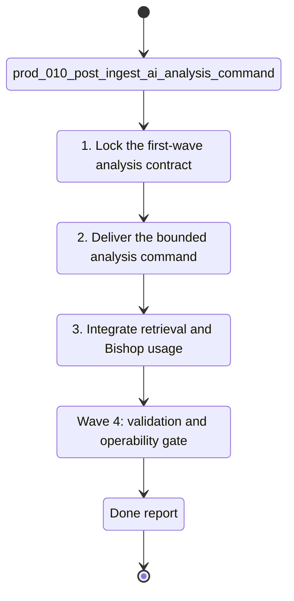

## task_037_orchestrate_post_ingest_ai_analysis_command_for_corpus_enrichment - Orchestrate post-ingest AI analysis command for corpus enrichment
> From version: 1.3.0
> Schema version: 1.0
> Status: Proposed
> Understanding: 97%
> Confidence: 93%
> Progress: 0%
> Complexity: High
> Theme: Product / Architecture
> Reminder: Update status/understanding/confidence/progress and linked product/backlog/task references when you edit this doc.

# Context
- Orchestrate the full delivery program for `prod_010_add_a_post_ingest_ai_analysis_command_for_corpus_enrichment`.
- The product goal is to add a separate post-ingest command that enriches the corpus through bounded AI analysis without destabilizing baseline ingest.
- Keep the first waves focused on contract clarity, selective analysis, exclusion policy, Bishop/retrieval consumption, and cost-bounded operability.
- Treat the analysis command as an additive enrichment pipeline, not as a replacement for the source-of-truth ingest path.

## Wave map
- Wave 1: product, contract, and state framing
  - Goal: freeze the first-wave `analysis` block, reanalysis rules, exclusion policy, and processing-state model.
  - Expected outputs: linked backlog item(s), storage/contract decisions, and explicit rules for `not_analyzed`, `analyzed`, `excluded`, `failed`, and `stale`.
- Wave 2: command and persistence implementation
  - Goal: ship the bounded post-ingest analysis command with additive persistence and deterministic candidate selection.
  - Expected outputs: CLI command, analysis persistence, exclusion reasons, versioned analysis block, and delta-safe reruns.
- Wave 3: retrieval and Bishop integration
  - Goal: make the enriched corpus useful to downstream retrieval and Bishop flows.
  - Expected outputs: analysis-aware retrieval precedence, Bishop-facing summary/section consumption, and traceable document-level states.
- Wave 4: quality, cost, and operability hardening
  - Goal: prove the command is worth running and safe to operate routinely.
  - Expected outputs: difficult-file validation set, bounded run metrics, budget-aware selection rules, and explicit follow-up boundaries.

# Plan
- [ ] 1. Wave 1 — lock the first-wave `analysis` block contract, processing states, exclusion policy, and reanalysis rules from `prod_010_add_a_post_ingest_ai_analysis_command_for_corpus_enrichment`.
- [ ] 2. Wave 1 — create or update the linked backlog / architecture refs needed to formalize the command boundary, the additive analysis block, and the downstream usage contract.
- [ ] 3. Wave 2 — implement the bounded post-ingest analysis command with deterministic candidate selection, additive persistence, and explicit exclusion reasons.
- [ ] 4. Wave 2 — keep baseline corpus behavior intact when the analysis path is unavailable, excluded, or failed.
- [ ] 5. Wave 2 — add validation coverage for reanalysis triggers, exclusion handling, failure states, and additive output shape.
- [ ] 6. Wave 3 — integrate analysis-aware summary/section usage into retrieval and Bishop without replacing raw evidence grounding.
- [ ] 7. Wave 3 — expose document-level analysis status clearly enough to diagnose weak sources and downstream behavior.
- [ ] 8. Wave 4 — add a difficult-file validation set and bounded budget metrics so the command can be judged on quality and cost, not only on data shape.
- [ ] 9. Update linked Logics docs during each wave, not only at final closure.
- [ ] CHECKPOINT: leave each wave commit-ready before moving to the next one.
- [ ] GATE: do not close a wave until the relevant automated tests and linked docs are updated.
- [ ] FINAL: close the orchestration task only when the first-wave analysis command is documented, validated, and safe to run routinely.

# Delivery checkpoints
- After Wave 1: the first-wave `analysis` contract and state model are frozen.
- After Wave 2: the bounded post-ingest analysis command exists and writes additive analysis state without breaking baseline corpus usage.
- After Wave 3: retrieval and Bishop consume the enriched fields in a controlled, traceable order.
- After Wave 4: the command has explicit quality, budget, and operability evidence.

# AC Traceability
- AC1 -> Wave 1. Freeze the first-wave additive `analysis` block and processing-state contract. Proof: linked product/architecture refs and updated scope text.
- AC2 -> Wave 2. Deliver a bounded post-ingest analysis command with exclusion handling and additive persistence. Proof: command path, analysis output shape, and explicit exclusion/failure reasons.
- AC3 -> Wave 2. Preserve baseline corpus behavior when analysis is unavailable or fails. Proof: fallback behavior and focused tests.
- AC4 -> Wave 3. Make retrieval and Bishop consume the enriched fields in a controlled way. Proof: analysis-aware downstream behavior and validation coverage.
- AC5 -> Wave 4. Prove the command is quality-positive and cost-bounded on difficult files. Proof: validation set, metrics, and run budget evidence.

# Decision framing
- Product framing: Required
- Product signals: retrieval usefulness, Bishop answer quality, operator trust, cost transparency
- Product follow-up: Re-check whether the first-wave candidate set and hard size ceiling remain correct after the validation wave.
- Architecture framing: Required
- Architecture signals: additive schema contract, command boundary, persistence, state model, downstream consumption order
- Architecture follow-up: Capture the command/output contract and downstream usage order in an ADR before or during Wave 2.

# Links
- Product brief(s): `logics/product/prod_010_add_a_post_ingest_ai_analysis_command_for_corpus_enrichment.md`
- Architecture decision(s): `adr_002_sharepoint_ingestion_and_sync_pipeline`, `adr_003_hybrid_knowledge_store_and_retrieval_model`, `adr_014_deepvault_retrieval_ranking_quality_and_cost_policy`, `adr_016_deepvault_persistence_and_storage_layout`, `adr_023_split_execution_runtime_from_the_app_and_share_corpus_artifacts`
- Derived from: `prod_010_add_a_post_ingest_ai_analysis_command_for_corpus_enrichment`
- Request(s): (none yet)
- Backlog item(s): (none yet)
- Task(s): (this orchestration task)

# AI Context
- Summary: Orchestrate the post-ingest AI analysis command from contract framing through bounded implementation, downstream usage, and operability validation.
- Keywords: post-ingest, analysis, corpus enrichment, bishop, retrieval, exclusion, reanalysis, cost
- Use when: Use when planning or delivering the bounded AI enrichment path defined by P10.
- Skip when: Skip when the work does not change the analysis command, analysis contract, or downstream consumption of enriched fields.

# Validation
- Run `rtk npm run typecheck` for every code-bearing wave.
- Run focused `rtk npm run test -- ...` suites for command, persistence, retrieval, and Bishop changes during Waves 2 and 3.
- Run `rtk npm run check` before closing Wave 3 or Wave 4.
- Run `rtk python3 logics/skills/logics-doc-linter/scripts/logics_lint.py --require-status --format text` after updating linked Logics docs.

# Definition of Done (DoD)
- [ ] Scope implemented and acceptance criteria covered for the shipped wave.
- [ ] Validation commands executed and results captured.
- [ ] Linked product / backlog / architecture docs updated during the wave.
- [ ] Each completed wave left a commit-ready checkpoint.
- [ ] Status moved to `Done` only when the bounded analysis command is complete, validated, and explicitly integrated into downstream usage.

# Report
- Pending.
