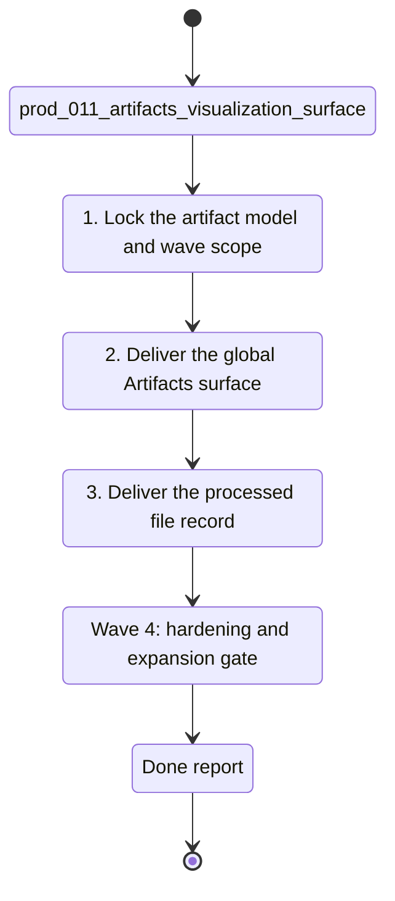

## task_038_orchestrate_artifacts_visualization_surface_for_generated_outputs - Orchestrate Artifacts visualization surface for generated outputs
> From version: 1.3.0
> Schema version: 1.0
> Status: Done
> Understanding: 96%
> Confidence: 92%
> Progress: 100%
> Complexity: High
> Theme: Product / Architecture
> Reminder: Update status/understanding/confidence/progress and linked product/backlog/task references when you edit this doc.

# Context
- Orchestrate the full delivery program for `prod_011_add_an_artifacts_visualization_surface_for_generated_outputs`.
- The product goal is to add a top-level `Artifacts` surface that shows everything the system has generated and allows drill-down into a processed SharePoint file record.
- Keep the first waves read-only, inspection-first, and centered on generated outputs rather than job execution.
- Treat the SharePoint file processed record as a primary scenario, not an incidental detail view.

## Wave map
- Wave 1: product framing and artifact model
  - Goal: freeze the artifact categories, global-view information model, and processed-file record scope.
  - Expected outputs: linked backlog item(s), artifact taxonomy, and explicit first-wave read-only guardrails.
- Wave 2: global Artifacts surface
  - Goal: ship the unified artifacts list with global visibility, filtering, grouping, and artifact-level inspection.
  - Expected outputs: top-level `Artifacts` navigation, global list view, grouping/filter controls, and category coverage for the first shipped artifact set.
- Wave 3: processed SharePoint file record
  - Goal: let users inspect a single SharePoint file's ingestion and analysis record in one place.
  - Expected outputs: file-level identity, ingestion state, analysis state, derived outputs, provenance, and diagnostics blocks.
- Wave 4: hardening and expansion boundary
  - Goal: make the surface trustworthy for routine debugging and ready for P10 analysis outputs.
  - Expected outputs: empty/error states, artifact-source traceability, and an explicit roadmap for additional artifact families.

# Plan
- [ ] 1. Wave 1 — lock the first-wave artifact taxonomy, grouping/filter model, and processed SharePoint file record scope from `prod_011_add_an_artifacts_visualization_surface_for_generated_outputs`.
- [ ] 2. Wave 1 — create or update the linked backlog / architecture refs needed to formalize artifact families, source provenance, and read-only detail inspection.
- [ ] 3. Wave 2 — implement the top-level `Artifacts` surface with a global generated-output view, compact filters, and first-wave artifact categories.
- [ ] 4. Wave 2 — keep the first-wave surface inspection-first and avoid turning it into a file manager or execution panel.
- [ ] 5. Wave 2 — add validation coverage for grouping, filtering, empty states, and artifact category visibility.
- [ ] 6. Wave 3 — implement the processed SharePoint file record with ingestion state, analysis state, derived outputs, provenance, and diagnostics.
- [ ] 7. Wave 3 — make the detail flow usable for explaining weak Bishop behavior without requiring raw file inspection.
- [ ] 8. Wave 4 — harden traceability, edge states, and future expansion points for analysis artifacts and additional generated-output families.
- [ ] 9. Update linked Logics docs during each wave, not only at final closure.
- [ ] CHECKPOINT: leave each wave commit-ready before moving to the next one.
- [ ] GATE: do not close a wave until the relevant automated tests and linked docs are updated.
- [ ] FINAL: close the orchestration task only when the first-wave Artifacts surface and processed-file record are documented, validated, and clearly bounded.

# Delivery checkpoints
- After Wave 1: the artifact model, categories, and processed-record scope are frozen.
- After Wave 2: the top-level `Artifacts` surface exists and can show generated outputs globally.
- After Wave 3: a specific SharePoint file can be inspected through a processed record view.
- After Wave 4: the surface has enough state handling and traceability to support routine operator use.

# AC Traceability
- AC1 -> Wave 1. Freeze the first-wave artifact categories and information model. Proof: linked product/architecture refs and updated scope text.
- AC2 -> Wave 2. Deliver the global Artifacts surface with filtering and grouping. Proof: top-level navigation, list/group view, and validation coverage.
- AC3 -> Wave 3. Deliver the processed SharePoint file record with ingestion and analysis state. Proof: detail view blocks and downstream debugging utility.
- AC4 -> Wave 4. Make the surface trustworthy for real operator inspection. Proof: empty/error states, provenance, and traceability checks.

# Decision framing
- Product framing: Required
- Product signals: operator inspectability, debugging speed, generated-output visibility, Bishop diagnosis clarity
- Product follow-up: Re-check whether the first-wave artifact families should expand immediately after P10 lands.
- Architecture framing: Required
- Architecture signals: artifact taxonomy, persistence layout, provenance, detail-source mapping, future analysis artifact integration
- Architecture follow-up: Capture the artifact information model and detail-source mapping in an ADR before or during Wave 2.

# Links
- Product brief(s): `logics/product/prod_011_add_an_artifacts_visualization_surface_for_generated_outputs.md`
- Architecture decision(s): `adr_003_hybrid_knowledge_store_and_retrieval_model`, `adr_016_deepvault_persistence_and_storage_layout`, `adr_023_split_execution_runtime_from_the_app_and_share_corpus_artifacts`, `adr_030_artifacts_surface_information_model_and_processed_record`
- Derived from: `prod_011_add_an_artifacts_visualization_surface_for_generated_outputs`
- Request(s): (none yet)
- Backlog item(s): `item_070_ship_artifacts_inspection_surface`
- Task(s): (this orchestration task)

# AI Context
- Summary: Orchestrate the Artifacts surface from global generated-output visibility through processed SharePoint file drill-down.
- Keywords: artifacts, generated outputs, corpus, manifests, snapshots, processed file record, bishop diagnostics
- Use when: Use when planning or delivering the first-wave Artifacts inspection surface.
- Skip when: Skip when the work does not change generated-output visibility, artifact grouping, or the processed-file record.

# Validation
- Run `rtk npm run typecheck` for every code-bearing wave.
- Run focused `rtk npm run test -- ...` suites for navigation, list/detail states, grouping, and artifact drill-down during Waves 2 and 3.
- Run `rtk npm run check` before closing Wave 3 or Wave 4.
- Run `rtk python3 logics/skills/logics-doc-linter/scripts/logics_lint.py --require-status --format text` after updating linked Logics docs.

# Definition of Done (DoD)
- [ ] Scope implemented and acceptance criteria covered for the shipped wave.
- [ ] Validation commands executed and results captured.
- [ ] Linked product / backlog / architecture docs updated during the wave.
- [ ] Each completed wave left a commit-ready checkpoint.
- [ ] Status moved to `Done` only when the first-wave Artifacts surface and processed-file record are complete, validated, and clearly bounded.

# Report
- The app now ships a top-level `Artifacts` surface with filtering, grouping, and list-plus-detail inspection.
- Processed-file records expose identity, analysis state, derived outputs, and diagnostics blocks for debugging weak corpus behavior.
