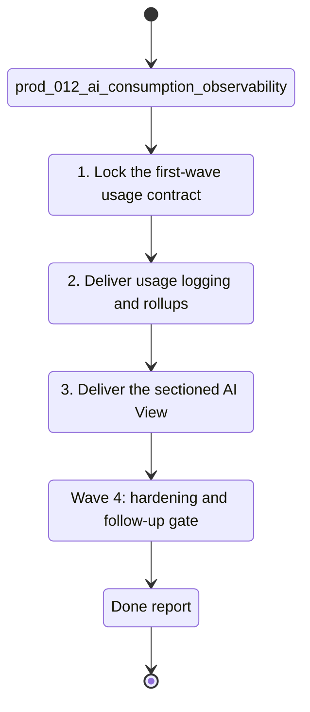

## task_039_orchestrate_ai_consumption_observability_and_sectioned_ai_view - Orchestrate AI consumption observability and a sectioned AI View
> From version: 1.3.0
> Schema version: 1.0
> Status: Done
> Understanding: 98%
> Confidence: 94%
> Progress: 100%
> Complexity: High
> Theme: Product / Architecture
> Reminder: Update status/understanding/confidence/progress and linked product/backlog/task references when you edit this doc.

# Context
- Orchestrate the full delivery program for `prod_012_add_ai_consumption_observability_and_sectioned_ai_view`.
- The product goal is to log input/output token usage and split `AI View` into an answer-review section and a consumption-observability section.
- Keep the first waves focused on bounded observability, local dedicated usage storage, and a clear distinction between provider-backed token events and local outcomes.
- Treat the `Answered` and `Tokens` sections as separate operational surfaces that answer different questions.

## Wave map
- Wave 1: observability contract and storage framing
  - Goal: freeze the first-wave usage-event model, local dedicated storage, and section split of `AI View`.
  - Expected outputs: linked backlog item(s), event schema, retention assumptions, and explicit privacy/cost guardrails.
- Wave 2: usage logging and rollup implementation
  - Goal: log per-response input/output token events and build daily/hourly rollups from the dedicated local store.
  - Expected outputs: bounded append-only usage store, rollup logic, provider-backed vs local event distinction, and validation of partial-usage cases.
- Wave 3: sectioned AI View delivery
  - Goal: deliver the `Answered` and `Tokens` sections with a coherent section switcher and useful first-wave token visuals.
  - Expected outputs: section navigation, existing answer review preserved under `Answered`, and `Tokens` KPIs plus daily/hourly usage views.
- Wave 4: hardening and follow-up boundary
  - Goal: make the new observability path trustworthy and ready for later cost or per-model extensions.
  - Expected outputs: empty/error states, provider split summaries, data-retention handling, and an explicit deferred-cost boundary.

# Plan
- [ ] 1. Wave 1 — lock the first-wave usage-event schema, local dedicated storage, retention assumptions, and `Answered` / `Tokens` section split from `prod_012_add_ai_consumption_observability_and_sectioned_ai_view`.
- [ ] 2. Wave 1 — create or update the linked backlog / architecture refs needed to formalize token event logging, rollup logic, and privacy-aware observability boundaries.
- [ ] 3. Wave 2 — implement per-response input/output token logging, provider-backed vs local event separation, and daily/hourly rollup logic.
- [ ] 4. Wave 2 — keep partial usage events explicit instead of fabricating split values when a provider reports only totals.
- [ ] 5. Wave 2 — add validation coverage for dedicated usage storage, rollups, local/no-provider outcomes, and partial usage data.
- [ ] 6. Wave 3 — deliver the sectioned `AI View` with a settings-like section switcher and preserve the qualitative answer-review flow under `Answered`.
- [ ] 7. Wave 3 — deliver the `Tokens` section with first-wave KPIs, a daily trend view, an hourly distribution view, and provider-level summaries.
- [ ] 8. Wave 4 — harden empty/error/retention states and capture the explicit follow-up boundary for estimated cost and per-model breakdowns.
- [ ] 9. Update linked Logics docs during each wave, not only at final closure.
- [ ] CHECKPOINT: leave each wave commit-ready before moving to the next one.
- [ ] GATE: do not close a wave until the relevant automated tests and linked docs are updated.
- [ ] FINAL: close the orchestration task only when the first-wave usage contract, rollups, and sectioned AI View are documented, validated, and clearly bounded.

# Delivery checkpoints
- After Wave 1: the first-wave token-event model, storage boundary, and section split are frozen.
- After Wave 2: the product can log input/output usage events and derive daily/hourly rollups.
- After Wave 3: `AI View` exposes distinct `Answered` and `Tokens` sections with useful first-wave observability.
- After Wave 4: the path is hardened enough to support routine monitoring and future cost extensions.

# AC Traceability
- AC1 -> Wave 1. Freeze the first-wave token-event schema, storage boundary, and section split. Proof: linked product/architecture refs and updated scope text.
- AC2 -> Wave 2. Deliver bounded input/output token logging and rollup logic. Proof: dedicated usage store, rollups, and validation coverage.
- AC3 -> Wave 2. Preserve correct distinctions between provider-backed, local, and partial-usage events. Proof: event classification and focused tests.
- AC4 -> Wave 3. Deliver the `Answered` and `Tokens` sections in `AI View`. Proof: section switcher, answer-review continuity, and token-usage views.
- AC5 -> Wave 4. Make the usage observability path trustworthy enough for routine monitoring. Proof: state handling, provider summaries, and explicit deferred-cost boundary.

# Decision framing
- Product framing: Required
- Product signals: usage transparency, operator trust, provider visibility, AI View clarity
- Product follow-up: Re-check whether estimated cost should become a follow-up brief or stay inside this stream after the token observability wave stabilizes.
- Architecture framing: Required
- Architecture signals: usage-event schema, local storage, rollup logic, privacy boundaries, AI View state model
- Architecture follow-up: Capture the usage-event schema and retention/rollup boundary in an ADR before or during Wave 2.

# Links
- Product brief(s): `logics/product/prod_012_add_ai_consumption_observability_and_sectioned_ai_view.md`
- Architecture decision(s): `adr_008_llm_provider_abstraction_for_openai_and_gemini`, `adr_011_observability_audit_and_answer_traceability`, `adr_014_deepvault_retrieval_ranking_quality_and_cost_policy`, `adr_015_deepvault_security_audit_logging_and_retention_boundaries`, `adr_017_bishop_llm_orchestration_after_local_grounding`, `adr_031_local_ai_usage_event_store_and_sectioned_ai_view`
- Derived from: `prod_012_add_ai_consumption_observability_and_sectioned_ai_view`
- Request(s): (none yet)
- Backlog item(s): `item_071_ship_ai_usage_store_and_sectioned_ai_view`
- Task(s): (this orchestration task)

# AI Context
- Summary: Orchestrate AI consumption observability from event logging and rollups through a sectioned AI View.
- Keywords: ai view, tokens, input tokens, output tokens, observability, answered, provider usage, rollups
- Use when: Use when planning or delivering bounded AI consumption visibility and the `Answered` / `Tokens` split.
- Skip when: Skip when the work does not change usage logging, token rollups, or the AI View section model.

# Validation
- Run `rtk npm run typecheck` for every code-bearing wave.
- Run focused `rtk npm run test -- ...` suites for usage logging, rollups, and AI View UI changes during Waves 2 and 3.
- Run `rtk npm run check` before closing Wave 3 or Wave 4.
- Run `rtk python3 logics/skills/logics-doc-linter/scripts/logics_lint.py --require-status --format text` after updating linked Logics docs.

# Definition of Done (DoD)
- [ ] Scope implemented and acceptance criteria covered for the shipped wave.
- [ ] Validation commands executed and results captured.
- [ ] Linked product / backlog / architecture docs updated during the wave.
- [ ] Each completed wave left a commit-ready checkpoint.
- [ ] Status moved to `Done` only when the first-wave usage contract, rollups, and sectioned AI View are complete, validated, and clearly bounded.

# Report
- The app now persists bounded local usage events with explicit `provider`, `partial`, and `local` usage kinds.
- `AI View` now ships the `Answered` and `Tokens` split with daily/hourly rollups and provider summaries.
