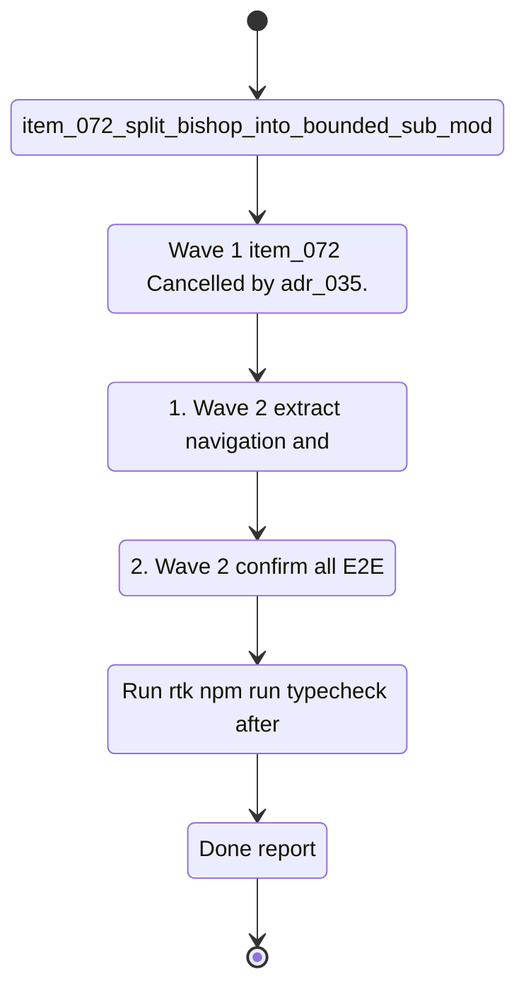

## task_040_orchestrate_post_v1_3_code_quality_security_and_maintainability_audit - Orchestrate post-v1.3 code quality, security, and maintainability audit

> From version: 1.3.0
> Schema version: 1.0
> Status: Done
> Understanding: 99%
> Confidence: 98%
> Progress: 100%
> Complexity: High
> Theme: Quality / Security / Maintainability
> Reminder: Update status/understanding/confidence/progress and linked request/backlog references when you edit this doc.

# Context

- Orchestrate the remaining bounded cleanup items from `req_018_post_v1_3_code_quality_security_and_maintainability_audit`.
- The goal is to resolve file size violations, harden localStorage safety, and add granular error isolation — without changing any product behavior.
- Wave 1 (bishop.ts split) and Wave 5 (lazy mock corpus) are cancelled by `adr_035_python_fastapi_as_the_worker_runtime`: bishop.ts and the bundled corpus are removed from the browser entirely.
- Keep each wave commit-ready and validate before moving on.

## Wave map

- ~~Wave 1: Split `bishop.ts` into bounded sub-modules (`item_072`)~~ — **Cancelled** (`adr_035`): bishop.ts moves to Python, not split.
- Wave 2: Reduce `app-shell.tsx` below 800 lines (`item_073`)
  - Goal: extract navigation and panel coordination into dedicated components or hooks.
  - Expected outputs: reduced shell, extracted units, all E2E and unit tests passing.
- Wave 3: Harden localStorage — API key warning and schema validation (`item_074`)
  - Goal: add a visible inline warning next to API key inputs (local dev mode); validate all critical `localStorage` reads against a declared schema.
  - Expected outputs: warning UI in Settings (local mode only), schema validation on settings/Bishop conversation/artifacts reads, clean empty-state fallback on failure.
- Wave 4: Python worker health check and granular panel error boundaries (`item_075`)
  - Goal: silent health check at startup against the Python worker (`GET /api/health`); each of the 6 panels wrapped in its own `<ErrorBoundary>`.
  - Expected outputs: worker availability indicator in Settings or status bar, 6 granular boundaries, isolated failure test.
- ~~Wave 5: Lazy-load the mock corpus chunk (`item_076`)~~ — **Cancelled** (`adr_035`): no corpus is bundled in the browser; browser always fetches from the Python worker.

# Plan

- [x] ~~Wave 1 (item_072)~~ — Cancelled by `adr_035`. Bishop moves to Python.
- [x] 1. Wave 2 — extract navigation and panel coordination logic from `app-shell.tsx` into dedicated units; confirm the file drops below 800 lines.
- [x] 2. Wave 2 — confirm all E2E smoke tests and unit tests pass after the extraction.
- [x] CHECKPOINT: leave Wave 2 commit-ready and run `rtk npm run e2e` and `rtk npm run check` before continuing.
- [x] 3. Wave 3 — add an explicit inline warning in the Settings panel next to each API key input field (shown in local dev mode only; hidden in hosted mode).
- [x] 4. Wave 3 — introduce schema validation on all critical `localStorage` reads; produce a clean empty-state fallback with a diagnostic log on failure; add unit tests covering the failure path.
- [x] CHECKPOINT: leave Wave 3 commit-ready and run `rtk npm run test -- tests/settings-panel.spec.tsx tests/use-provider-secrets.spec.tsx` before continuing.
- [x] 5. Wave 4 — add a silent startup health check against the Python worker (`GET /api/health`); surface a worker availability indicator without blocking the UI.
- [x] 6. Wave 4 — wrap each of the 6 panels in a granular `<ErrorBoundary>`; add a test confirming a simulated exception is contained without crashing other panels.
- [x] CHECKPOINT: leave Wave 4 commit-ready and run `rtk npm run test -- tests/error-boundary.spec.tsx` and `rtk npm run check` before continuing.
- [x] ~~Wave 5 (item_076)~~ — Cancelled by `adr_035`. No bundled corpus in the browser.
- [x] GATE: do not close a wave until the relevant automated tests and linked docs are updated.
- [x] FINAL: update request, backlog, and task docs once all waves are closed.

# Delivery checkpoints

- ~~After Wave 1~~ — Cancelled (adr_035).
- After Wave 2: `app-shell.tsx` is below 800 lines; E2E and unit tests pass.
- After Wave 3: localStorage reads are validated; API key warning is visible in Settings (local dev); failure path is tested.
- After Wave 4: Python worker health check is in place; all 6 panels have granular error boundaries.
- ~~After Wave 5~~ — Cancelled (adr_035).

# AC Traceability

- ~~AC1 (req_018) → Wave 1~~ — Cancelled (adr_035).
- AC2 (req_018) → Wave 2. Reduce `app-shell.tsx` below 800 lines. Proof: file size and passing E2E.
- AC3 (req_018) → Wave 3. Visible API key warning in Settings (local mode). Proof: UI inspection and unit test.
- AC4 (req_018) → Wave 3. Schema validation on critical localStorage reads. Proof: validation coverage and failure path test.
- AC5 (req_018) → Wave 4. Silent Python worker health check (`GET /api/health`) at startup. Proof: startup behavior and indicator visibility.
- AC6 (req_018) → Wave 4. Granular error boundaries per panel. Proof: 6 boundaries and isolated failure test.
- ~~AC7 (req_018) → Wave 5~~ — Cancelled (adr_035).

# Decision framing

- Product framing: Not needed
- Product signals: (none detected)
- Product follow-up: No product brief follow-up expected — this wave is structural only.
- Architecture framing: Required for Wave 1 if splitting bishop.ts changes the orchestration contract.
- Architecture signals: bishop orchestration contract, localStorage schema, PWA chunk strategy
- Architecture follow-up: Create an ADR for Wave 1 if the split changes the public bishop surface.

# Links

- Request(s): `logics/request/req_018_post_v1_3_code_quality_security_and_maintainability_audit.md`
- Backlog item(s): `item_072_split_bishop_into_bounded_sub_modules`, `item_073_reduce_app_shell_below_800_lines`, `item_074_harden_localstorage_api_key_warning_and_schema_validation`, `item_075_add_worker_health_check_and_granular_error_boundaries`, `item_076_lazy_load_mock_corpus_chunk`
- Architecture decision(s): `adr_016_deepvault_persistence_and_storage_layout`, `adr_027_pwa_cache_and_offline_fallback_strategy`, `adr_018_split_the_app_shell_and_ui_state_boundaries`, `adr_033_split_bishop_ts_into_bounded_sub_modules`
- Product brief(s): (none)

# AI Context

- Summary: Orchestrate the five-wave post-v1.3 structural cleanup — bishop.ts split, app-shell reduction, localStorage hardening, granular error boundaries, and lazy mock corpus loading.
- Keywords: bishop refactor, app-shell, localstorage, schema validation, error boundary, health check, lazy loading, bundle, maintainability
- Use when: Use when executing the structural and security cleanup waves from req_018.
- Skip when: Skip when the work targets new features or product improvements covered by task_041.

# Validation

- Run `rtk npm run typecheck` after every code-bearing wave.
- Run focused `rtk npm run test -- ...` suites after each wave as listed in the plan.
- Run `rtk npm run check` before closing Wave 3 and Wave 5.
- Run `rtk npm run e2e` before closing Wave 2 and Wave 5.
- Run `rtk npm run build` before closing Wave 5 to verify bundle output.

# Definition of Done (DoD)

- [x] All five backlog items implemented and acceptance criteria covered.
- [x] Validation commands executed and results captured per wave.
- [x] No wave closed before the relevant automated tests passed.
- [x] Linked request, backlog, and task docs updated during completed waves and at closure.
- [x] Each completed wave left a commit-ready checkpoint.
- [x] Status moved to `Done` and progress to `100%`.

## Progress notes

- Wave 2 is now complete: `src/components/app-shell.tsx` was reduced from 948 lines to 478 lines by extracting the shell chrome into `src/components/app-shell-chrome.tsx`, leaving the main shell focused on application state and panel orchestration.
- The extracted shell chrome preserved existing behavior while making navigation, topbar controls, and toolbar rendering independently maintainable.
- Wave 2 validation passed with `rtk npm run typecheck`, `rtk npm run test -- tests/app.spec.tsx`, `rtk npm run e2e`, and the full `rtk npm run check` gate.
- Wave 3 is now complete: API key inputs in `settings-panel.tsx` now include an explicit plaintext `localStorage` warning, and critical browser persistence reads were hardened through the shared parsing helpers in `src/lib/storage-schema.ts`.
- The Wave 3 fallback path now logs a diagnostic warning and resets to safe empty defaults for invalid provider secrets, Entra settings, worker settings, Bishop persisted state, and artifact panel persistence values.
- Wave 3 validation passed with `rtk npm run test -- tests/app.spec.tsx tests/settings-panel.spec.tsx tests/use-provider-secrets.spec.tsx tests/use-worker-settings.spec.ts tests/use-entra-settings.spec.ts tests/use-bishop-conversation.spec.tsx`, `rtk npm run typecheck`, and the full `rtk npm run check` gate.
- Wave 4 is now complete: `useWorkerHealth` adds the non-blocking startup `/api/health` probe for configured remote workers, and the Settings worker screen now surfaces the resulting availability state directly to the operator.
- Wave 4 validation also proves panel-level isolation at the app shell boundary through `tests/app-shell-error-boundary.spec.tsx`, in addition to the direct `ErrorBoundary` unit test coverage.
- Final validation for the completed task passed with `rtk npm run check`, including lint, typecheck, the full unit/integration suite, build, E2E, and evaluation.
